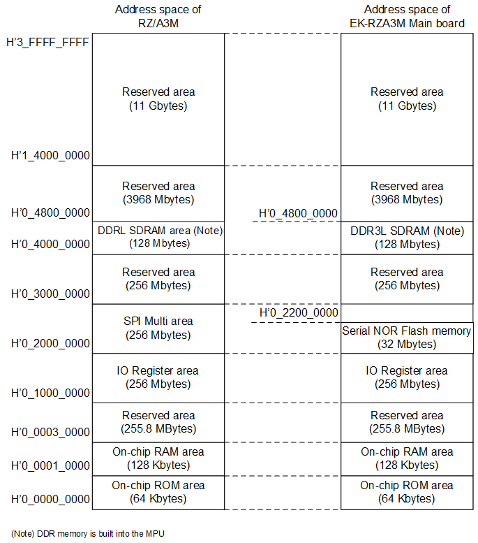

<h3 id="4.3.3">4.3.3 Memory Map of EK-RZ/A3M Main board (switching Serial NOR Flash memory)</h3>

<a href="#Figure4.3.3.1">Figure 4.3.3.1</a> shows the RZ/A3M address space and the memory map of the EK-RZ/A3M Main board(swiching Serial NOR Flash memory).

<h4 id="Figure4.3.3.1">Figure 4.3.3.1 Memory MAP of EK-RZ/A3M Main board (swiching Serial NOR Flash memory)</h4>

