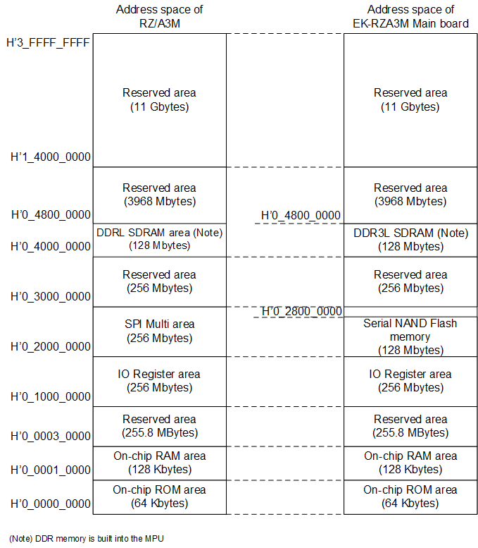

<h3 id="4.3.4">4.3.4 Memory Map of EK-RZA3M Main board (switching Serial NAND Flash memory)</h3>

<a href="#Figure4.3.4.1">Figure 4.3.4.1</a> shows the RZ/A3M address space and the memory map of the EK-RZA3M Main board (switching Serial NAND Flash memory).

<h4 id="Figure4.3.4.1">Figure 4.3.4.1 Memory MAP of EK-RZA3M Main board (switching Serial NAND Flash memory)</h4>

