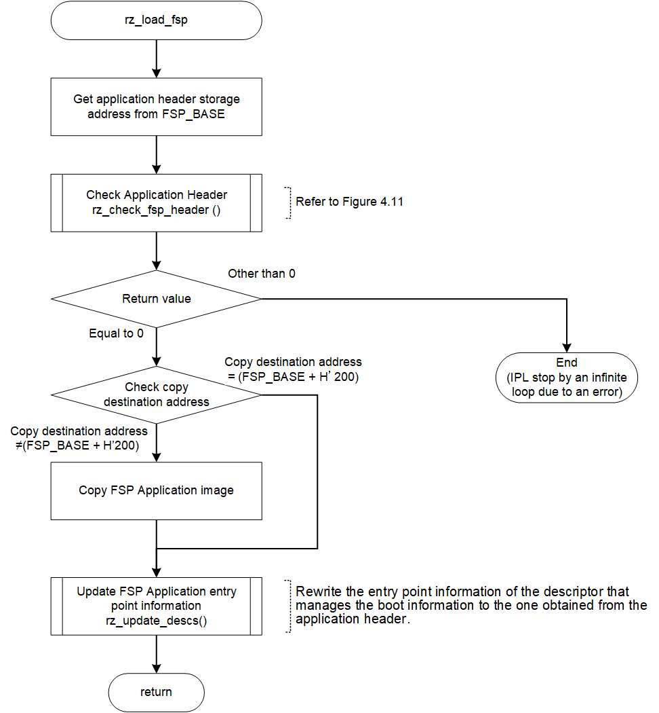

<h3 id="4.13.2">4.13.2 FSP application image copy process</h3>

<a href="#Figure4.13.2.1">Figure 4.13.2.1</a> and <a href="#Figure4.13.2.2">Figure 4.13.2.2</a> show the flow chart of the FSP application image copy process.

<h4 id="Figure 4.13.2.1">Figure4.13.2.1 Flow Chart of rz_load_fsp()</h4>

<h4 id="Figure4.13.2.2">Figure 4.13.2.2 Flow Chart of rz_check_fsp_header()</h4>

