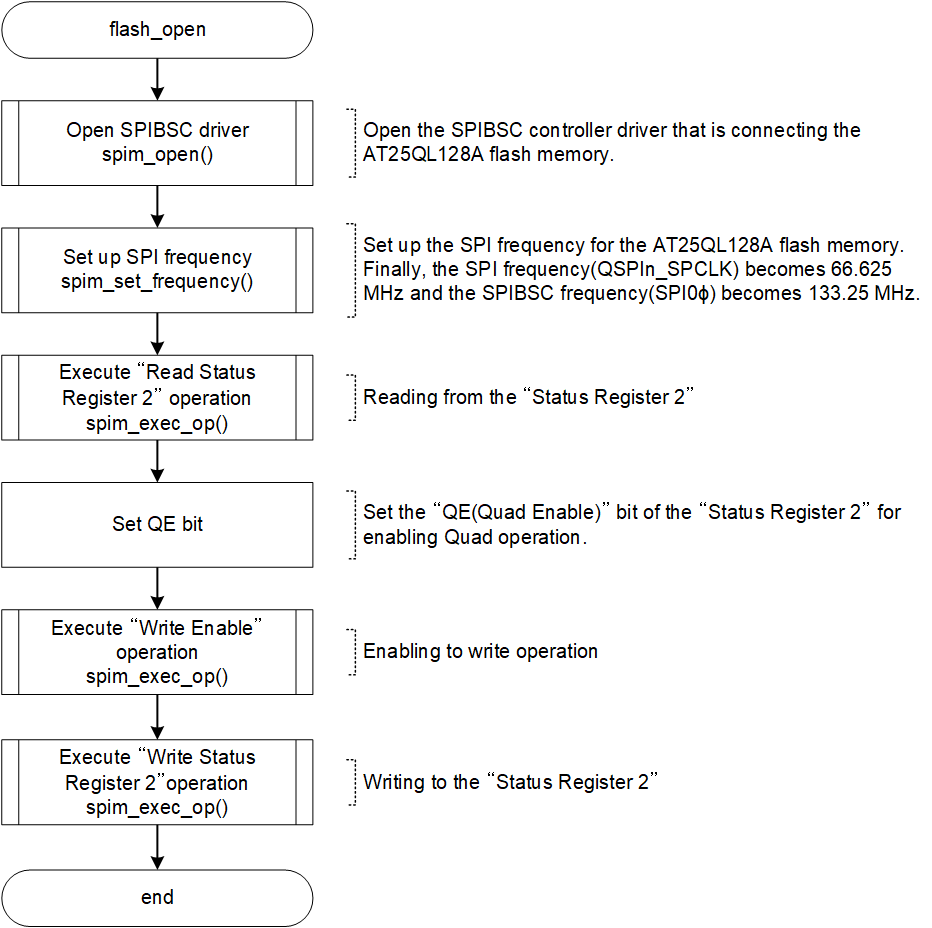

<h3 id="4.13.3">4.13.3 Setting of Serial NOR Flash memory and SPIBSC</h3>

As an example of the flow for setting up serial NOR flash memory in IPL, <a href="#Figure4.13.3.1">Figure 4.13.3.1</a> - <a href="#Figure4.13.3.3">Figure 4.13.3.3</a> show the setting up of the Renesas Electronics Serial NOR Flash memory (AT25QL128A) mounted on the RZ/A3UL SMARC EVK board (QSPI version).  
Once the settings are complete for serial NOR Flash memory, you can read data by accessing the bus.

<h4 id="Figure4.13.3.1">Figure 4.13.3.1 Flowchart of xspi_setup()</h4>

  

<h4 id="Figure4.13.3.2">Figure 4.13.3.2 Flowchart of flash_open()</h4>

<h4 id="Figure4.13.3.3">Figure 4.13.3.3 Flowchart of flash_enter_xip()</h4>

