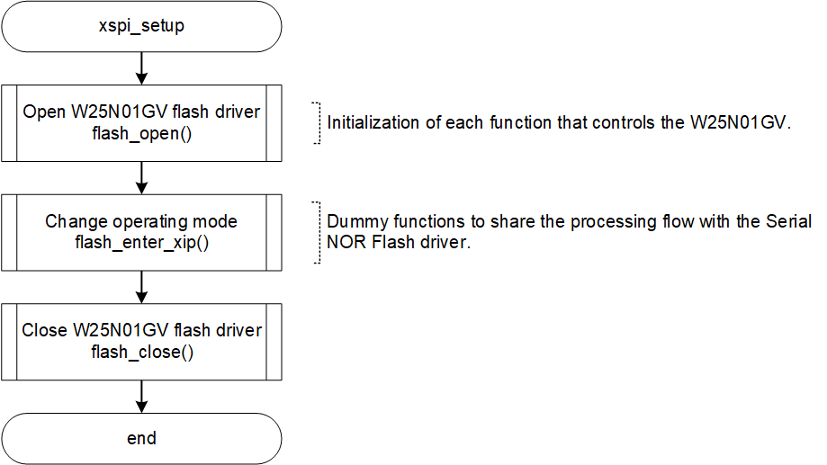
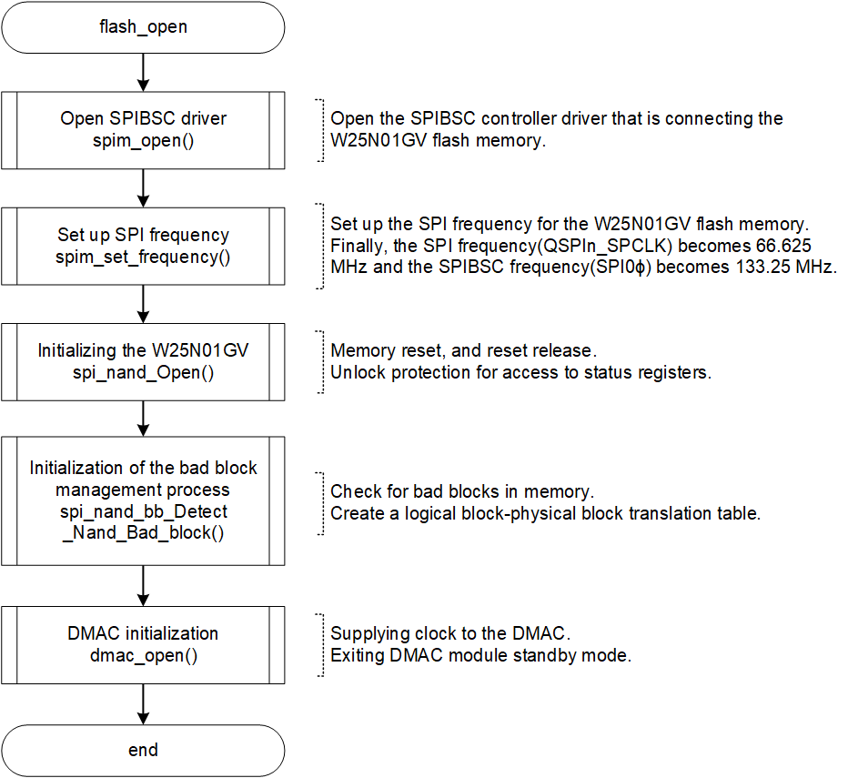
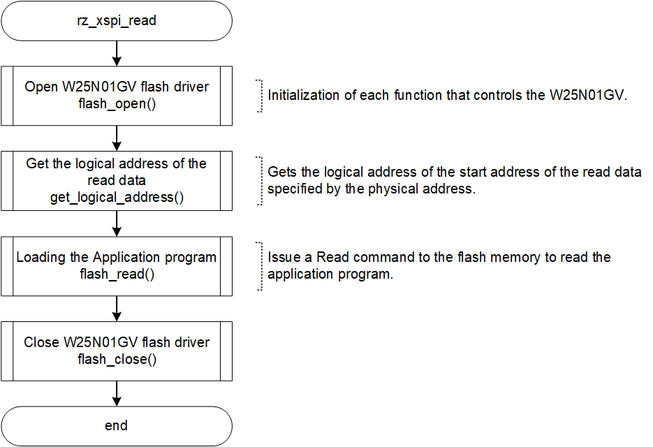
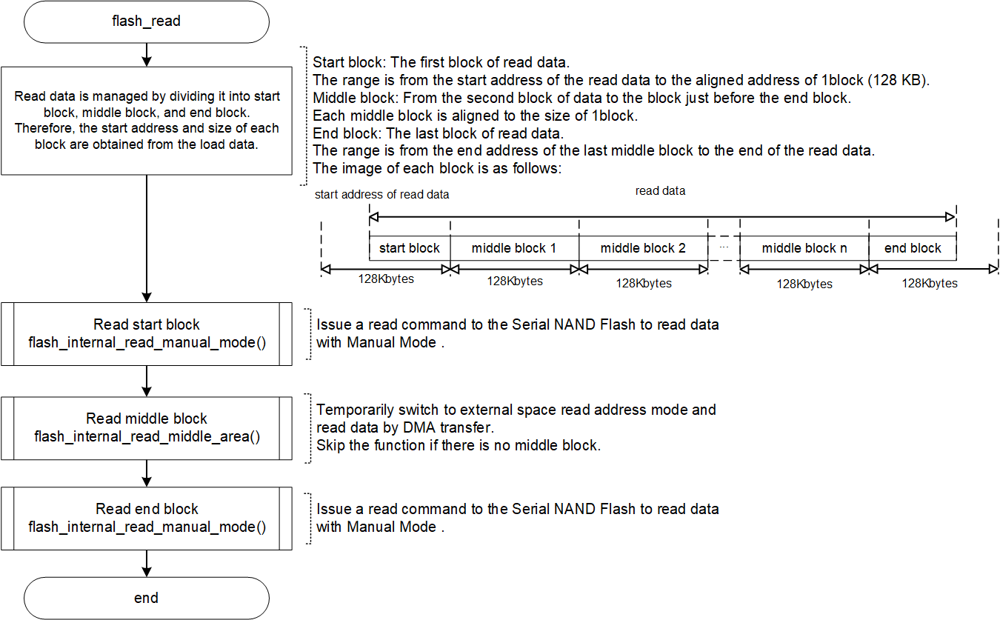

<h3 id="4.13.4">4.13.4 Setting and read sequence of Serial NAND Flash memory and SPIBSC</h3>

With serial NAND Flash memory, after the settings are complete, a read command must be issued to the memory to read the data.  
The read process flow is also explained in this chapter.

<h4 id="Figure4.13.4.1">Figure 4.13.4.1 Flowchart of xspi_setup()</h4>

  

<h4 id="Figure4.13.4.2">Figure 4.13.4.2 Flowchart of flash_open()</h4>

<h4 id="Figure4.13.4.3">Figure 4.13.4.3 Flowchart of rz_xspi_read()</h4>

<h4 id="Figure4.13.4.4">Figure 4.13.4.4 Flowchart of flash_read()</h4>

