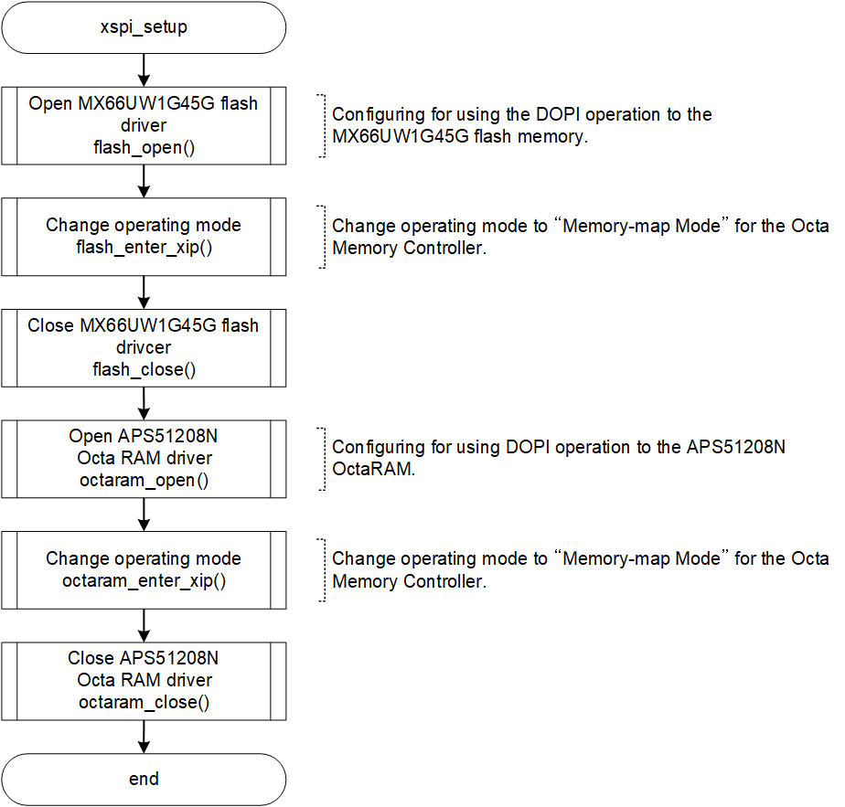
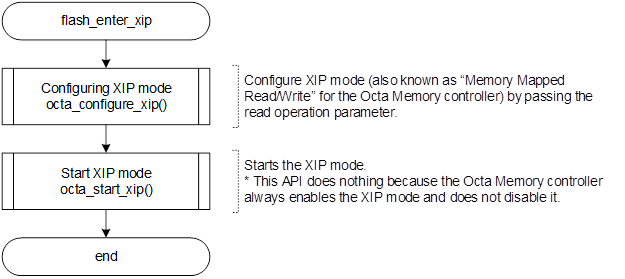
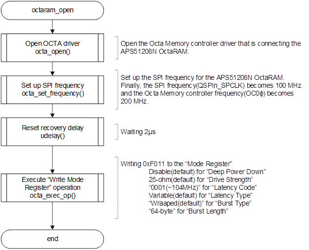

<h3 id="4.13.5">4.13.5 Setting of OctaFlash, OctaRAM, and Octa Memory Controller</h3>

In default IPL, the Macronix OctaFlash (MX66UW1G45G) and the OctaRAM (APS51208N) mounted on RZ/A3UL SMARC EVK board (Octal-SPI version) is set so that it can be accessed by Memory-map Mode via Octa Memory Controller.
<a href="#Figure4.13.5.1">Figure 4.13.5.1</a>- <a href="#Figure4.13.5.5">Figure 4.13.5.5</a> show the initialization procedure.  
Once the initialization are complete for OctaFlash and OctaRAM, you can read data by accessing the bus.

<h4 id="Figure4.13.5.1">Figure 4.13.5.1 Flowchart of xspi_setup</h>
  

<h4 id="Figure4.13.5.2">Figure 4.13.5.2 Flowchart of flash_open</h>
  

<h4 id="Figure4.13.5.3">Figure 4.13.5.3 Flowchart of flash_enter_xip</h>
  

<h4 id="Figure4.13.5.4">Figure 4.13.5.4 Flowchart of octaram_open</h>
  

<h4 id="Figure4.13.5.5">Figure 4.13.5.5 Flowchart of octaram_enter_xip</h>
  
