<h3 id="5.1.1">5.1.1 Install e<sup>2</sup> studio</h3>

1. Launch the e<sup>2</sup> studio installation wizard.

    If you launch the installer in an Ubuntu 22.04 LTS environment, please execute the following command.  
    The command is an example when the e<sup>2</sup> studio installer("e2studio_installer-2025-01_linux_host.run") is saved in the "~/Downloads" folder.  
    Please change the command to match the installer file name for the version you want to install.
    ```
    $ cd ~/Downloads
    $ sudo chmod +x e2studio_installer-2025-01_linux_host.run
    $ ./e2studio_installer-2025-01_linux_host.run
    ```
    When the installation wizard starts, select the [Custom Install] option and click the [Next] button.

    <center>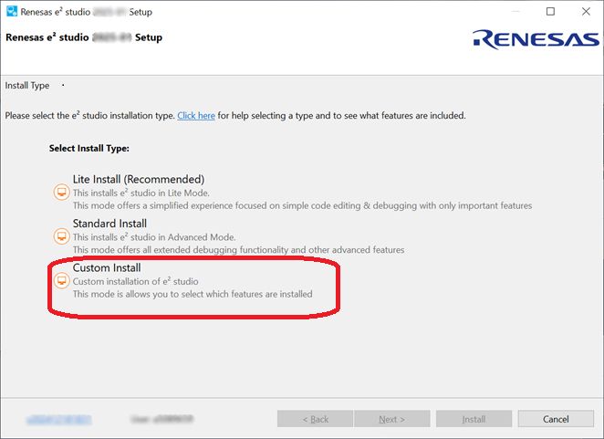</center>    

    <center><h4 id="Figure5.1.1.1">Figure 5.1.1.1 e<sup>2</sup> studio installation wizard</h4></center>    

    Note:  
    If you are using a multi-user environment, you may receive a prompt to confirm whether you want to install it for the current user only or for all users.

    <center>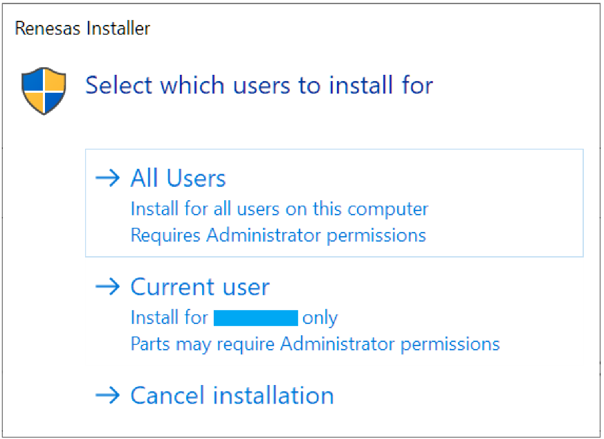</center>

    <center><h4 id="Figure5.1.1.2">Figure 5.1.1.2 Select User for Installation</h4></center>

    Note:  
    If e<sup>2</sup> studio had been installed in your PC, the option to modify, remove the existing version or install
    e<sup>2</sup> studio to a different location will be displayed.  
    In this case, please select [Install].

    <center>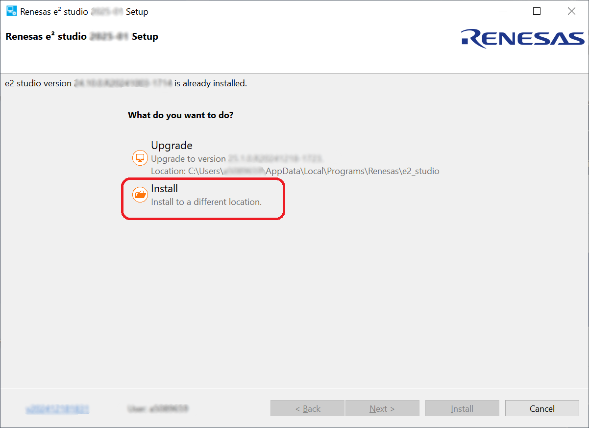</center>

    <center><h4 id="Figure5.1.1.3">Figure 5.1.1.3 e<sup>2</sup> studio installation wizard</h4></center>

2. "Welcome page"

    User can change the install folder by clicking [Change...].   
    Click [Next] to continue.

    Notes:  
    1. If you would like to have multiple versions of e<sup>2</sup> studio, please specify new folder here.  
    2. Multi-byte characters cannot be used for e<sup>2</sup> studio installation folder name.

    <center>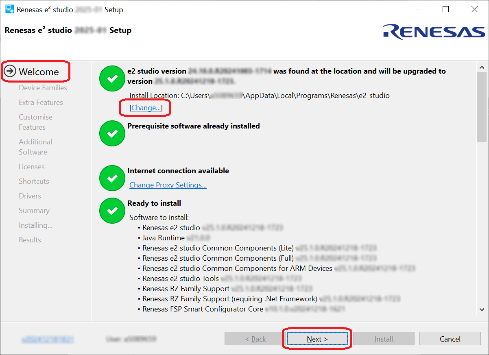</center>

    <center><h4 id="Figure5.1.1.4">Figure 5.1.1.4 Installation of e<sup>2</sup> studio - Welcome page</h4></center>

3. "Device Families"

    You can select the device family to install. Select [RZ] Device Families to install.  
    Click the [Next] button to continue.

    <center>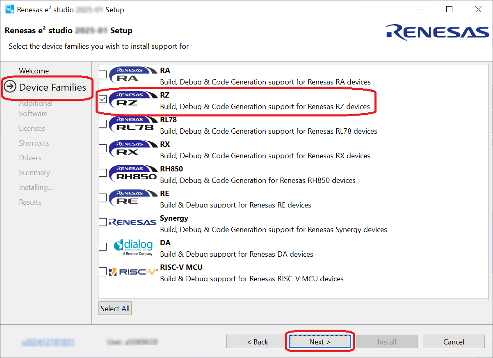</center>

    <center><h4 id="Figure5.1.1.5">Figure 5.1.1.5 Installation of e<sup>2</sup> studio - Device Families</h4></center>

4. "Extra Features"

    Select Extra Features (i.e., Language packs, SVN & Git support, RTOS support...) to be installed.  
    For non-English language users, please select Language packs at this step if needed.  
    This document describes an example of using e<sup>2</sup> studio terminal, so please check [Terminals].  
    Click the [Next] button to continue.

    <center>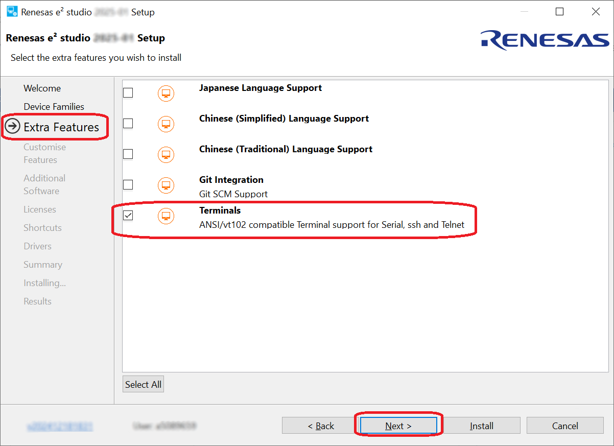</center>

    <center><h4 id="Figure5.1.1.6">Figure 5.1.1.6 Installation of e<sup>2</sup> studio - Extra Features</h4></center>

5. "Customize Features"

    Be sure to select [Renesas FSP Smart Configurator Core].

    <center>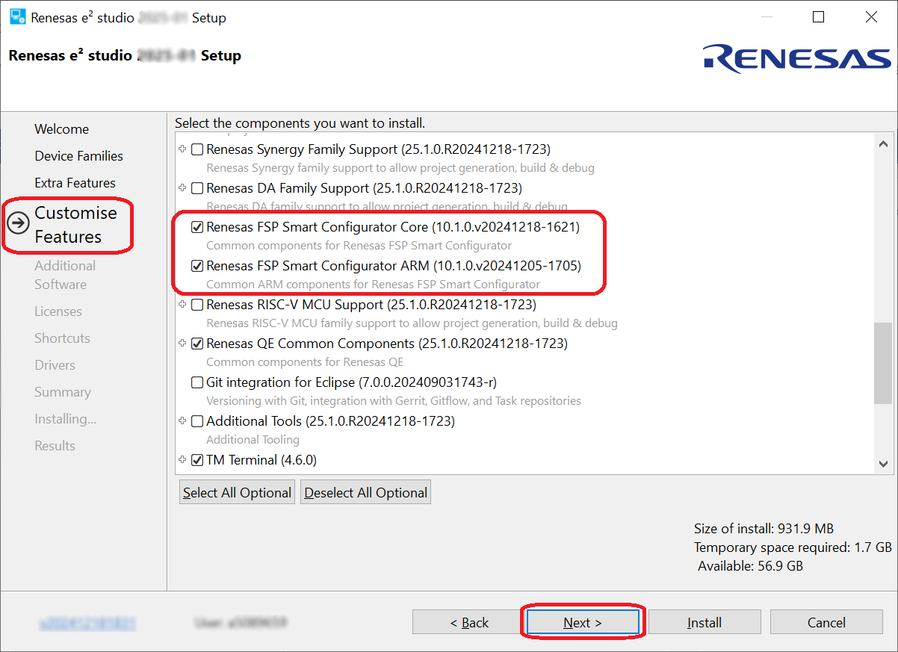</center>

    <center><h4 id="Figure5.1.1.7">Figure 5.1.1.7 Installation of e<sup>2</sup> studio - Features</h4></center>

6. "Additional Software"

    Select additional software (i.e., compilers, utilities, QE...) to be installed.  
    Add the following items if they are not checked, and be sure to click [Next] to continue:

    * GCC ARM A-Profile (AArch64 bare-metal) 10.3.2021.07<br>

    <center>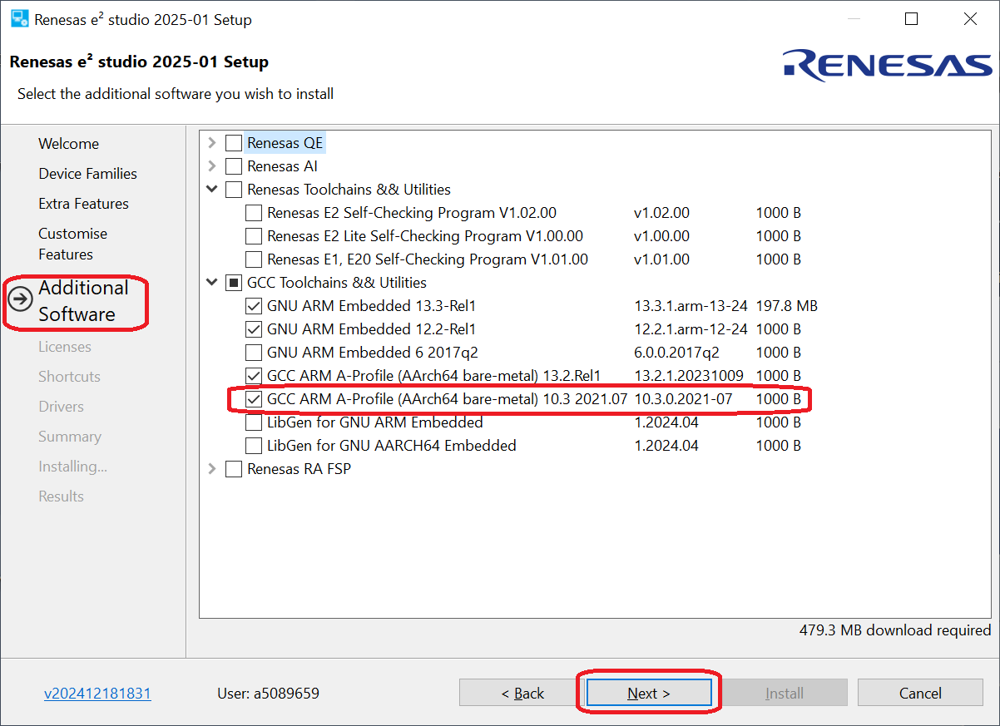</center>

    <center><h4 id="Figure5.1.1.8">Figure 5.1.1.8 Installation of e<sup>2</sup> studio - Additional Software</h4></center>

7. "License Agreement"

    Please read and accept the software license agreement, then click the [Next] button.   
    Note that acceptance of the license agreement is mandatory; without it, the installation process cannot proceed.

    <center>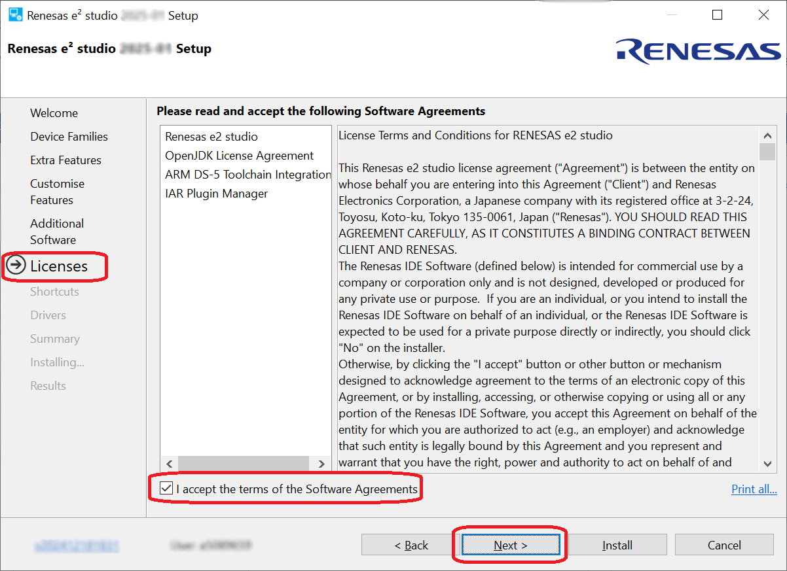</center>

    <center><h4 id="Figure5.1.1.9">Figure 5.1.1.9 Installation of e<sup>2</sup> studio - Licenses</h4></center>

8. "Shortcuts"

    Select shortcut name for start menu and click [Next] button to continue.

    Note:  
    If e<sup>2</sup> studio was installed in another location, it is recommended to rename it to distinguish from the other e<sup>2</sup> studio(s).

    <center>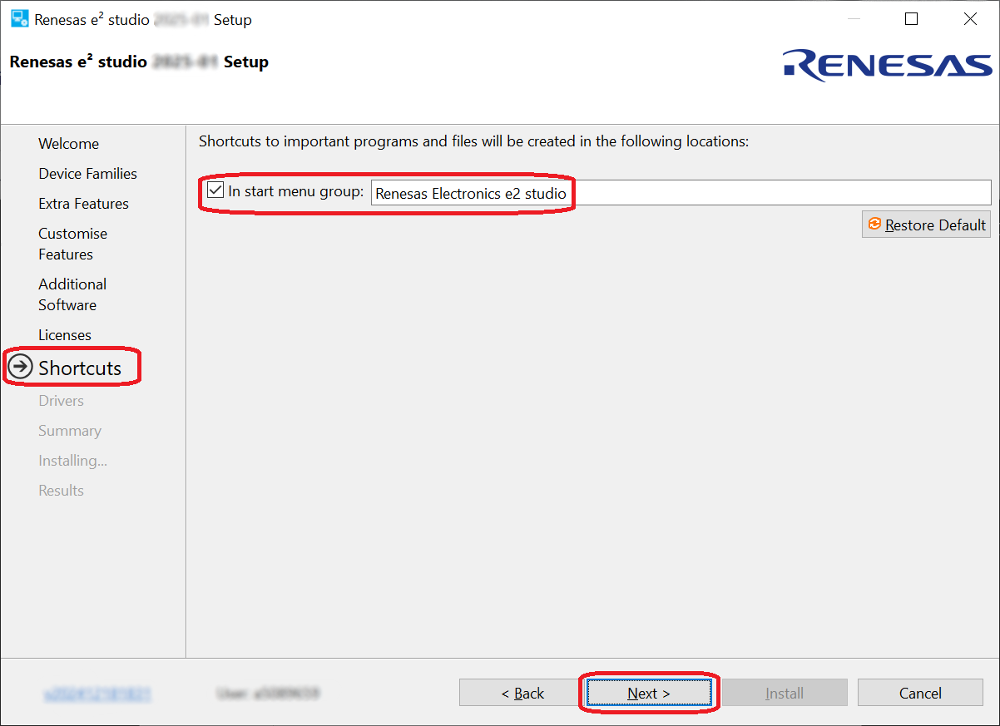</center>

    <center><h4 id="Figure5.1.1.10">Figure 5.1.1.10 Installation of e<sup>2</sup> studio - Shortcuts</h4></center>

9. "Summary"

    Components list to be installed is shown.  
    Please confirm the contents and click the [Install] button to install the Renesas e<sup>2</sup> studio IDE.

    <center>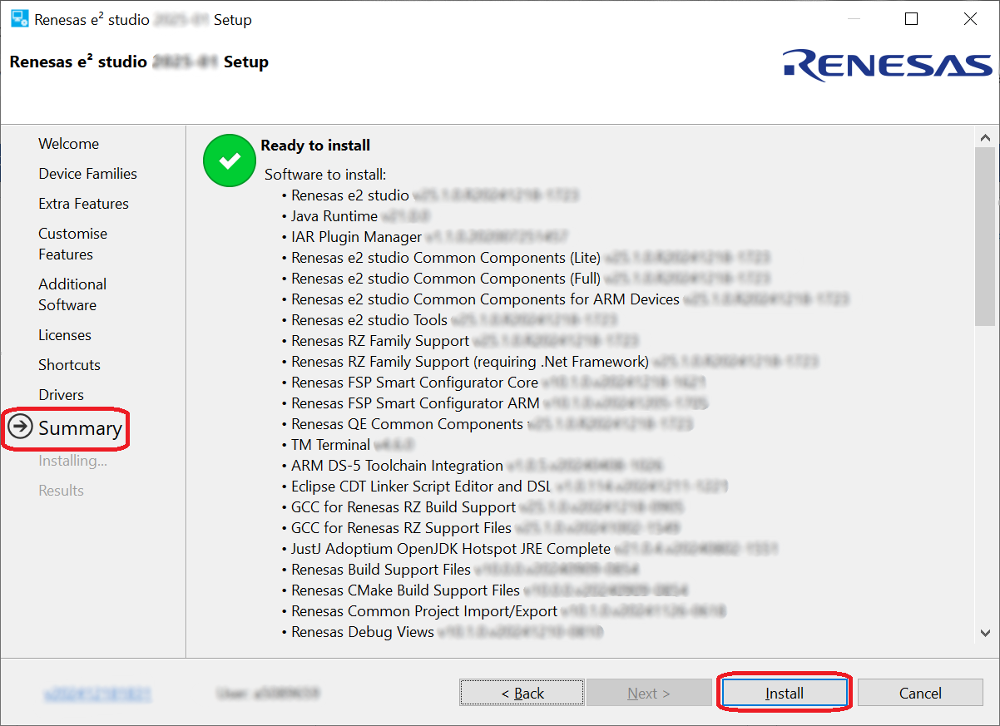</center>

    <center><h4 id="Figure5.1.1.11">Figure 5.1.1.11 Installation of e<sup>2</sup> studio - Summary</h4></center>

10. "Installing"

    The installation is performed. Depending on selected items of additional software, new dialog prompts may appear during the installation process.

11. "Results"

    Click the [OK] button to complete the installation.

    <center>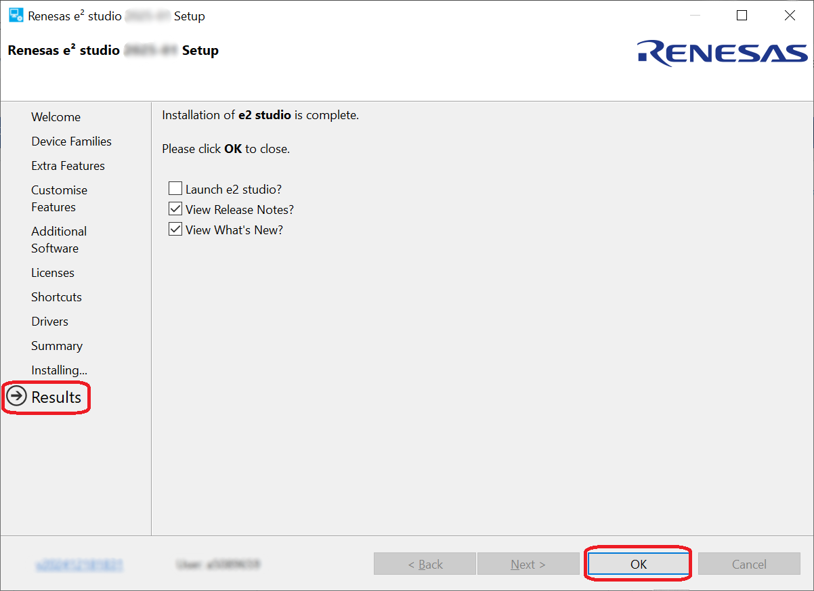</center>

    <center><h4 id="Figure5.1.1.12">Figure 5.1.1.12 Results Page</h4></center>
