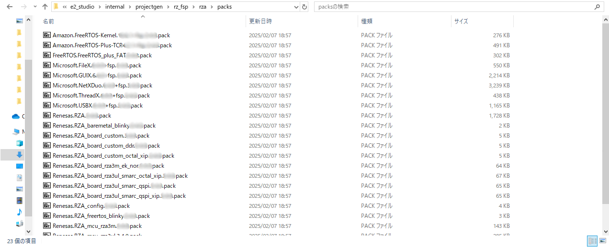

<h3 id="5.1.2">5.1.2 Installation of RZ/A FSP packs</h3>

Install the FSP packs for use in the RZ/A3 IPL environment.

1. Exit e2 studio

2. Extract FSP Packs.

3. Copy the extracted FSP Packs (named "internal") to the e2 studio installation folder as shown below:  
   If you followed the installation procedures in this chapter, the path is:

    * For Windows 10 environment:
      " C:\Renesas\e2_studio\internal\projectgen\rz_fsp\rza\packs"
    * For Ubuntu 22.04 LTS environment: "~/.local/share/Renesas/e2_studio/internal/projectgen/rz_fsp/rza/packs"

    

    
<h4 id="Figure5.1.2.1">Figure 5.1.2.1 Installed packs folder</h4>

4. Please re-launch e2 studio  
   Then packs will be reflected in the development environment.
