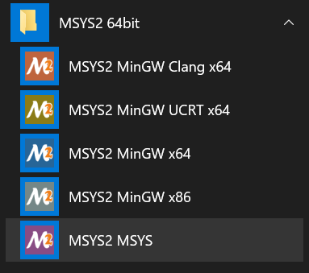
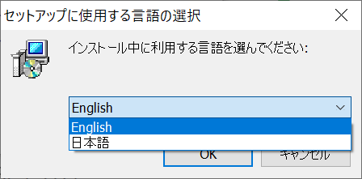
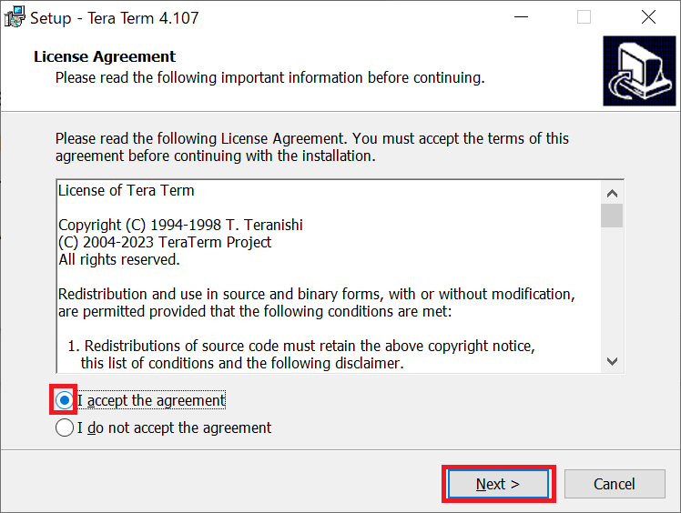
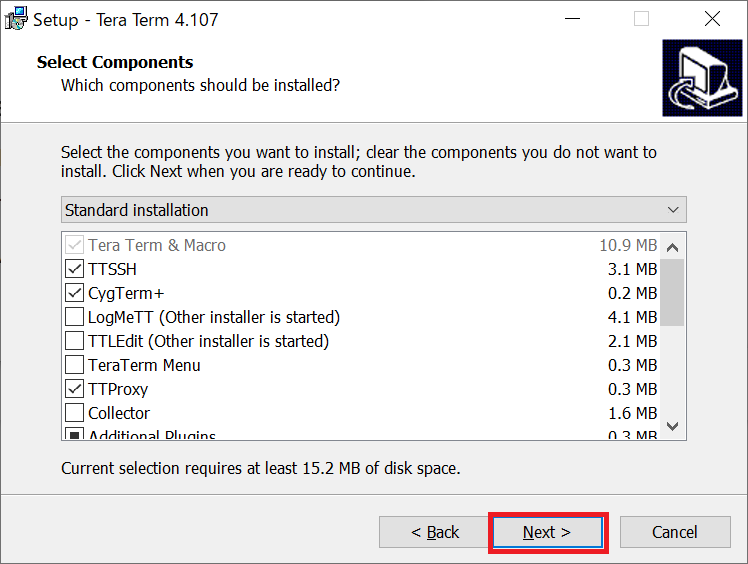
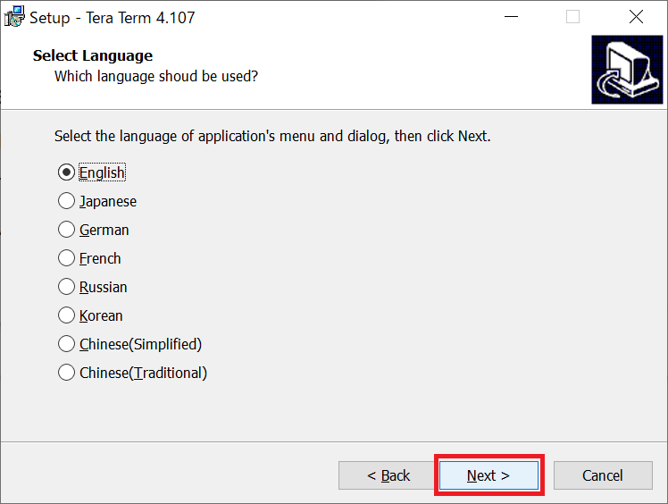
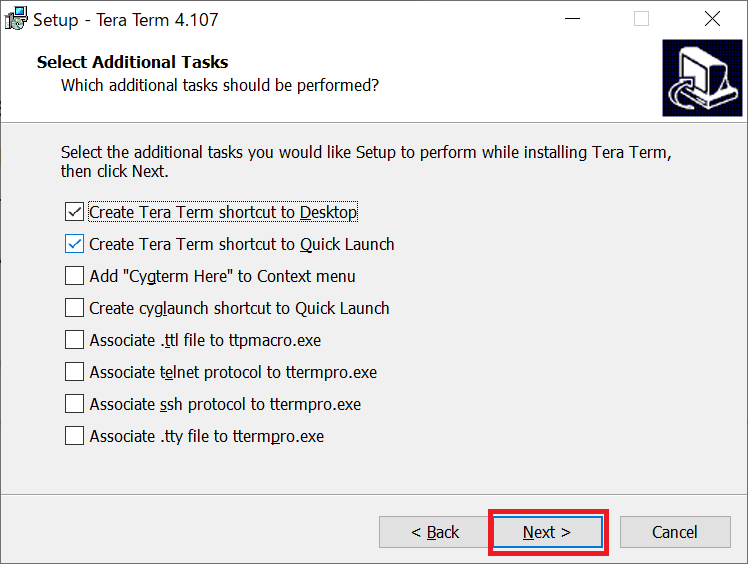

<h3 id="5.2.1">5.2.1 Install Additional Software for Windows 10</h3>

You must install some additional software to build IPL in Windows 10 environment.

Install MSYS2:

1. Download MSYS2 from "Installation" on the following website.  
   Please install by following the procedure described in "Installation".

    <https://www.msys2.org/>

    This document describes the case where MSYS2 is installed in the following folder.  
    c:\msys64

2. Install the make command on MSYS2.  
   Open the start menu and start "MSYS2 MSYS".

   

   
<h4 id="Figure5.2.1.1">Figure 5.2.1.1 Launch MSYS2</h4>

3. A command window will appear.  
   Enter "pacman -S make" on command window to install  the make command on MSYS2.

   

   
<h4 id="Figure5.2.1.2">Figure 5.2.1.2 Make command installation (1)</h4>

4. Enter 'y' when "Proceed with installation? [Y / n] "is output.

   

   
<h4 id="Figure5.2.1.3">Figure 5.2.1.3 Make command installation (2)</h4>

5. The make installation is completed.

   

   
<h4 id="Figure5.2.1.4">Figure 5.2.1.4 Make command installation (3)</h4>

Install Tera Term: 

1. Download and run the Tera Term installer from the GitHub page below.  

    <https://github.com/TeraTermProject/teraterm/releases/tag/v4.107>

    Notes:  
    1. Tera Term will be used to receive messages from the target board and transfer files to the target board.  
       Please download Flash Writer from the link below.  
       <https://www.renesas.com/products/rz-a3m>  
    2. File transfer will fail with Tera Term version 5 or later, so please use Tera Term version 4.  
       Operation in this document has been confirmed with Tera Term v4.107.

2. When the installer starts, user will be asked which language to use during installation, so select the language that suits your environment. 

 

   
<h4 id="Figure5.2.1.5">Figure 5.2.1.5 Language selection during installation</h4>

3. Please read License Agreement and check "I accept the agreement", then click the [Next] button. 

 

   
<h4 id="Figure5.2.1.6">Figure 5.2.1.6 License Agreement</h4>

4. On the next Select Components screen, simply click [Next] to proceed to the next step. 

 

   
<h4 id="Figure5.2.1.7">Figure 5.2.1.7 Select Components</h4>

5. On the next Select Language screen, select the language in which Tera Term will operate. 
Then click [Next] to proceed to the next step. 

 

   
<h4 id="Figure5.2.1.8">Figure 5.2.1.8 Language selection during operation</h4>

6. On the next Select Aditional Tasks screen, simply click [Next] to proceed to the next step.  
Then, Tera Term installation will run and complete.

 

   
<h4 id="Figure5.2.1.9">Figure 5.2.1.9 Select Additional Tasks</h4>
