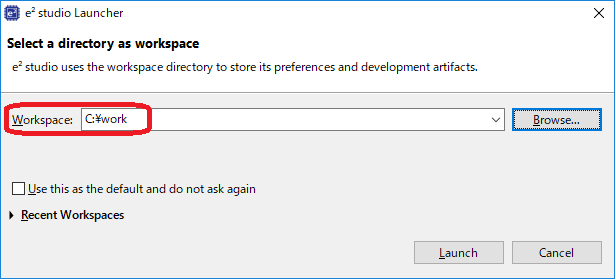
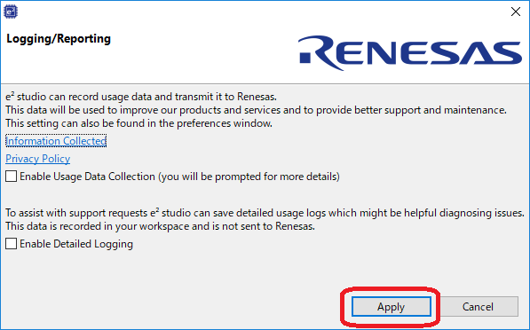
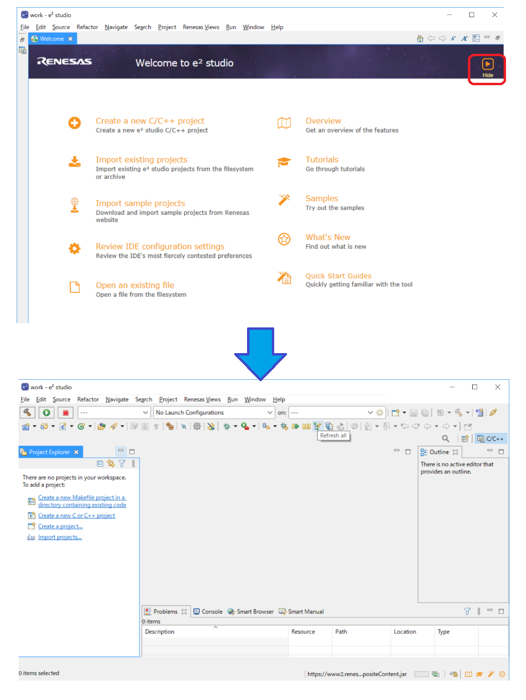
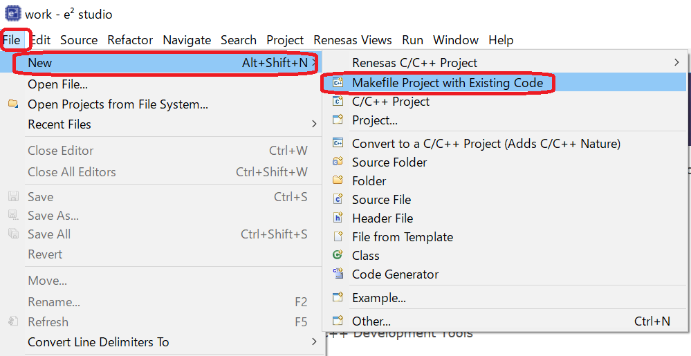
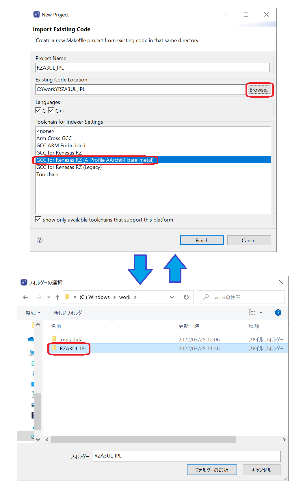
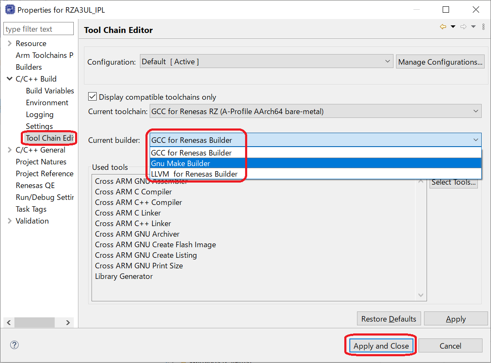
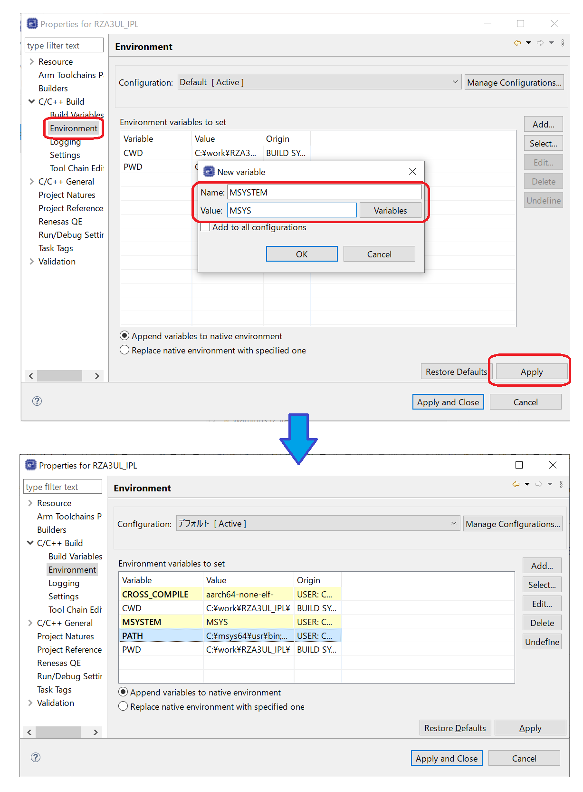
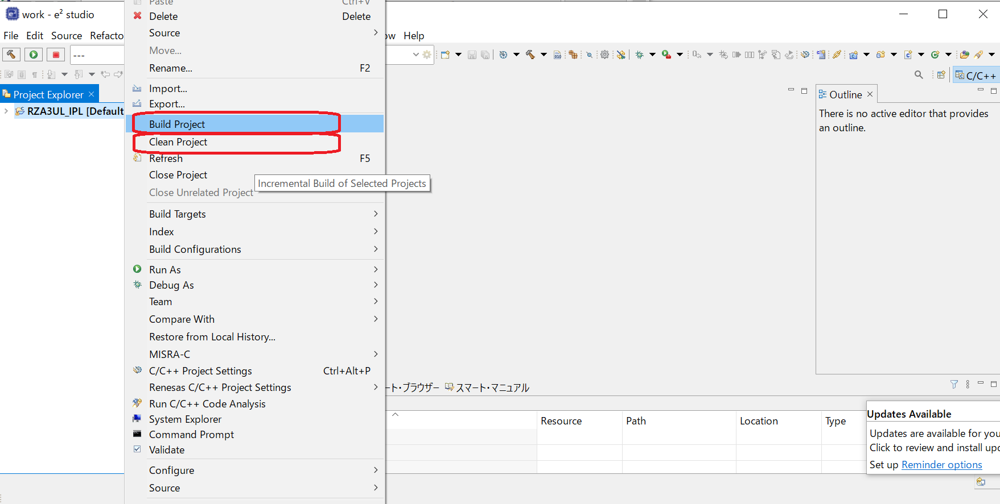

<h2 id="6.">6. IPL build environment construction procedure</h2>

This chapter describes the procedure for building IPL.  
The build procedure for the RZ/A3UL SMARC EVK board is shown here as a representative example of the build procedure.  
If you build IPL for other board, replace the Make Options explained in this chapter with those appropriate for your environment.  
Also, the procedure is the same for both Windows 10 version and Ubuntu 22.04 LTS version.

1.  Get IPL source code from the GitHub page shown below.  
    This document shows an example when the obtained source code is saved in "C:\work\RZA3UL_IPL".  
    (Please notice that the build might fail if the folder's path is too long.)  
    [renesas/rza-initial-program-loader (github.com)](https://github.com/renesas/rza-initial-program-loader)

2.  Launch e2 studio.  
    Click [Browse] and specify "C:\work" for the workspace on e2 studio launcher.

    

    
<h4 id="Figure6.1">Figure 6.1 Launch e2 studio (1)</h4>

3. In the Logging/Reporting dialog that is displayed when e2 studio is started.  
    Please confirm the descriptions, put a check to description that match your privacy policy, and click [Apply].

    

    
<h4 id="Figure6.2">Figure 6.2 Launch e2 studio (2)</h4>

4.  When e2 studio starts, click [Hide] to bring up the main window.

    

    
<h4 id="Figure6.3">Figure 6.3 Launch e2 studio (3)</h4>

5.  Click [File] -> [Import] in main window to call up the Select window.
    Next, in the Select window, click [C/C++] -> [Exiting Code as Makefile Project].

    

    
<h4 id="Figure6.4">Figure 6.4 Create project (1)</h4>

    

    
<h4 id="Figure6.5">Figure 6.5 Select Window</h4>

6.  Click [Browse] and choose "C:\work\RZA3UL_IPL", the folder where you unzipped IPL.  
    Then the folder path will be registered in the Existing Code Location field.

7.  Select "GCC for Renesas RZ (A-Profile AArch64 bare-metal)" in the Toolchain for Indexer Settings and click [Finish].

    

    
<h4 id="Figure6.6">Figure 6.6 Create project (2)</h4>

8.  Right-click the [RZA3UL_IPL] project generated in Project Explorer and click [Properties].

    

    
<h4 id="Figure6.7">Figure 6.7 Create project (3)</h4>

9.  Open [C / C ++ Build] -> [Tool Chain Editor] in Properties for [RZA3UL_IPL] and enter the build command.  
    Select [Gnu Make Builder] in "Current builder", then click [Apply and Close].

    

    
<h4 id="Figure6.8">Figure 6.8 Create project (4)</h4>

10.  Open [C/C ++ Build] -> [Behavior] in Properties for RZA3UL_IPL and enter the build command.  
     Check "Use custom build arguments" and set the make option shown in <a href="#Table6.1">Table 6.1</a> according to the board on which you want to run IPL.  
     This chapter explains how to build an IPL for the RZ/A3UL SMARC (QSPI version) board, so set "PLAT=a3ul BOARD=a3ul_smarc_qspi" in the "Build arguments" field.  
     Then click [Apply].  

     Notes:  
     1.&nbsp;Make Options can be modified.  
     Please refer the <a href="#Table6.1">Table 6.1</a> for detail.  
     2.&nbsp;This description is the setting when the same make option is specified for Build and Clean.  
     If you want to use different make options for build and clean, set the make options in the "Build" and "Clean" fields respectively.

     

     
<h4 id="Figure6.9">Figure 6.9 Build Command</h4>

<h4 id="Table6.1">Table 6.1 Make Option</h4>

<table>
<colgroup>
<col style="width: 14%" />
<col style="width: 31%" />
<col style="width: 53%" />
</colgroup>
<thead>
<tr>
<th>Name</th>
<th>Explanation</th>
<th>Setting Example</th>
</tr>
</thead>
<tbody>
<tr>
<td>PLAT</td>
<td>Set the platform 
This option cannot be omitted</td>
<td><strong>a3ul</strong>: for RZ/A3UL 
<strong>a3m</strong>: for RZ/A3M</td>
</tr>
<tr>
<td>BOARD</td>
<td>Set the board 
This option cannot be omitted</td>
<td>
<strong>a3ul_smarc_qspi</strong>: 
&emsp;RZ/A3UL SMARC Board (QSPI version) 
<strong>a3ul_smarc_octal</strong>: 
&emsp;RZ/A3UL SMARC Board (Octal-SPI version) 
<strong>a3m_ek_nor</strong>: 
&emsp;EK-RZ/A3M Main board (switching Serial NOR Flash memory) 
<strong>a3m_ek_nand</strong>: 
&emsp;EK-RZ/A3M Main board (switching Serial NAND Flash memory)
</td>
</tr>
<tr>
<td>ONLY_INIT_DEVICE</td>
<td>Select the IPL operation mode</td>
<td><strong>1</strong>: Only init device mode 
&emsp;After the device initialization is complete, the IPL waits for the e2studio to download and run the application. 
<strong>0</strong>: Normal boot mode 
&emsp;After device initialization is complete, the IPL performs the application boot.  

&emsp;If you do not set this option, the default value for this option is automatically set depending on the BOARD setting.  
&emsp;If BOARD=a3m_ek_nand: 1 
&emsp;If not, BOARD=a3m_ek_nand: 0</td>
&emsp;After device initialization is complete, the IPL performs the application boot.

If you do not set this option, the default value for this option is automatically set depending on the BOARD setting.

If BOARD=a3m_ek_nand: 1 
If not, BOARD=a3m_ek_nand: 0</td>
</tr>
<tr>
<td>DEBUG</td>
<td>Select debug/release build</td>
<td><strong>1</strong>: debug build 
<strong>0</strong>: release build 
&emsp;This option can be omitted. 
&emsp;In that case a release build is executed.</td>
</tr>
<tr>
<td>FSP_BASE</td>
<td>Indicates the start address of the application header</td>
<td><strong>0x20020000</strong> 
&emsp;If you do not set this option, 0x20020000 is automatically set as the default value.</td>
</tr>
</tbody>
</table>

11. Open [C / C ++ Build]-> [Environment] in Properties for [RZA3UL_IPL] and enter the Environment variables.  
    When you click [Add], the new variable window will appear.  
    Set the environment variables of the combinations shown in the <a href="#Table6.2">Table 6.2</a> (for Windows 10) or <a href="#Table6.3">Table 6.3</a> (for Ubuntu 22.04 LTS) in the Name and Value fields, then click [Apply].

    

    
<h4 id="Figure6.10">Figure 6.10 Build Environment</h4>

<h4 id="Table6.2">Table 6.2 Environment Variables (Windows 10)</h4>

<table>
<colgroup>
<col style="width: 20%" />
<col style="width: 79%" />
</colgroup>
<thead>
<tr>
<th>Name</th>
<th>Value</th>
</tr>
</thead>
<tbody>
<tr>
<td>CROSS_COMPILE</td>
<td>aarch64-none-elf-</td>
</tr>
<tr>
<td>MSYSTEM</td>
<td>MSYS</td>
</tr>
<tr>
<td>PATH</td>
<td>C:\msys64\usr\bin;C:\Renesas\e2_studio\toolchains\gcc_arm_aarch64\10_2021_07\gcc-arm-10.3-2021.07-mingw-w64-i686-aarch64-none-elf\bin 
(Notes1, 2)</td>
</tr>
</tbody>
</table>

Notes:  
1.&nbsp;Change value to match the MSYS2 installation folder.  
2.&nbsp;Toolchain will be installed under the e2 studio installation folder.  
Please set the path to that folder.

<h4 id="Table6.3">Table 6.3 Environment Variables (Ubuntu 22.04 LTS PC)</h4>

<table>
<colgroup>
<col style="width: 20%" />
<col style="width: 79%" />
</colgroup>
<thead>
<tr>
<th>Name</th>
<th>Value</th>
</tr>
</thead>
<tbody>
<tr>
<td>CROSS_COMPILE</td>
<td>aarch64-none-elf-</td>
</tr>
<tr>
<td>PATH</td>
<td>/home/username/.local/share/renesas/e2_studio/toolchains/gcc_arm_aarch64/10_2021_07/gcc-arm-10.3-2021.07-x86_64-aarch64-none-elf/bin 
(Note)</td>
</tr>
</tbody>
</table>

Note:  
Toolchain will be installed under the e2 studio installation folder.  
Please set the path to folder.

12. Right-click [RZA3UL_IPL] and click [Clean project] to clean it once.  
    Then click [Build Project] to build it.

    

    
<h4 id="Figure6.11">Figure 6.11 Build Environment</h4>

    If the build is successful, the following files will be generated in "RZA3UL_IPL\build\a3ul\release".  
    Note that the names of These file change depending on the Make Option.

    <strong>rza3ul_smarc_qspi_ipl.dump</strong>:  
    &emsp;This file shows the disassembled data of IPL code.  
    <strong>rza3ul_smarc_qspi_ipl.map</strong>:  
    &emsp;Map file of IPL.  
    <strong>rza3ul_smarc_qspi_ipl.bin</strong>:  
    &emsp;Raw Binary image of IPL.  
    <strong>rza3ul_smarc_qspi_ipl.elf</strong>:  
    &emsp;Executable file of IPL.  
    &emsp;It is used to download and run IPL to On-chip RAM in e2 studio.  
    <strong>rza3ul_smarc_qspi_ipl.srec</strong>:  
    &emsp;Motorola S format file of IPL.  
    &emsp;By writing to the Serial Flash memory, automatic boot is performed when the RZ/A3UL SMARC EVK board is reset.  
    &emsp;IPL write destination address (H'2000_0000) is registered in this file itself.  
    &emsp;When using the download function of e2 studio, the registered address is referenced and written to the memory, so the offset address specified in e2 studio is H'0000_0000.  
    &emsp;When writing an IPL to the board using Flash Writer, specify the write destination offset address according to specification of it.  
    <strong>bl2.bin, rz_bl2_xspi.env, rz_bl2_xspi_def.c</strong>:  
    &emsp;Temporary file when building.

