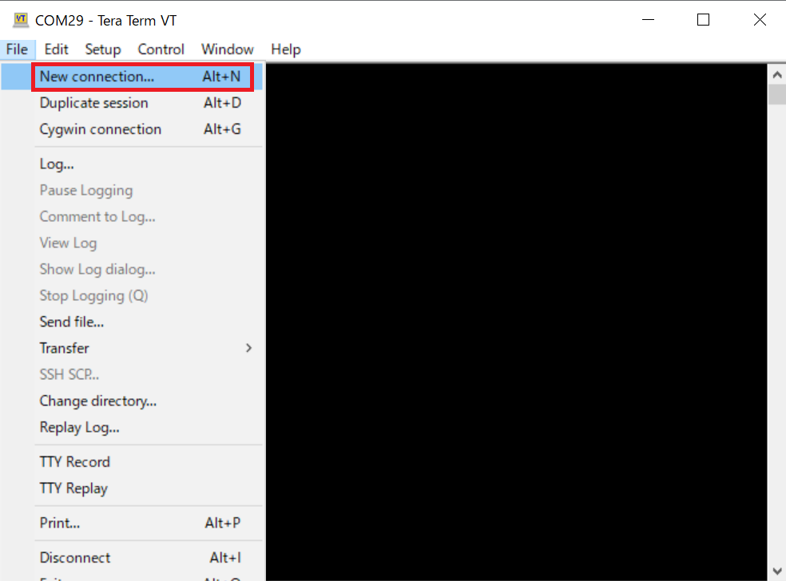
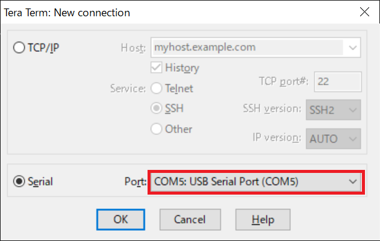
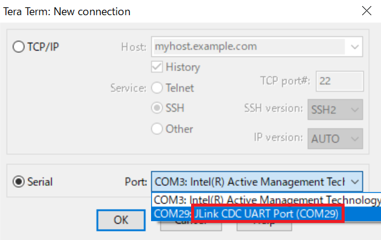
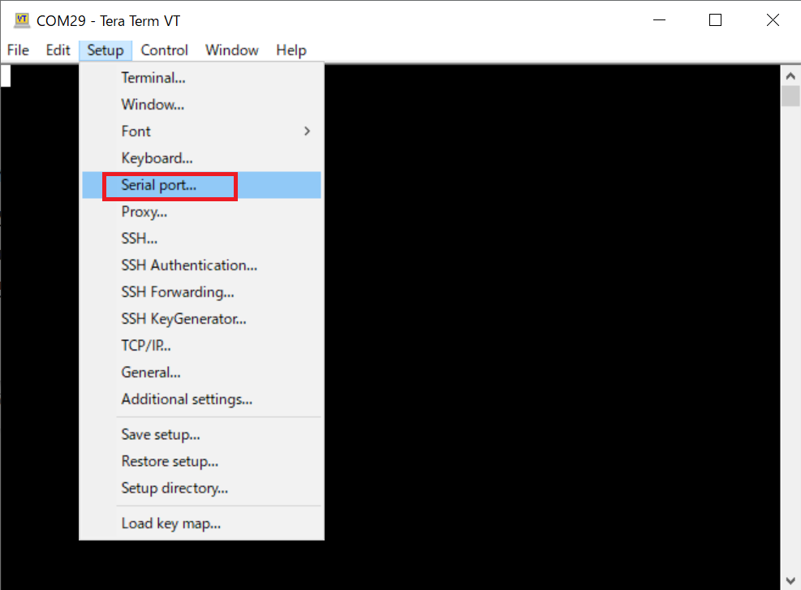
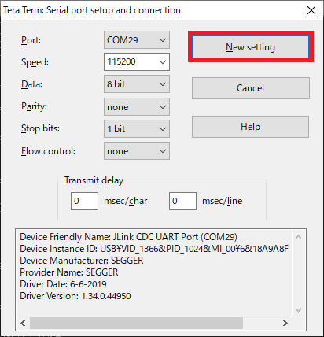

<h2 id="7.3.1">7.3.1 Setting for Windows 10</h2>

This chapter describes the procedure for setting the serial terminal fow Windows 10.  

1. Power on the target board.  
2. Launch Tera Term.  
3. Click [File] -> [New connection].

   

   
<h4 id="Figure7.3.1.1">Figure 7.3.1.1 Connection setting</h4>

  

4. Select the serial connection port for the target board in the Serial field. 
   The name of the serial connection port will vary depending on the target board, as shown below. 
   The COM number will vary depending on your Windows 10 PC environment.

   For the RZ/A3UL SMARC EVK board (QSPI version / Octal-SPI version): 
   USB Serial Port

   For the EK-RZ/A3M board: 
   JLink CDC UART Port

   

   
<h4 id="Figure7.3.1.2">Figure 7.3.1.2 Serial Port (RZ/A3UL SMARC EVK board)</h4>

  
   

   
<h4 id="Figure7.3.1.3">Figure 7.3.1.3 Serial Port (EK-RZ/A3M board)</h4>

5. Return to the main screen, click [Setup] -> [Serial port].  

   

   
<h4 id="Figure7.3.1.4">Figure 7.3.1.4 Serial port setting</h4>

  
  
6. Configure the serial port as shown below:

   Speed: 115200 
   Data: 8 bit 
   Parity: none 
   Stop bits: 1bit 
   Flow control: none  
   Transmit delay: 0msec/char, 0msec/line 

   After completing the settings, click [New setting] to reflect the changes.

   

   
<h4 id="Figure7.3.1.5">Figure 7.3.1.5 Serial port setting</h4>

