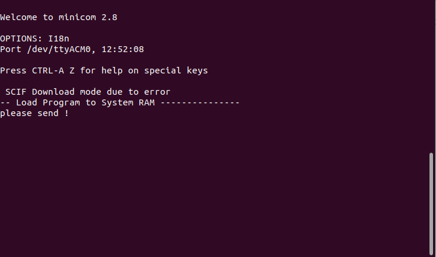
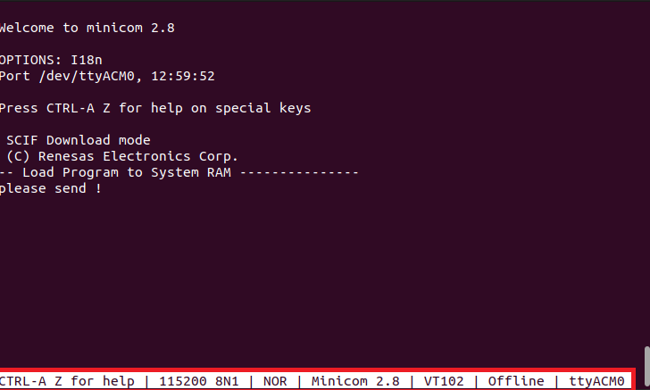
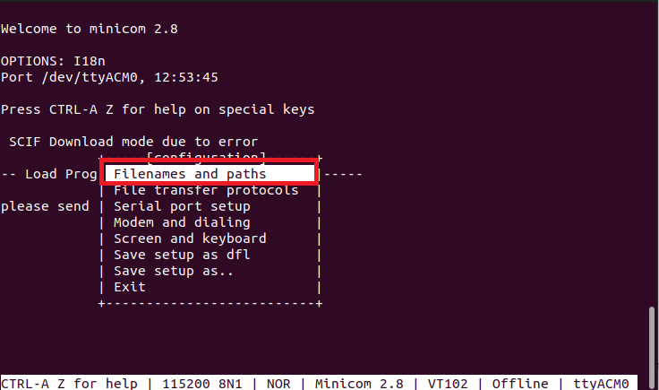
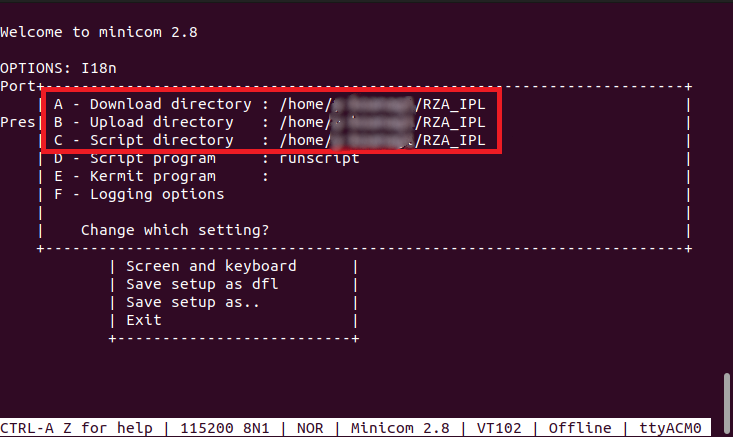
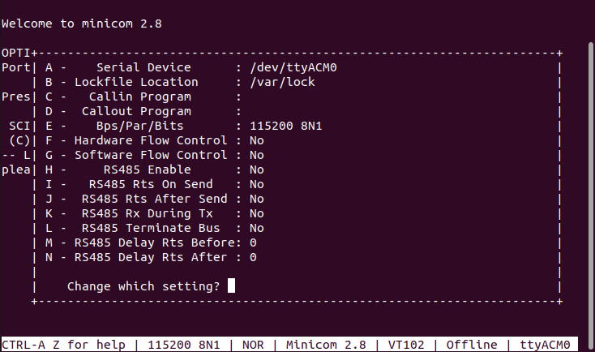
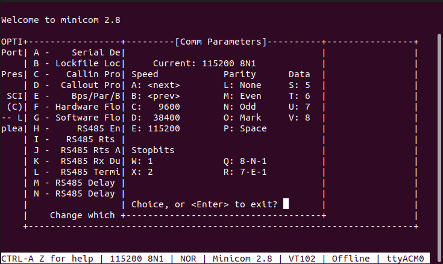
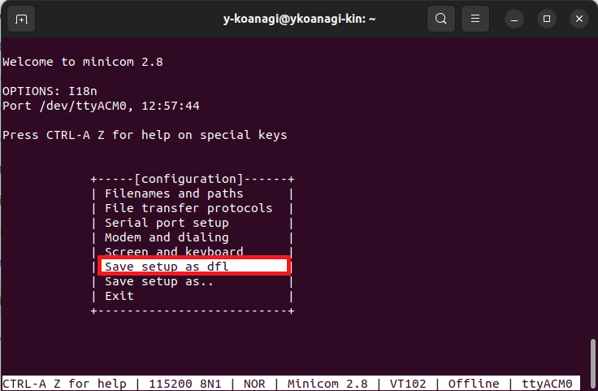

<h2 id="7.3.2">7.3.2 Setting for Ubuntu 22.04 LTS</h2>

This chapter describes the procedure for setting the serial terminal fow Ubuntu 22.04 LTS.  

1. Power on the target board.  
2. Execute the following command on the Terminal to start minicom. 
   [Serial port] will vary depending on the board you are using. 
   The last 'n' in the serial port is a number.  
   This number varies depending on the Ubuntu 22.04 LTS environment. 
    ```
    $ sudo minicom -D /dev/[Serial port]
    ```

   Serial port:  
   &emsp;For the RZ/A3UL SMARC EVK board (QSPI version / Octal-SPI version):<br>
   &emsp;ttyUSB'n'

   &emsp;For the EK-RZA3M board:<br>
   &emsp;ttyACM'n'


3. Start minicom.

   <center></center>

   <center><h4 id="Figure7.3.2.1">Figure 7.3.2.1 Start minicom</h4></center>

4. After minicom starts, first press 'ctrl' + 'A', then press 'Z'. 
   This will open a help menu at the bottom of the Terminal.

   <center></center>

   <center><h4 id="Figure7.3.2.2">Figure 7.3.2.2 Call help menu</h4></center>
  

5. Press the 'O' key to launch the configuration. 
   Then select [Filenames and paths] and press 'ENTER' to set the path to the folder containing the download files for the target board.

   <center></center>

   <center><h4 id="Figure7.3.2.3">Figure 7.3.2.3 Select Filnemae and paths</h4></center>
  
  
6. Register the paths to the folders containing the files to be sent to the target board in "Download directory", "Upload directory", and "Script directory".  
   You can edit by pressing the 'A', 'B', or 'C' keys corresponding to each item.  
   The image below is an example where files are saved in "/home/usr/RZA_IPL".  
   After registering the paths, press the 'esc' key to return to the previous screen.

   <center></center>

   <center><h4 id="Figure7.3.2.4">Figure 7.3.2.4 Register folder paths</h4></center>

7. Next, configure the serial port. 
   Select [Serial port setup] and press 'ENTER'.

   <center></center>

   <center><h4 id="Figure7.3.2.5">Figure 7.3.2.5 Select Serial port setup</h4></center>

8. Configure the serial port as shown below:  
   Each item can be edited by pressing the corresponding key.  
   Items A - D do not need to be changed.

   E - Bps/Par/Bits: 115200 8N1<br>
   F - Hardware Flow control: No <br>
   G - Software Flow control: No <br>
   H - RS485 Enable: No <br>
   I - RS485 Rts On Send: No <br>
   J - RS485 Rts After Send: No <br>
   K - RS485 Rx During Tx: No <br>
   L - RS485 Terminate Bus: No <br>
   M - RS485 Rts Delay Rts Before: 0 <br>
   N - RS485 Rts Delay Rts After: 0 <br>

   <center></center>

   <center><h4 id="Figure7.3.2.6">Figure 7.3.2.6 Setting serial port</h4></center>

   E - Press the 'E' key to open the settings screen for Bps/Par/Bits. 
   Press the 'E' and 'Q' keys on this screen to achieve the expected settings. 

   <center></center>

   <center><h4 id="Figure7.3.2.7">Figure 7.3.2.7 Setting Bps/Par/Bits</h4></center>

9. Return to the first screen and select [Save setup as dfl] to save the configuration.  
   Then select [Exit] to close the configuration.

   <center></center>

   <center><h4 id="Figure7.3.2.8">Figure 7.3.2.8 Save configuration</h4></center>
  
