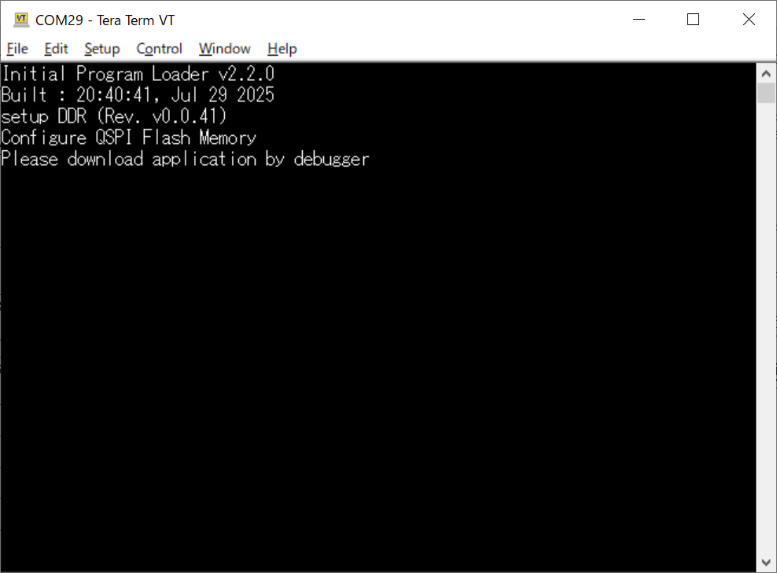
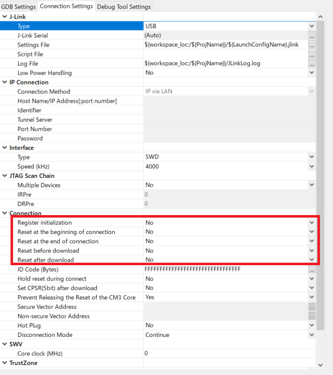
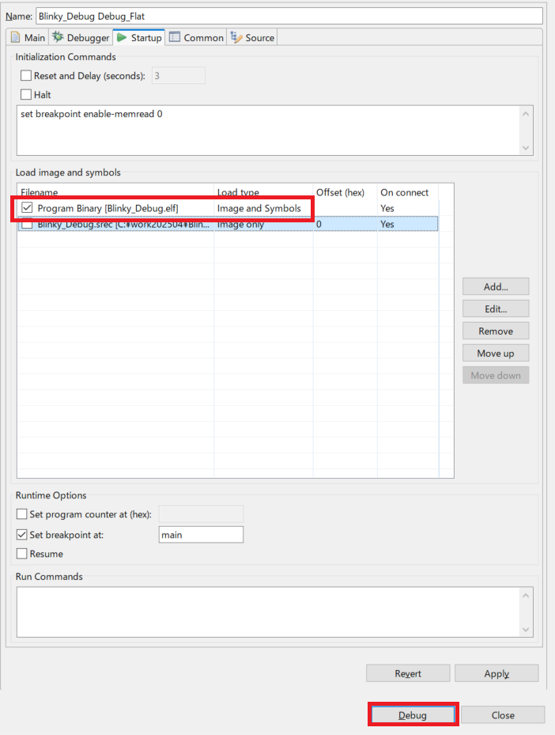
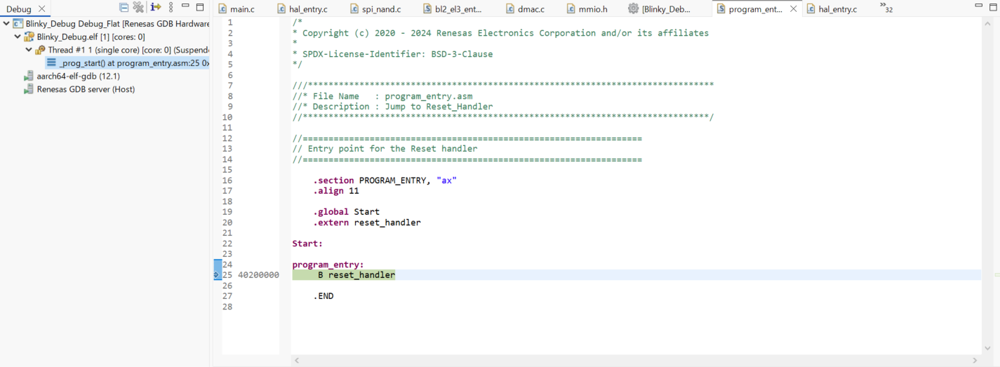

<h2 id="7.5">7.5 Execution procedure of IPL (Only init device mode)</h2>

This chapter explains how to executing IPL with Only init device mode.
Normal boot mode provides a device boot process that jumps to an application after initializing the device.

In Only init device mode, the IPL stops after initializing the device without jumping to the FSP application.
While the IPL is stopped, the FSP application can be downloaded to RAM and executed using e2 studio.
This means that when updating the FSP application for debugging, it can be debugged without writing to the serial flash memory.
As the number of writes to the serial NAND flash memory increases, memory degradation will occur, resulting in blocks that cannot be accessed correctly.
When debugging an FSP application in a serial NAND flash memory environment, it is recommended that you use this mode.

The procedure for executing IPL and FSP application is shown below.  
This explanation is a procedure for the RZ/A3UL SMARC Board (QSPI version).  
The explanation uses the project created in <a href="06. IPL build environment construction procedure.md#.6">Chapter 6</a> for this board.  
If you create a Debug configuration for other board, replace your environment with the ones used in this chapter.  
Also, the procedure is the same for both Windows 10 version and Ubuntu 22.04 LTS version.

1. Follow the steps in <a href="06. IPL build environment construction procedure.md#.6">Chapter 6</a> to build the IPL project.
   Be sure to specify "ONLY_INIT_DEVICE=1" as a make option when building to run in Only init device mode.  D
2. Write the generated Motorola S format file of IPL to the Serial Flash memory.  
   The writing method varies depending on the Serial Flash memory you are writing to.  
   See below for writing methods.  
   
   When using flash memory other than NAND Flash memory: 
   <a href="08.01.01 How to write IPL to Serial Flash memory using e2studio.md#8.1.1">chapter 8.1.1</a>

   When using NAND Flash memory: 
   <a href="08.01.02.01 How to write IPL to Serial Flash memory using Flashwriter for Windows 10.md#8.1.2.1">Chapter 8.1.2.1 (for Windows 10)</a>  
   <a href="08.01.02.02 How to write IPL to Serial Flash memory using Flashwriter for Ubuntu 22.04 LTS.md#8.1.2.2">Chapter 8.1.2.2 (for Ubuntu 22.04 LTS)</a>

3. Build the FSP application that IPL will boot.
   For how to build it, please refer to "Getting Started with RZ/A Flexible Software Package (R01AN6499EJ)".
4. Set the RZ/A3UL SMARC EVK board operating mode to Boot Mode3 (1.8-V Serial Flash Memory) and turn on the power.
   After the IPL runs and initializes the device, it outputs the message "Please download application by debugger" to the serial terminal and stops.
   
   

   
<h4 id="Figure7.5.1">Figure 7.5.1 IPL execution log</h4>

5. Refer to "Getting Started with RZ/A Flexible Software Package (R01AN6499EJ)" and launch the debugger configuration for the project built in step 3.  
   Then open the [Debugger]->[Connection Settings] tab and set all of the Reset settings shown below to No.

   [Register initialization] 
   [Reset at the beginning of connection] 
   [Reset at the end of connection] 
   [Reset before download] 
   [Reset after download] 

   

   
<h4 id="Figure7.5.2">Figure 7.5.2 Reset settings</h4>

6. Open the [Startup] tab of the debugger configuration, check only [Program Binary] and set the Load type to [Image and Symbols].  
   Then click [Debug] to launch the FSP application.

   

   
<h4 id="Figure7.5.3">Figure 7.5.3 Load image setting</h4>

   

   
<h4 id="Figure7.5.4">Figure 7.5.4 Launch FSP application</h4>

