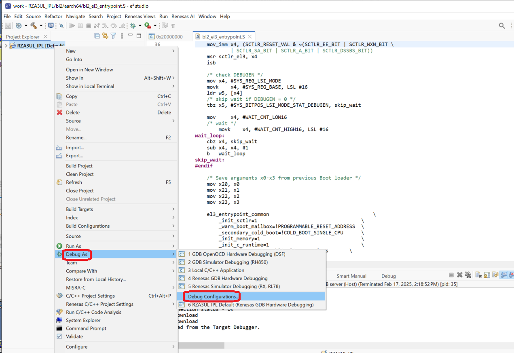
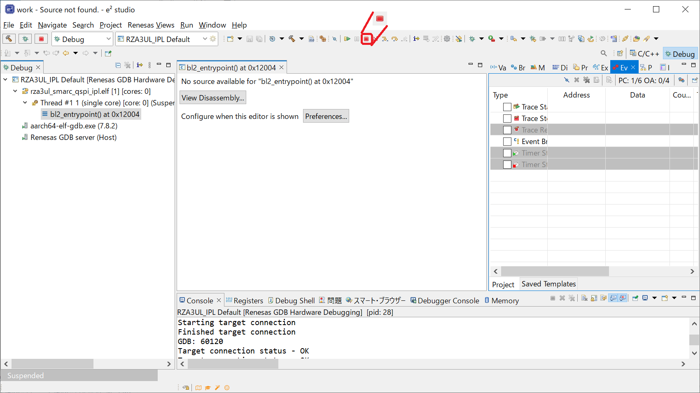
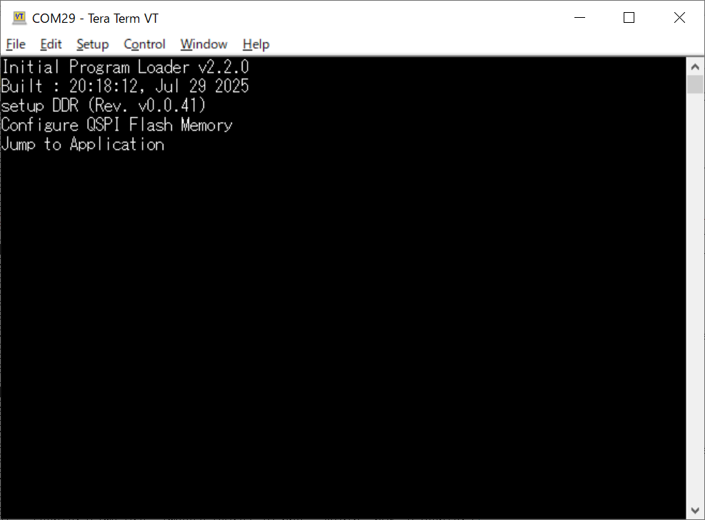

<h2 id="8.1.1">8.1.1 How to write IPL to Serial Flash memory using e2studio</h2>

This chapter explains how to write and run an IPL to Flash memory using e2 studio.
The procedure in this chapter cannot be used to write an IPL to NAND Flash memory.
Please refer to <a href="08.01.02 How to write IPL to Serial Flash memory using Flashwriter.md#8.1.2">Chapter 8.1.2</a> and subsections.

This explanation is a procedure for the RZ/A3UL SMARC Board (QSPI version).  
The explanation uses the project created in <a href="06. IPL build environment construction procedure.md#.6">Chapter 6</a> for this board.  
If you create a Debug configuration for other board, replace your environment with the ones used in this chapter.  

1. Set the RZ/A3UL SMARC EVK board operating mode to Boot Mode3 (1.8-V Serial Flash Memory) and turn on the power.  
2. Right-click on RZA3UL_IPL and select [Debug As] -> [Debug Configurations].  
   Then, open RZA3UL_IPL Default configuration to bring up the setting window.

   

   
<h4 id="Figure8.1.1.1">Figure 8.1.1.1 Change Debug Configuration of Serial Flash (1)</h4>

3. Go to the "Startup" tab and set "On connect" for "rza3ul_smarc_qspi_ipl.srec" to [Yes].  
   Also, set "On connect" in "Program Binary" to [No].  
   Then, click [Apply] to complete the setting, and click [Debug] to start the device connection.

   

   
<h4 id="Figure8.1.1.2">Figure 8.1.1.2 Change Debug Configuration of Serial Flash (2)</h4>

4. Writing to the Serial Flash memory is performed.  
   After the write is complete, the perspective for the debug control will be launched.

   

   
<h4 id="Figure8.1.1.3">Figure 8.1.1.3 Execution of IPL on Serial Flash memory (1)</h4>

5. If "Confirm Perspective Switch" is displayed during the launch of the perspective, press [Switch] button.

   

   
<h4 id="Figure8.1.1.4">Figure 8.1.1.4 Execution of IPL on Serial Flash memory (2)</h4>

6. After writing to the Serial Flash, click&nbsp;&nbsp;mark in the perspective to disconnect from the RZ/A3UL SMARC EVK board.  
   After that, press the RESET button on the RZ/A3UL SMARC EVK board to execute IPL.  
   At this time, IPL startup messages (<a href="#Figure8.1.1.6">Figure 8.1.1.6</a>) are output to the serial terminal.   
   
   The IPL behavior after the IPL startup messages are output varies depending on the operating mode and whether the FSP application has been written to the serial flash memory.
   <a href=#Figure8.1.1.7>Figure 8.1.1.7</a> shows the log when in Normal boot mode and the FSP application has been written to the serial flash memory.

   

   
<h4 id="Figure8.1.1.5">Figure 8.1.1.5 Execution of IPL (3)</h4>

   

   
<h4 id="Figure8.1.1.6">Figure 8.1.1.6 IPL startup messages</h4>

   

   
<h4 id="Figure8.1.1.7">Figure 8.1.1.7 FSP application running</h4>

