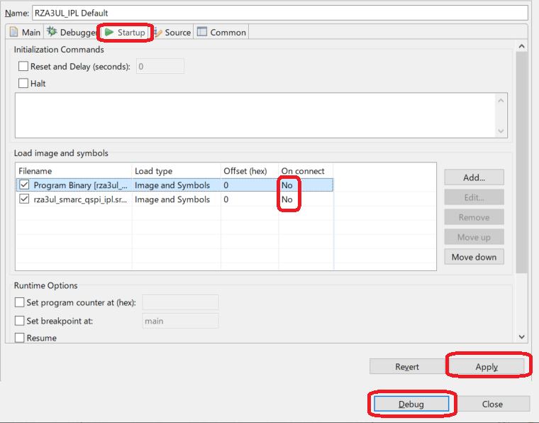
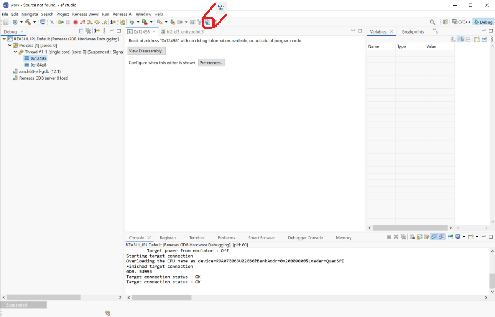
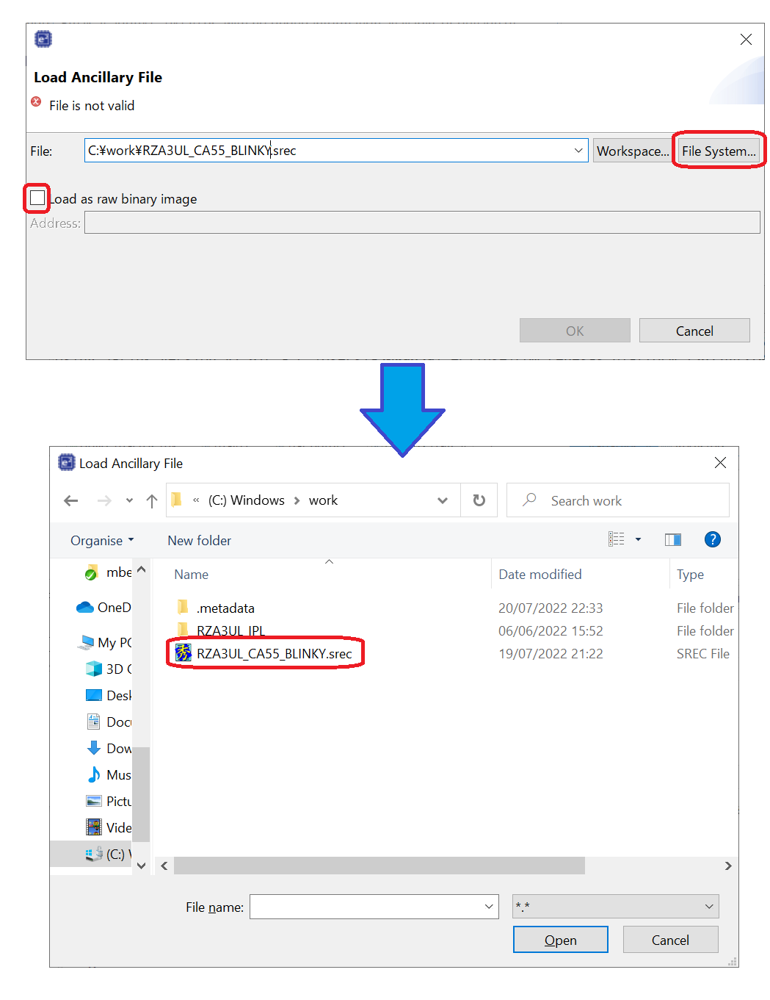
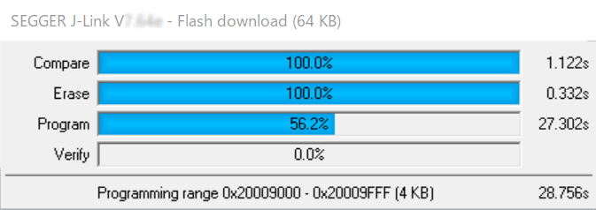
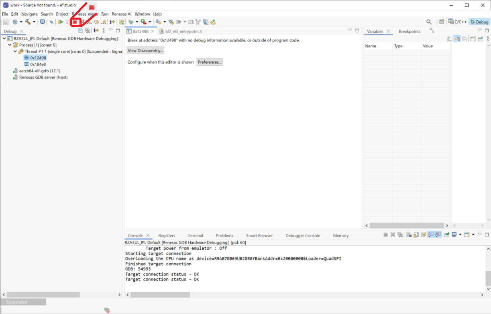

<h2 id="8.2.1">8.2.1 How to write FSP application to Serial Flash memory using e2studio</h2>

To debug IPL with Normal boot mode, it is necessary to write the FSP application to Flash memory.  
This chapter describes the procedure for writing the FSP application to Flash memory using e2 studio.  
The procedure in this chapter cannot be used to write an IPL to NAND Flash memory.  
Please refer to <a href="08.02.02 How to write FSP application to Serial Flash memory using Flashwriter.md#8.2.2">Chapter 8.2.2</a> and subsections.  

This explanation is procedure for the RZ/A3UL SMARC Board (QSPI version).  
The explanation uses the project created in <a href="06. IPL build environment construction procedure.md#.6">Chapter 6</a> for this board.  
If you create a Debug configuration for other board, replace your environment with the ones used in this chapter.  
Also, the procedure is the same for both Windows 10 version and Ubuntu 22.04 LTS version.

Refer to the Getting Started with RZ/A Flexible Software Package (R01AN6499EJ) for building the FSP application.  
This chapter shows an example of saving the FSP application binary file in C:\work.

1. Set the RZ/A3UL SMARC EVK board operating mode to Boot Mode3 (1.8-V Serial Flash Memory) and turn on the power.  
2. Right-click on RZA3UL_IPL and select [Debug As] -> [Debug Configurations].  
   Then, open RZA3UL_IPL Default configuration.

   

   
<h4 id="Figure8.2.1.1">Figure 8.2.1.1 Procedure of writing FSP application (1)</h4>

3. Edit Configuration will be launched.  
   Set the "On connect" of all registered images to [No], set the image not to be downloaded when connecting to the RZ/A3UL SMARC EVK board.  
   Then, click [Apply] to complete the setting, and click [Debug] to launch the program.

   

   
<h4 id="Figure8.2.1.2">Figure 8.2.1.2 Procedure of writing FSP application (2)</h4>

4. If "Confirm Perspective Switch" is displayed during the perspective launches, press [Switch] button.

   

   
<h4 id="Figure8.2.1.3">Figure 8.2.1.3 Procedure of writing FSP application (3)</h4>

5. The board is connected, and the perspective is launched.  
   Click Load Ancillary file&nbsp;&nbsp;.

   

   
<h4 id="Figure8.2.1.4">Figure 8.2.1.4 Procedure of writing FSP application (5)</h4>

6. The Load Ancillary File window will be launched.  
   Click [File System] and select C:\work\RZA3UL_CA55_BLINKY.srec.  
   Also, uncheck "Load as raw binary image".  
   Click [OK] to write to the Serial Flash memory.

   

   
<h4 id="Figure8.2.1.5">Figure 8.2.1.5 Procedure of writing FSP application (6)</h4>

   

   
<h4 id="Figure8.2.1.6">Figure 8.2.1.6 Procedure of writing FSP application (7)</h4>

7. After writing, click mark to disconnect from the RZ/A3UL SMARC EVK board.

   

   
<h4 id="Figure8.2.1.7">Figure 8.2.1.7 Procedure of writing FSP application (8)</h4>

