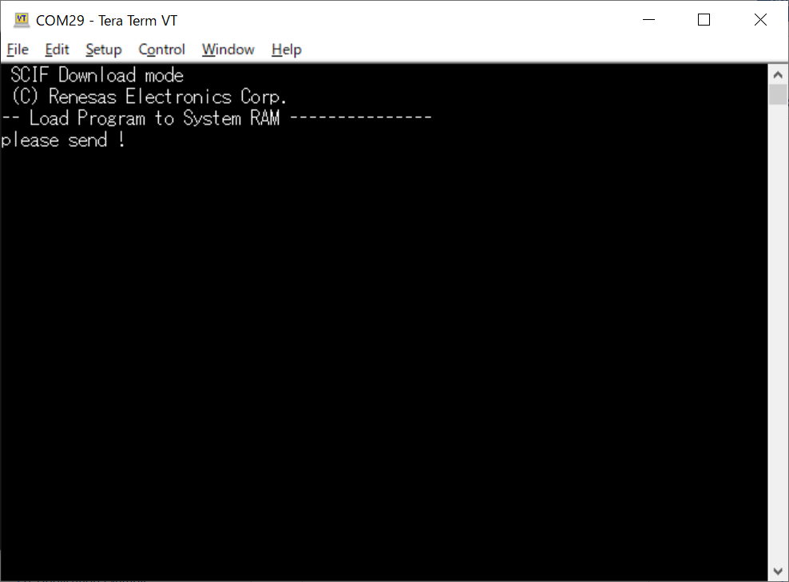
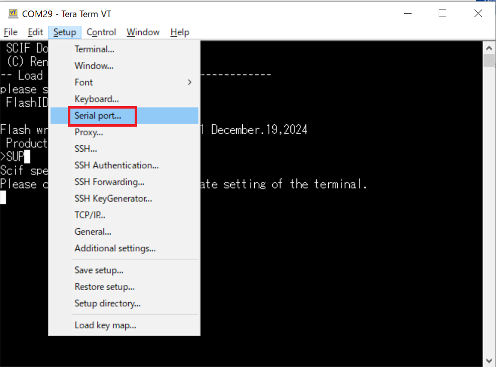
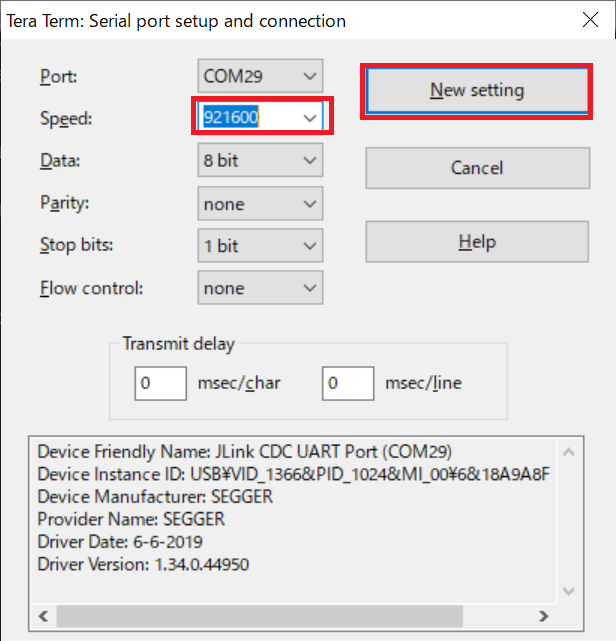
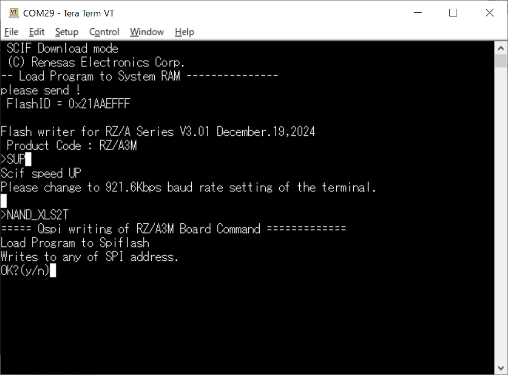
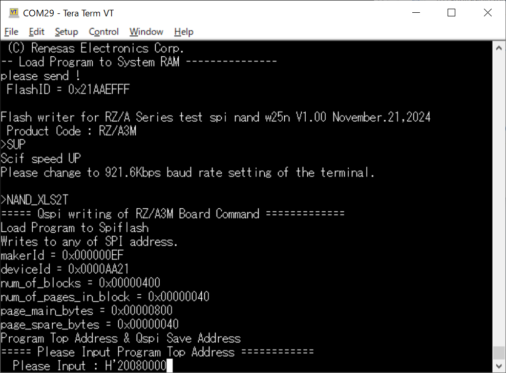
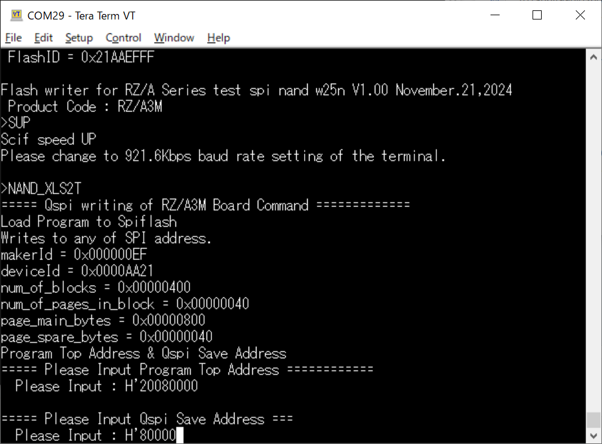
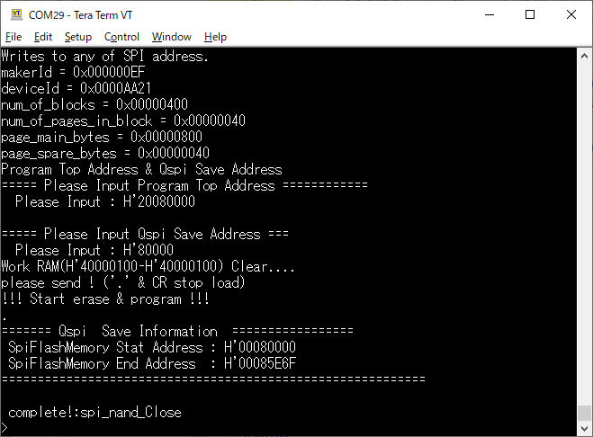
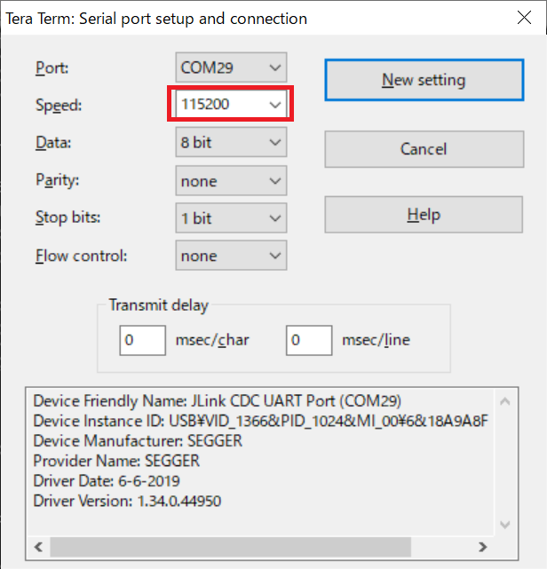

<h2 id="8.2.2.1">8.2.2.1 How to write FSP application to Serial Flash memory using Flashwriter for Windows 10</h2>

This is an explanation of the procedure for writing the FSP application to the EK-RZ/A3M Kit when using Tera Term as a serial terminal in Windows 10.

Refer to the Getting Started with RZ/A Flexible Software Package (R01AN6499EJ) for building the FSP application.  
This chapter explains that the generated srec file of the FSP application is named "Blinky_Debug.srec".

1. Set the EK-RZ/A3M main board operating mode to Boot Mode5 (SCIF download mode) and turn on the power.  
2. When the following message appears on Tera Term, drag and drop Flashwriter.

   

   
<h4 id="Figure8.2.2.1.1">Figure 8.2.2.1.1 Tera Term screen (1)</h4>

3. After Flash Writer starts, enter the SUP command.

   

   
<h4 id="Figure8.2.2.1.2">Figure 8.2.2.1.2 Tera Term screen (2)</h4>

4. After that, when "Scif Speed UP" is displayed on the teardown, click Setup->Serial port.
   Then, on the Serial port setup and connection screen that appears, change the Speed to [921600] and click [New setting].
   When you return to the Tera Term main screen, press the Enter key.

   

   
<h4 id="Figure8.2.2.1.3">Figure 8.2.2.1.3 Tera Term screen (3)</h4>

   

   
<h4 id="Figure8.2.2.1.4">Figure 8.2.2.1.4 Select Speed</h4>

5. Execute the "NAND_XLS2T" command.
   Enter "y" for "OK?(y/n)".

   

   
<h4 id="Figure8.2.2.1.5">Figure 8.2.2.1.5 Tera Term screen (4)</h4>

6. When "Please input Program Top Address" is displayed on Tera Term, enter the address where "Blinky_Debug.srec" will be written.
   To find the destination address for "Blinky_Debug.srec", open "Blinky_Debug.srec" and find the 8-digit number following "S315" on the second line.
   In the case of <a href="#Figure8.2.2.1.6">Figure8.2.2.1.6</a>, it is "20080000".  

   

   
<h4 id="Figure8.2.2.1.6">Figure 8.2.2.1.6 Address for writing FSP application </h4>

   

   
<h4 id="Figure8.2.2.1.7">Figure 8.2.2.1.7 Tera Term screen (5)</h4>

7. When "Please input Qspi Save Address" is displayed on Tera Term, enter the value obtained by subtracting "20000000" from the address entered in step 6.
   For "Blinky_Debug.srec", the value is "80000".  
   Then, press Enter.

   

   
<h4 id="Figure8.2.2.1.8">Figure 8.2.2.1.8 Tera Term screen (6)</h4>

8. When "please send!" is displayed on Tera Term, drag and drop "Blinky_Debug.srec".

9. Then, the IPL will be written to the NAND Flash memory, and "complete!:spi_nand_Close" will be displayed on Tera Term.

   

   
<h4 id="Figure8.2.2.1.9">Figure 8.2.2.1.9 Tera Term screen (7)</h4>

10. Follow the same steps as in step 6 to bring up the Serial port setup and connection screen.
    Then change the Speed to [115200].

   

   
<h4 id="Figure8.2.2.1.10">Figure 8.2.2.1.10 Tera Term screen (7)</h4>

