<h2 id="8.2.2.2">8.2.2.2 How to write FSP application to Serial Flash memory using Flashwriter for Ubuntu 22.04 LTS</h2>

This is an explanation of the procedure for writing the FSP application to the EK-RZ/A3M Kit when using minicom as a serial terminal in Ubuntu 22.04 LTS.

Refer to the Getting Started with RZ/A Flexible Software Package (R01AN6499EJ) for building the FSP application.  
This chapter explains that the generated srec file of the FSP application is named "Blinky_Debug.srec".

1. Set the EK-RZ/A3M main board operating mode to Boot Mode5 (SCIF download mode) and turn on the power.  
2. Execute the following command on the Terminal to start minicom. 
   The last 'n' in the serial port is a number.  
   This number varies depending on the Ubuntu 22.04 LTS environment. 
    ```
    $ sudo minicom -D /dev/ttyACM'n'
    ```

3. Once minicom has started up, press the reset button on the EK-RZ/A3M board to reset the board.  
   When the "please send!" message appears, first press 'ctrl' + 'A', then press 'Z'.  
   This will open a help menu at the bottom of the Terminal.

   <center></center>

   <center><h4 id="Figure8.2.2.2.1">Figure 8.2.2.2.1 Call help menu</h4></center>

4. Press the 'S' key to call Upload menu.  
   In the Upload menu, select [ascii] and press 'ENTER'.

   <center>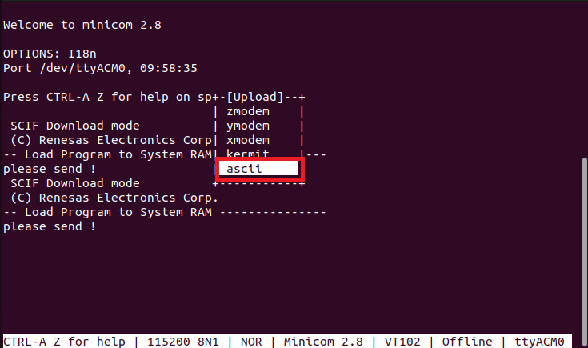</center>

   <center><h4 id="Figure8.2.2.2.2">Figure 8.2.2.2.2 Call upload menu</h4></center>

5. "Select a file for upload" will appear.  
   Use the arrow keys to select [Okay] and press 'ENTER'.   
   You will then be asked to enter the name of the file to upload, so enter the Flash Writer file name.

   <center>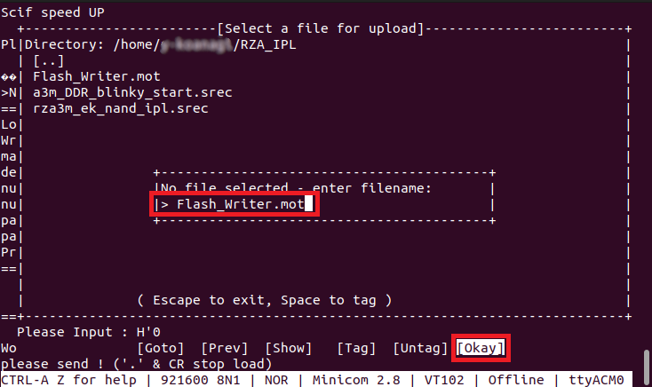</center>

   <center><h4 id="Figure8.1.2.3">Figure 8.2.2.2.3 Select upload file</h4></center>

6. "The Flash Writer transfer will be performed, and when it is complete, the message "READY: press any key to continue..." will be displayed, so press any key.

   <center>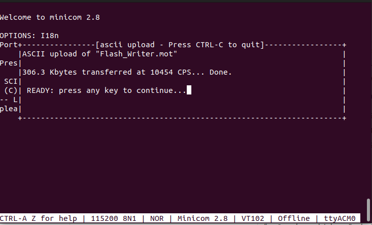</center>

   <center><h4 id="Figure8.1.2.4">Figure 8.2.2.2.4 File transfer</h4></center>

7. After Flash Writer starts, enter the SUP command.

   <center>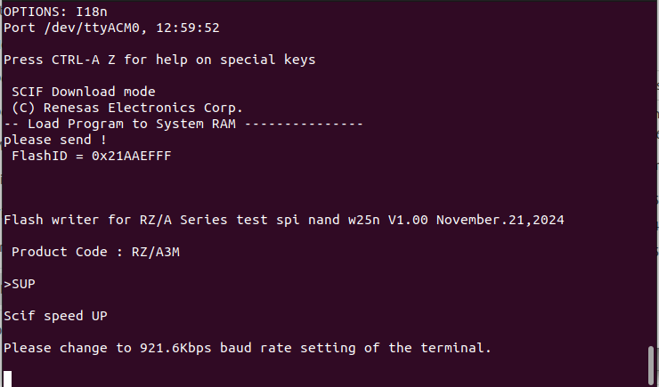</center>

   <center><h4 id="Figure8.2.2.2.5">Figure 8.2.2.2.5 Flash writer (1)</h4></center>

8. First press 'ctrl' + 'A', then press 'Z' to call help menu, and press the 'O' key to launch the configuration.  
   Then, select [Serial port setup] and press 'ENTER'.

   <center>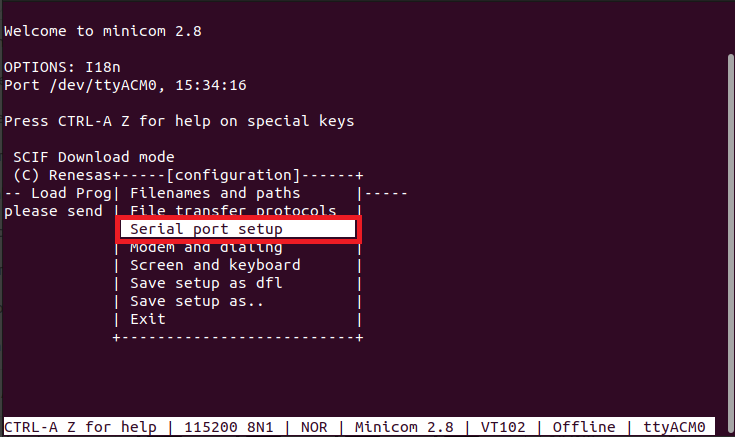</center>

   <center><h4 id="Figure8.2.2.2.6">Figure 8.2.2.2.6 Select Serial port setup</h4></center>

9. On the Serial port setup screen, press the 'E' key to move to the BPS/Par/Bits configuration screen.  
   In the BPS/Par/Bits configuration screen, pressing the 'A' key will switch to the baudrate setting.  
   Continue pressing the 'A' key until the baudrate reaches 921600.  
   After setting the baudrate, press the esc key to exit the configuration screen.  

   <center></center>

   <center><h4 id="Figure8.2.2.2.7">Figure 8.2.2.2.7 Serial port setup</h4></center>

   <center>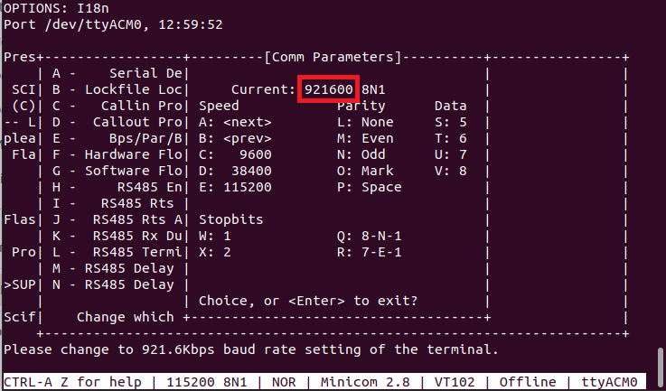</center>

   <center><h4 id="Figure8.2.2.2.8">Figure 8.2.2.2.8 Set baudrate</h4></center>

10. When you return to the Flash writer screen, execute the "NAND_XLS2T" command.
   Enter "y" for "OK?(y/n)".

   <center>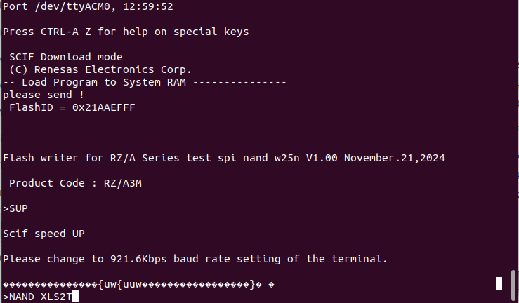</center>

   <center><h4 id="Figure8.2.2.2.9">Figure 8.2.2.2.9 Flash writer (2)</h4></center>

11. When "Please input Program Top Address" is displayed on Terminal, enter the address where "Blinky_Debug.srec" will be written.  
   To find the destination address for "Blinky_Debug.srec", open "Blinky_Debug.srec" and find the 8-digit number following "S315" on the second line.  
   In the case of <a href="#Figure8.2.2.2.10">Figure 8.2.2.2.10</a>, it is "20080000".

   <center>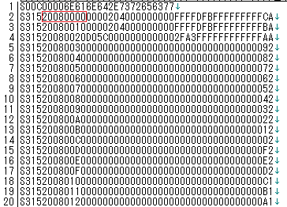</center>

   <center><h4 id="Figure8.2.2.2.10">Figure 8.2.2.2.10 Address for writing FSP application </h4></center>

   <center>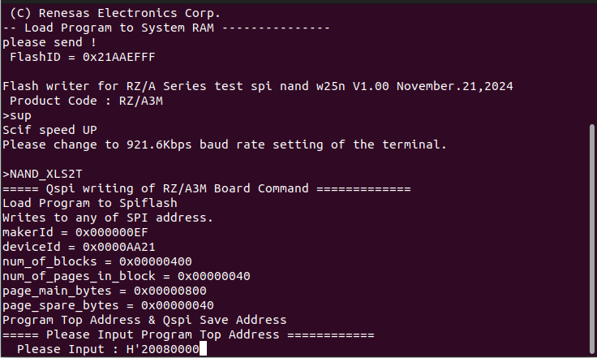</center>

   <center><h4 id="Figure8.2.2.2.11">Figure 8.2.2.2.11 Flash writer (4)</h4></center>

12. When "Please input Qspi Save Address" is displayed on Terminal, enter the value obtained by subtracting "20000000" from the address entered in step 6.
   For "Blinky_Debug.srec", the value is "80000". 
   Then, press Enter.

   <center>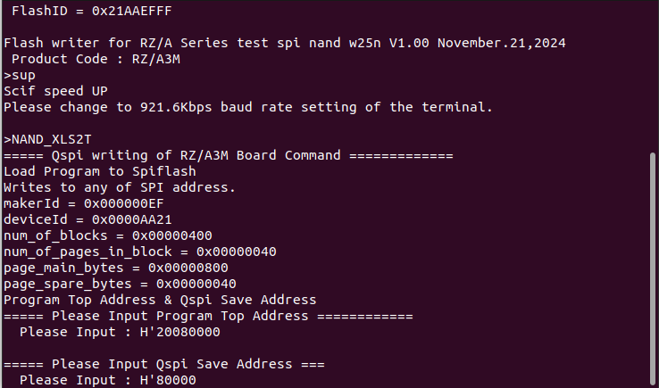</center>

   <center><h4 id="Figure8.2.2.2.12">Figure 8.2.2.2.12 Flash writer (5)</h4></center>

13. When "please send!" is displayed on terminal, Transfer the "Blinky_Debug.srec" to the board in the same way as steps 4 to 6.

14. Then, the IPL will be written to the NAND Flash memory, and "complete!:spi_nand_Close" will be displayed on Terminal.

   <center>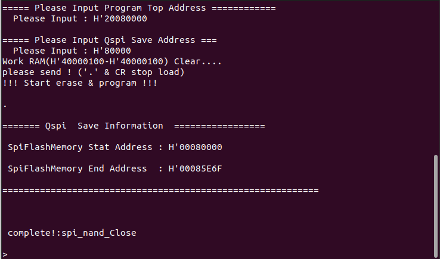</center>

   <center><h4 id="Figure8.2.2.2.13">Figure 8.2.2.2.13 Flash writer (6)</h4></center>

15. Follow the same steps as in step 8 and step 9 to set the baud rate back to 115200 bps.

16. 1Set the EK-RZ/A3M main board operating mode to Boot Mode7 (3.3-V Serial NAND Flash Memory) and reset the power.  
    At this time, IPL startup messages (<a href="#Figure8.2.2.2.14">Figure 8.2.2.2.14</a>) are output to the serial terminal.   
    
    The IPL behavior after the IPL startup messages are output varies depending on the operating mode and whether the FSP application has been written to the serial flash memory.

   <center></center>

   <center><h4 id="Figure8.2.2.2.14">Figure.8.2.2.2.14 IPL startup messages</h4></center>
>>>>>>> ISDRZAFSPDEV-3249_Create_applicationNote

