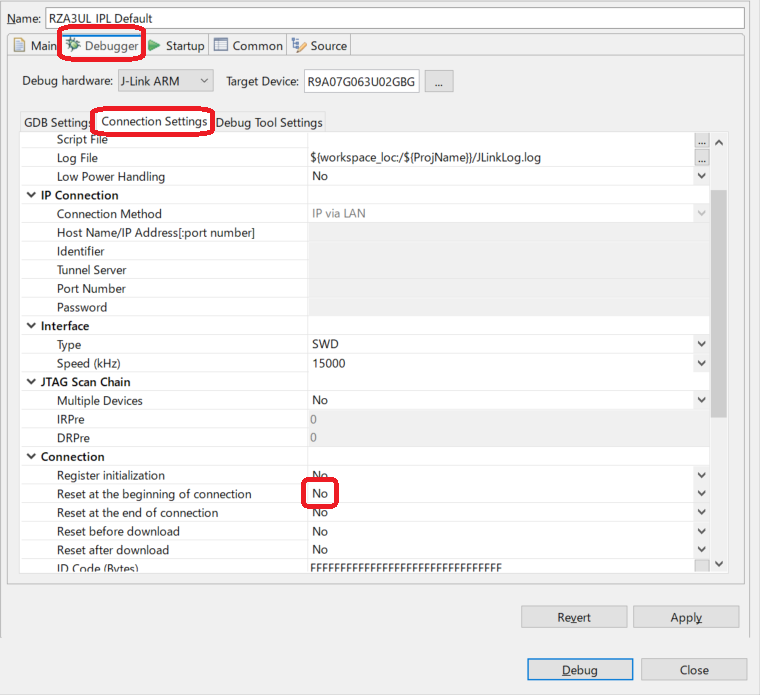
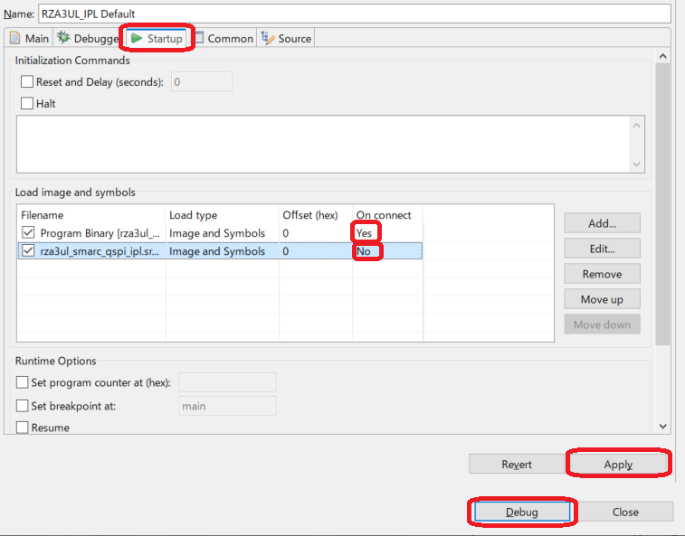
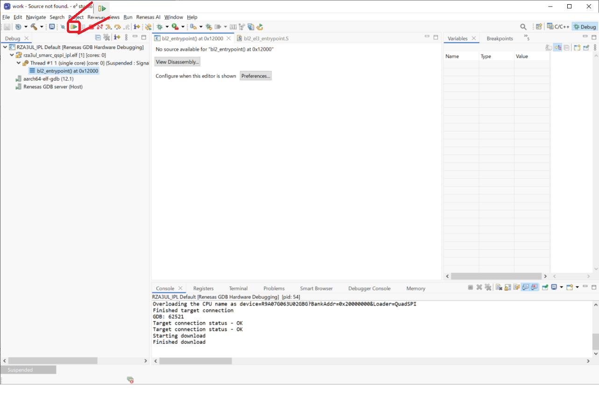
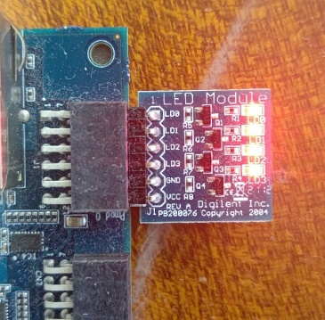

<h2 id="8.3">8.3 Execution procedure of IPL by On-chip RAM download</h2>

This chapter describes the procedure for writing and executing IPL to the On-chip RAM for the purpose of facilitating the operation check when customizing IPL.  
This explanation is procedure for the RZ/A3UL SMARC Board (QSPI version).  
The explanation uses the project created in <a href="06. IPL build environment construction procedure.md#.6">Chapter 6</a> for this board.  
If you create a Debug configuration for other board, replace your environment with the ones used in this chapter.  
Also, the procedure is the same for both Windows 10 version and Ubuntu 22.04 LTS version.

1. As the FSP application must be written to the Serial Flash memory to confirm the boot operation by IPL, if the FSP application is not written to the Serial Flash memory, write it.  
   For the write procedure, refer to <a href="08.02 Procedure for writing the FSP application to Serial Flash memory.md#8.2"> 8.2 Procedure for writing the FSP application to Serial Flash memory</a>.  
2. Set the RZ/A3UL SMARC EVK board operating mode to Boot Mode3 (1.8-V Serial Flash Memory) and turn on the power.  
3. Right-click on RZA3UL_IPL and select [Debug As] -> [Debug Configurations].  
   Then, open RZA3UL_IPL Default configuration.

   

   
<h4 id="Figure8.3.1">Figure 8.3.1 Change Debug Configuration of On-chip RAM (1)</h4>

4. Go to the "Debugger" -> "Connection Settings" tab and set " Reset at the beginning of connection" to [No].

   

   
<h4 id="Figure8.3.2">Figure 8.3.2 Change Debug Configuration of On-chip RAM (2)</h4>

5. Go to the "Startup" tab and set "On connect" for "Program Binary" to [Yes].  
   Also, set "On connect" in "rza3ul_smarc_qspi_ipl.srec" to [No].  
   Then, click [Apply] to complete the setting, and click [Debug] to launch the program.  
   This will bring up a perspective for the debug control.

   

   
<h4 id="Figure8.3.3">Figure 8.3.3 Change Debug Configuration of On-chip RAM (3)</h4>

6. Click&nbsp;&nbsp;mark in the perspective to perform IPL.  
   IPL will start executing and the log shown in <a href="#Figure8.3.5">Figure 8.3.5</a> will be displayed in the terminal.  
   At this time, the FSP application written on the Serial Flash memory starts, and the LED of the RZ/A3UL SMARC EVK board blinks as shown in <a href="#Figure8.3.6">Figure 8.3.6</a>.

   

   
<h4 id="Figure8.3.4">Figure 8.3.4 Execution of IPL (4)</h4>

   

   
<h4 id="Figure8.3.5">Figure 8.3.5 IPL execution log</h4>

   

   
<h4 id="Figure8.3.6">Figure 8.3.6 LED blinking</h4>

