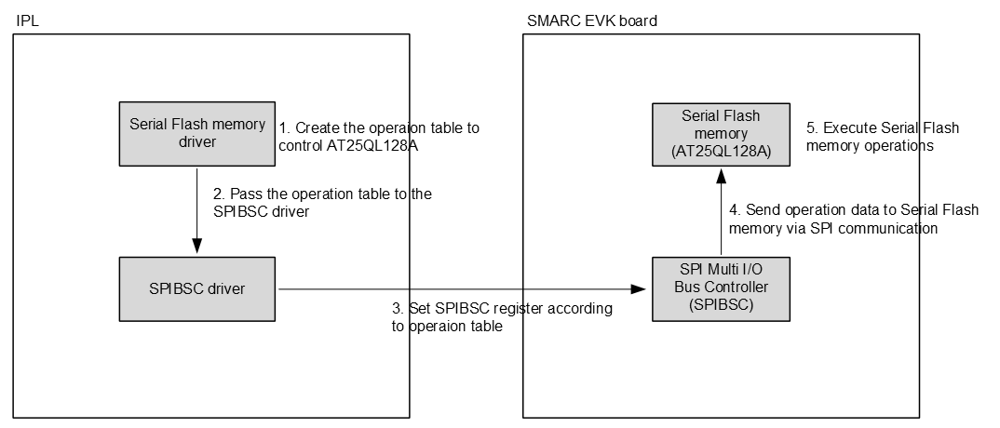
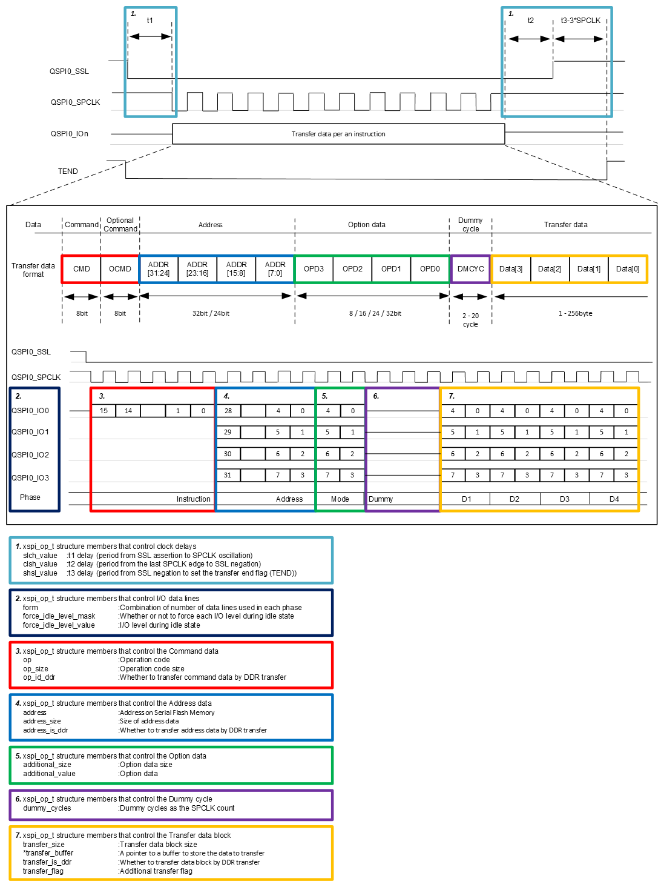
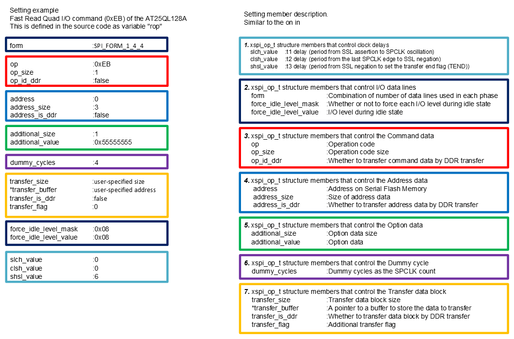
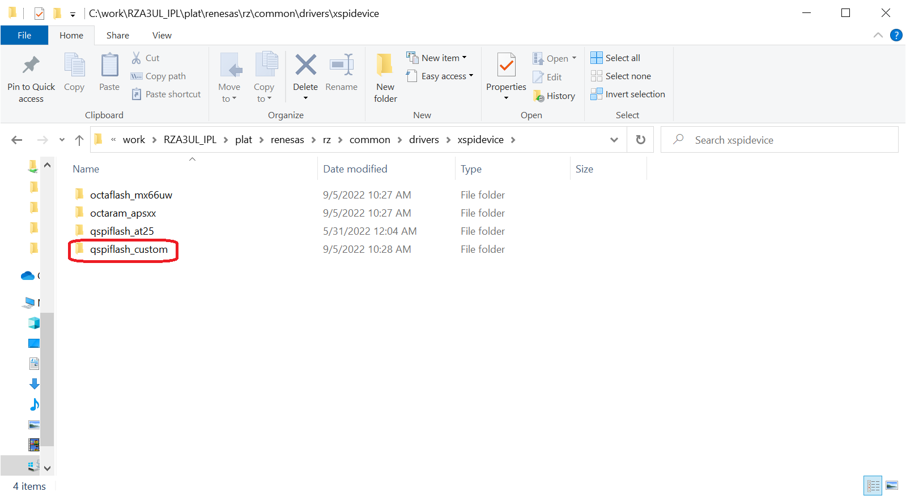
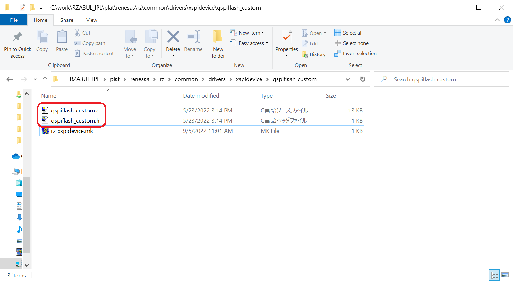
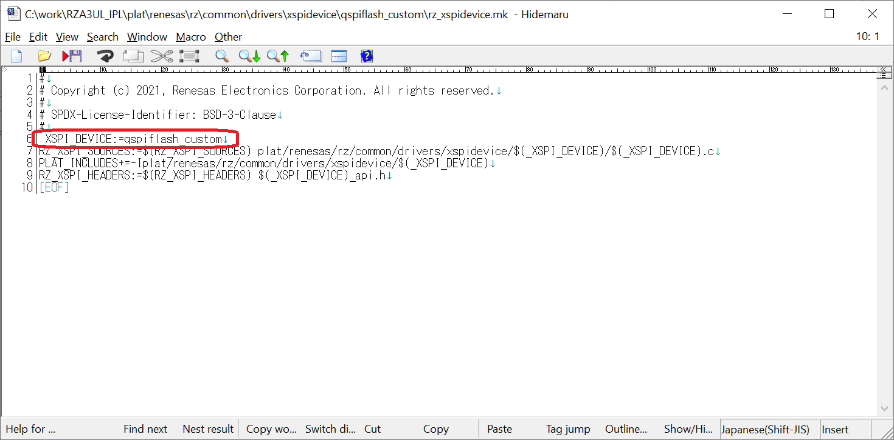
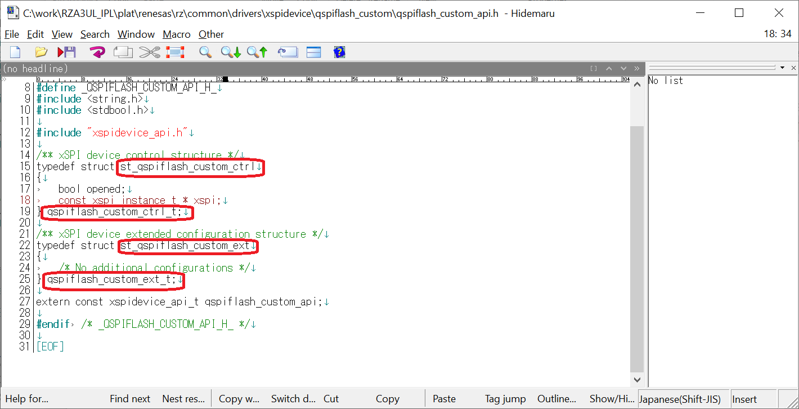
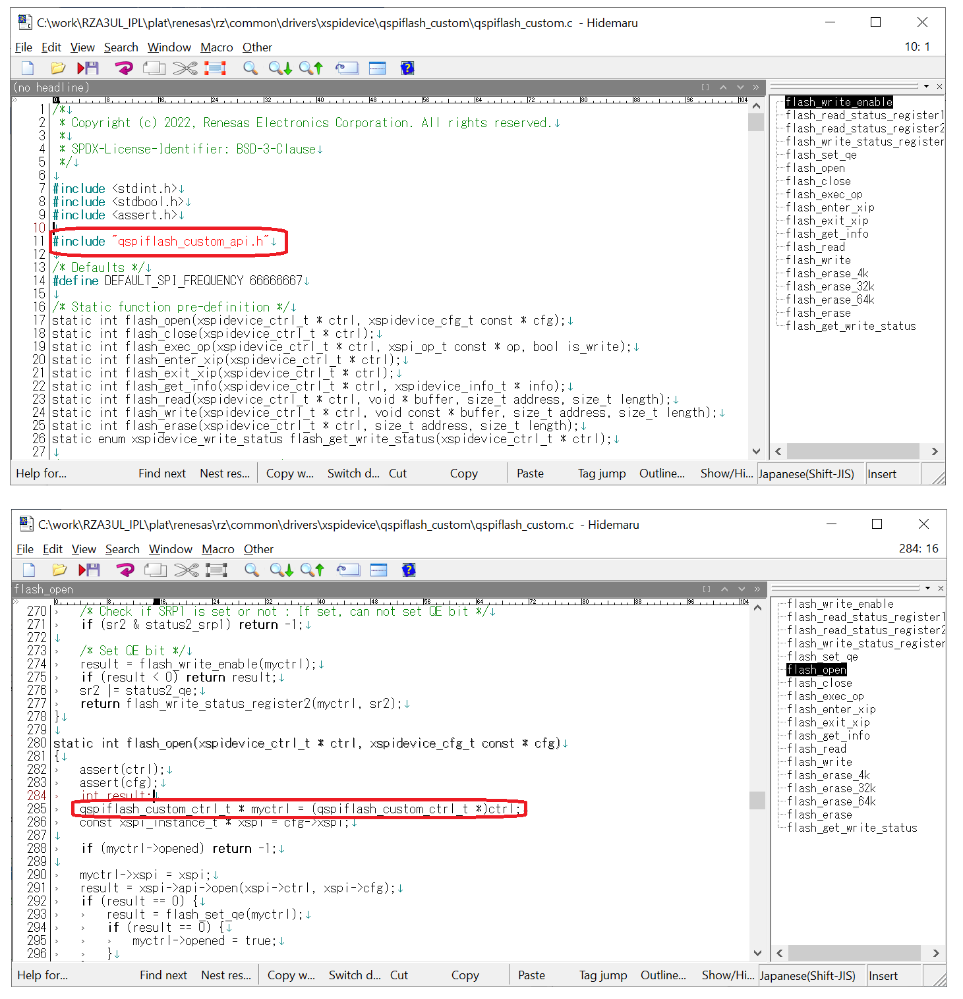

<h3 id="8.4.1">8.4.1 How to customize IPL for your Serial Flash memory</h3>

This chapter shows how to customize IPL environment for AT25QL128A to the user's environment, as a representative example of how to customize IPL to suit serial flash memory.  
Even if you use OctaFlash / OctaRAM, you can modify the OctaFlash driver / OctaRAM driver according to the customization method described in this chapter to make IPL compatible with your environment.  

First, the method of controlling the Serial Flash memory in IPL is shown.

IPL is implemented with the Serial Flash memory driver and SPIBSC driver to control the Serial Flash memory.  
The Serial Flash memory driver manages the execution of operations of the Serial Flash memory.  
SPIBSC driver is a driver for controlling serial communication between RZ/A3 and Serial Flash memory.

The Serial Flash memory driver creates an operation table consisting of parameters for executing Serial Flash memory operations and passes it to SPIBSC driver.  
SPIBSC driver controls HW according to the operation table passed as an argument from the Serial Flash memory driver and performs serial communication.  
Since the Serial Flash memory driver is a Serial Flash memory-dependent implementation, it must be changed according to your Serial Flash memory.  
On the other hand, SPIBSC driver implementation does not rely on Serial Flash memory.  
Therefore, there is no need to change even when changing the Serial Flash memory.  

   <a href="#Figure8.4.1.1">Figure 8.4.1.1</a> shows the operation image diagram of each driver.

   

   
<h4 id="Figure8.4.1.1">Figure 8.4.1.1 Operating image of Serial Flash memory driver and SPIBSC driver</h4>

1. The Serial Flash memory driver creates an operation table corresponding to your memory.  
2. The Serial Flash memory driver calls SPIBSC driver.  
At this time, the operation table is passed to SPIBSC driver.  
3. SPIBSC driver sets SPIBSC register according to the received operation table parameters.  
4. SPIBSC performs serial communication with the Serial Flash memory according to the settings made in step3 and sends operation data to the Serial Flash memory.  
5. The Serial Flash memory controls itself according to the received operation data.  

   <a href="#Figure8.4.1.2">Figure 8.4.1.2</a> shows the relationship between operation table parameters and transfer formats.  
   As an example of an operation table, <a href="#Figure8.4.1.3">Figure 8.4.1.3</a> shows AT25QL128A read command operation table setting values.

   

   
<h4 id="Figure8.4.1.2">Figure 8.4.1.2 Correspondence between the member of xspi_op_t structure and the transfer format</h4>

   

   
<h4 id="Figure8.4.1.3">Figure 8.4.1.3 Setting example of parameters corresponding to transfer format</h4>

   In the case of OctaFlash / OctaRAM, it works in the same way, just by replacing the peripherals and drivers used with those below.
   * SPIBSC ---> Octa Memory controller
   * Serial Flash memory driver ---> OctaFlash driver / OctaRAM driver
   * SPIBSC driver ---> Octa Memory controller driver

Next, shows how to add the Serial Flash memory driver for the Serial Flash memory on the custom board.

1. Open the "c:\work\RZA3UL_IPL\plat\renesas\rz\common\drivers\xspidevice" folder, copy the "qspiflash_at25" folder and rename it to any name.  
   From step2 onwards, the user will change the file name and structure name to correspond to the folder name decided in this step.  
   This time, rename the folder name to "qspiflash_custom".

   

   
<h4 id="Figure8.4.1.4">Figure 8.4.1.4 Rename Serial Flash memory driver foldert</h4>

2. Open "qspiflash_custom" folder and change "qspiflash_at25.c", "qspiflash_at25_api.h" to "qspiflash_custom.c", "qspiflash_custom_api.h".

   

   
<h4 id="Figure8.4.1.5">Figure 8.4.1.5 Rename Serial Flash memory driver files</h4>

3. Open "rz_xspidevice.mk" and change "_XSPI_DEVICE:=qspiflash_at25" on line 6 to "_XSPI_DEVICE:=qspiflash_custom".

   

   
<h4 id="Figure8.4.1.6">Figure 8.4.1.6 Change Serial Flash memory driver Makefile</h4>

4. Open "qspiflash_custom_api.h" and replace all structure definitions of "xx_qspiflash_at25_xx" with "xx_qspiflash_custom_xx".

   

   Note:  
   The qspiflash_custom_ext_t structure is for extended settings.  
   If the members corresponding to the parameters required for your Serial Flash memory are not provided in the qspiflash_custom_t structure, add those members as extended settings.

   
<h4 id="Figure8.4.1.7">Figure 8.4.1.7 Change Serial Flash memory driver structs name</h4>

5. Open qspiflash_custom.c and replace the included header with "qspiflash_custom_api.h".  
   Also, reflect the structure name replaced in step 4.

   

   
<h4 id="Figure8.4.1.8">Figure 8.4.1.8 Change Serial Flash memory driver source code</h4>

6. Change the implementation of API functions in <a href="#Table 8.4.1.1">Table 8.4.1.1</a> and Sub functions in <a href="#Table 8.4.1.2">Table 8.4.1.2</a> according to your Serial Flash memory.  
   <a href="08.04.01.01 flash_open.md#8.4.1.1">8.4.1.1</a> to <a href="08.04.01.14 flash_erase_4k_flash_erase_32k_flash_erase_64k.md#8.4.1.14">8.4.1.14</a> show the specifications of each function implemented in the default IPL and the change points when changing the Serial Flash memory.  
   Please refer to these and change the implementation of each function.

<h4 id="Table 8.4.1.1">Table 8.4.1.1 API Function</h4>

| Function Name | Description |
|----|----|
| flash_open | Serial Flash memory driver open function |
| flash_close | Serial Flash memory driver close function |
| flash_exec_op | Serial Flash memory driver operation function |
| flash_enter_xip | Serial Flash memory driver External Space Address Read Mode start function |
| flash_exit_xip | Serial Flash memory driver External Space Address Read Mode stop function |
| flash_read | Serial Flash memory driver read function |
| flash_write | Serial Flash memory driver write function |
| flash_erase | Serial Flash memory driver erase function |
| flash_get_write_status | Serial Flash memory driver write status get function |
| flash_get_logical_address | Get physical address of the Serial NAND Flash memory |

<h4 id="Table 8.4.1.2">Table 8.4.1.2 Sub Function</h4>

| Function Name | Description |
|----|----|
| flash_write_enable | Set write enable to Serial Flash memory |
| flash_read_status_register1 | Read lower 8bit of status register of the Serial Flash memory |
| flash_read_status_register2 | Read higher 8bit of status register of the Serial Flash memory |
| flash_write_status_register2 | Write higher 8bit of status register of the Serial Flash memory |
| flash_set_qe | Set Quad Enable bit of status register of the Serial Flash memory |
| flash_erase_4k | Erase the Serial Flash memory in units of 4-Kbytes |
| flash_erase_32k | Erase the Serial Flash memory in units of 32-Kbytes |
| flash_erase_64k | Erase the Serial Flash memory in units of 64-Kbytes |

7. Add the added Serial Flash memory driver to the board settings.  
   Refer to <a href="08.04.02 How to add a setting for a board on which your Serial Flash memory is mounted.md#8.4.2">Chapter 8.4.2</a> for how to add.
