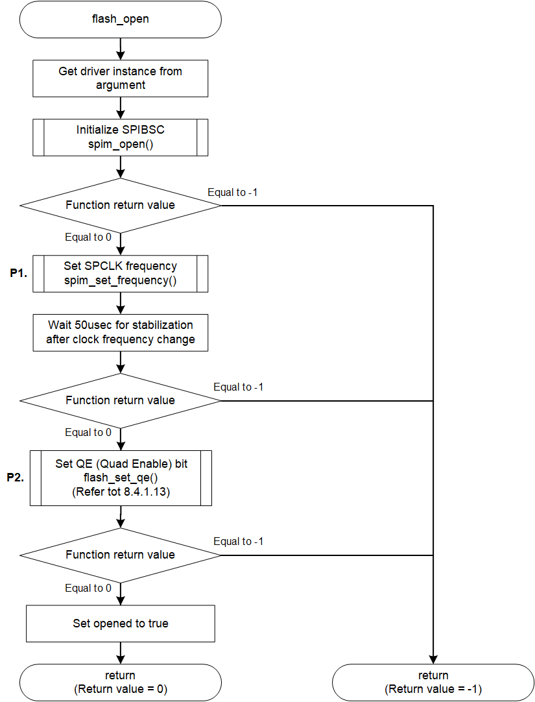
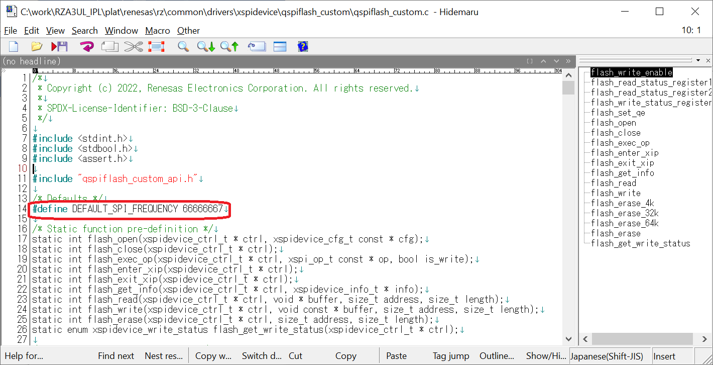

<h3 id="8.4.1.1">8.4.1.1 flash_open</h3>

flash_open() is a function that initializes the Serial Flash memory so that it can be accessed.

This chapter shows an example of implementing the initialization process to access the AT25QL128A mounted on the RZ/A3UL SMARC EVK board.

<table>
<colgroup>
<col style="width: 16%" />
<col style="width: 83%" />
</colgroup>
<thead>
<tr>
<th colspan="2">flash_open</th>
</tr>
</thead>
<tbody>
<tr>
<td>Outline</td>
<td>Initialize the Serial Flash memory</td>
</tr>
<tr>
<td>Declaration</td>
<td>int flash_open (xspidevice_ctrl_t * ctrl, xspidevice_cfg_t const * cfg)</td>
</tr>
<tr>
<td>Description</td>
<td>
- Set SPCLK frequency 
- Set the Serial Flash memory registers and access settings for the Serial Flash memory 
- Set opened flag
</td>
</tr>
<tr>
<td>Arguments</td>
<td>
*ctrl : Pointer to xSPI device control structure 
*cfg : Pointer to xSPI device configure structure
</td>
</tr>
<tr>
<td>Return value</td>
<td>0 : Initialization is complete 
-1 : Initialization is failed</td>
</tr>
<tr>
<td>Note</td>
<td>-</td>
</tr>
</tbody>
</table>

<a href="#Figure8.4.1.1.1">Figure 8.4.1.1.1</a> shows a flowchart of the flash_open() implementation in the default IPL.

The processing that changes the implementation when changing the Serial Flash memory is shown below.

* P1 Clock frequency setting change
* P2 Serial Flash memory register setting

These are shown as P1, P2 in the flow chart as implementation change points. 
The details of the processing are explained after the flow chart.

<h4 id="Figure8.4.1.1.1">Figure 8.4.1.1.1 Flowchart of flash_open</h4>

### P1. Clock Frequency setting change

flash_open sets the operating clock frequency of the Serial Flash memory.  
The defined value of DEFAULT_SPI_FREQUENCY in L14 of qspiflash_custom.c shown in <a href="#Figure8.4.1.1.2">Figure 8.4.1.1.2</a> is used for the operating clock frequency.  
Set this define value to the optimum value for your Serial Flash memory.  
The maximum value that can be set is 100000000 (100MHz) and the minimum value is 3125000 (3.125MHz).

<h4 id="Figure8.4.1.1.2">Figure 8.4.1.1.2 Change operation clock frequency</h4>

### P2. Serial Flash memory register setting

In AT25QL128A, QE bit of Status Register shown in <a href="#Table8.4.1.1.1">Table 8.4.1.1.1</a> must be set to enable Quad operation.  
The QE bit of the Status Register is set by the subfunction flash_set_qe() function.  
Refer to <a href="08.04.01.13 flash_set_qe.md#8.4.1.13">8.4.1.13</a> when changing the QE bit setting method.

<h4 id="Table8.4.1.1.1">Table 8.4.1.1.1 QE bit of AT25QL128A Status Register (BIT15 - BIT8)</h4>

| BIT15 | BIT14 | BIT13 | BIT12 | BIT11 | BIT10 | BIT9 | BIT8 |
|----|----|----|----|----|----|----|----|
| SUS | CMP | - | - | - | - | <strong> QE </strong> | SRP1 |
| Suspend Status | Complement Protect | Reserved | Reserved | Reserved | Reserved | <strong> Quad Enable </strong> | Register Protect1 |

The settings required for initialization differ depending on your Serial Flash memory.  
Set the Serial Flash memory registers according to the specifications.  
In particular, most Serial Flash memories require dummy cycle settings for initialization. (No setting required for AT25QL128A)  
For Serial Flash memory that requires dummy cycle setting, create a sub function to set the dummy cycle.  
Then refer to P2 and implement the setting to the register in that function.  
