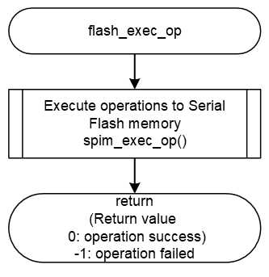

<h3 id="8.4.1.3">8.4.1.3 flash_exec_op</h3>

flash_exec_op() is a function to send operation information to be executed by Serial Flash memory.  >
This section shows an example of implementing the initialization process to send operation data to the AT25QL128A mounted on the RZ/A3UL SMARC EVK board.

This function is called to send operation data with the following function.
* flash_write()
* flash_write_enable()
* flash_read_status_register1()
* flash_read_status_register2()
* flash_write_status_register2()
* flash_erase_4k()
* flash_erase_32k()
* flash_erase_64k()

<table>
<colgroup>
<col style="width: 16%" />
<col style="width: 83%" />
</colgroup>
<thead>
<tr>
<th colspan="2">flash_exec_op</th>
</tr>
</thead>
<tbody>
<tr>
<td>Outline</td>
<td>Execute operation to Serial Flash memory</td>
</tr>
<tr>
<td>Declaration</td>
<td>void flash_exec_op (xspidevice_ctrl_t * ctrl, xspi_op_t const * op, bool is_write)</td>
</tr>
<tr>
<td>Description</td>
<td>- Pass operation table *op to spim_exec_op() to transfer operation data</td>
</tr>
<tr>
<td>Arguments</td>
<td>
*ctrl : Pointer to xSPI device control structure 
*op : Pointer to xSPI interface operation structure 
is_write : Specifies the transmission/reception direction of the operation 
(0=read, 1=write)
</td>
</tr>
<tr>
<td>Return value</td>
<td>0 : Execute the operation is complete 
-1 : Execute the operation is failed</td>
</tr>
<tr>
<td>Note</td>
<td>-</td>
</tr>
</tbody>
</table>

<a href="#Figure8.4.1.3.1">Figure 8.4.1.3.1</a> shows a flowchart of the flash_exec_op() implementation in the default IPL.

<h4 id="Figure8.4.1.3.1">Figure 8.4.1.3.1 Flowchart of flash_exec_op</h4>

