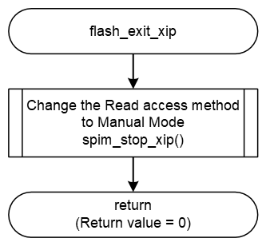

<h3 id="8.4.1.5">8.4.1.5 flash_exit_xip</h3>

flash_exit_xip() is a function that changes the read access method of SPIBSC from External Space Address Read Mode to Manual Mode.

| flash_exit_xip |  |
|----|----|
| Outline | Finish the External Address Space Read Mode |
| Declaration | int flash_exit_xip (xspi_ctrl_t \* const ctrl) |
| Description | - Change the Read access method to Manual Mode |
| Arguments | \*ctrl : Pointer to the control structure for instance |
| Return value | 0 : This value is always returned |
| Note | - |

<a href="#Figure8.4.1.5.1">Figure 8.4.1.5.1</a> shows a flowchart of the flash_exit_xip() implementation in the default IPL.

<h4 id="Figure8.4.1.5.1">Figure 8.4.1.5.1</a> Flowchart of flash_exit_xip
