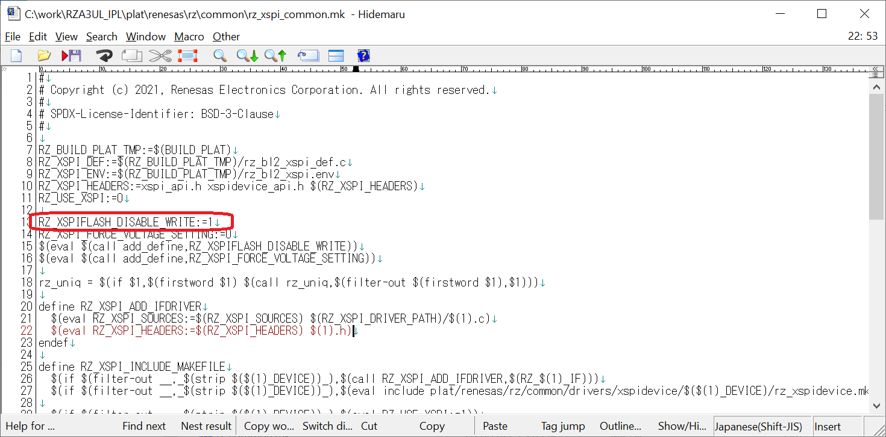
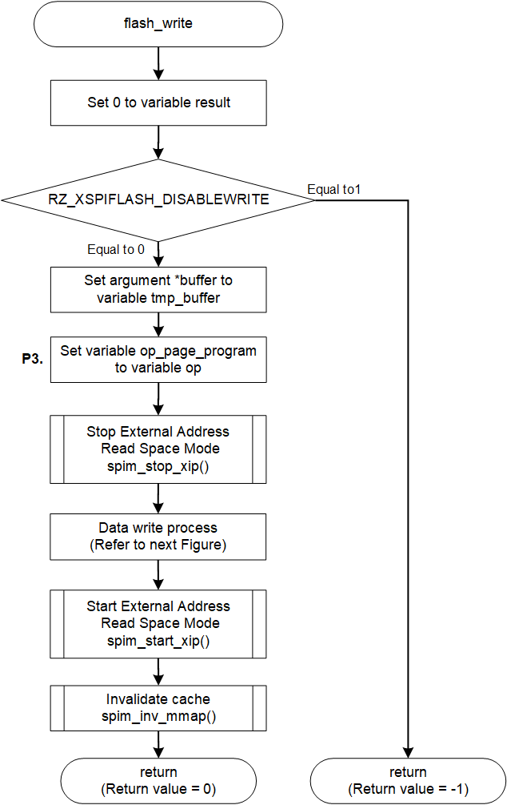
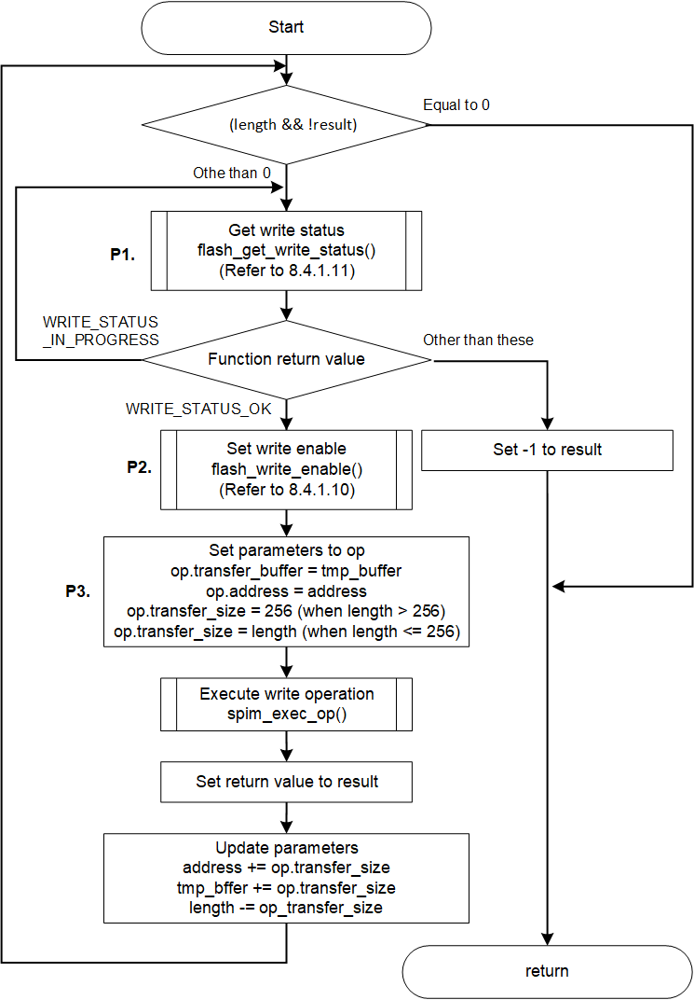

<h3 id="8.4.1.7">8.4.1.7 flash_write</h3>

flash_write() is a function to write data to Serial Flash memory.  
This chapter shows an example of implementing the write process for the AT25QL128A mounted on the RZ/A3UL SMARC EVK board.

<table>
<colgroup>
<col style="width: 16%" />
<col style="width: 83%" />
</colgroup>
<thead>
<tr>
<th colspan="2">flash_write</th>
</tr>
</thead>
<tbody>
<tr>
<td>Outline</td>
<td>Data write to the Serial Flash memory</td>
</tr>
<tr>
<td>Declaration</td>
<td>int flash_write (xspi_ctrl_t * const ctrl, void const * buffer, size_t address, size_t length)</td>
</tr>
<tr>
<td>Description</td>
<td>
- Checking the write status 
- Waiting for the end of the write process 
- Release write protection 
- Updating the write operation table 
- Write data by sending write operation data to Serial Flash memory
</td>
</tr>
<tr>
<td>Arguments</td>
<td>
*ctrl : Pointer to the control structure for instance 
* buffer : Pointer to buffer where write data is stored 
address : Data write destination address 
&emsp;&emsp;&emsp;&emsp;Specify the offset address in the Serial Flash memory for this argument 
length : Write data size
</td>
</tr>
<tr>
<td>Return value</td>
<td>
0 : Data write is success 
-1 : Data write is failed
</td>
</tr>
<tr>
<td>Note</td>
<td>
Processing of this function is disabled at the default IPL.

To enable write process, refer to <a href="#Figure8.4.1.7.1">Figure 8.4.1.7.1</a> and rewrite RZ_XSPIFLASH_DISABLE_WRITE:=1 in rz_xspi_common.mk L13 to RZ_XSPIFLASH_DISABLE_WRITE:=0 and rebuild.
</td>
</tr>
</tbody>
</table>

<h4 id="Figure8.4.1.7.1">Figure 8.4.1.7.1 Change build switch for write function</h4>

<a href="#Figure8.4.1.7.2">Figure 8.4.1.7.2</a> and <a href="#Figure8.4.1.7.3">Figure 8.4.1.7.3</a> show the flowchart of the flash_write() implementation in the default IPL.  
The processing that changes the implementation when changing the Serial Flash memory is shown below.
8
* P1. Wait process of write completion
* P2. Release write protect
* P3. Setting of Write operation table

These are shown as P1 to P3 in the flow chart as implementation change points.  
The details of the processing are explained after the flow chart.

<h4 id="Figure8.4.1.7.2">Figure 8.4.1.7.2 Flowchart of flash_write</h4>

<h4 id="Figure8.4.1.7.3">Figure 8.4.1.7.3 Flowchart of Data write process</h4>

### P1. Wait process of write completion

Since the next data cannot be received while the Serial Flash memory is writing the data received by serial communication or erasing the data, IPL must check the write status and wait for the end.  
The sub function flash_get_write_status() for getting the write status for the AT25QL128A is implemented in the Serial Flash memory driver implemented in the default IPL.  
Since the method of checking the write status depends on the Serial Flash memory specifications, it is necessary to change the implementation of the function when changing the memory.  
Please refer to <a href="08.04.01.09 flash_get_write_status.md#8.4.1.9">8.4.1.9</a> for change of checking method of write status.

### P2. Release Write Protect

Most of Serial Flash memories require release of write protect when writing data or erasing data.  
The Serial Flash memory driver implemented in the default IPL provides a sub function flash_write_enable() that release Write Protect for AT25QL128A.  
Since the write protect release method depends on the specifications of the Serial Flash memory, it is necessary to change the implementation of the function when changing the memory.  
Please refer to <a href="08.04.01.10 flash_write_enable.md#8.4.1.10">8.4.1.10</a> for change of write protect release method.

### P3. Setting Write operation table

When writing data to Serial Flash memory, data is written by sending a Write command.  
The Serial Flash memory driver implemented in the default IPL sets the AT25QL128A's Quad Page program operation (code: 0x33) to the variable op_page_program as the Write operation and sends it.

<a href="#Table8.4.1.7.1">Table 8.4.1.7.1</a> shows the settings of op_page_program_dopi when using Quad Page program.  
When changing the Serial Flash memory, refer to <a href="#Table8.4.1.7.1">Table 8.4.1.7.1</a> and rewrite the setting contents of op_page_program to the contents corresponding to the Write operation of your Serial Flash memory.

Note that the write destination address and the size of data that can be written with one write operation are limited by the operations implemented in the Serial Flash memory.  
The Page program operation requires writing to start from a 256-byte aligned address.  
Also, with this operation, the write data size per write is up to 256-byte, so flash_write() repeatedly transfers data in units of 256-byte.  
Similarly, adjust the write destination address and transfer data size per transfer according to the specifications of the Write operation that uses it.

<h4 id="Table8.4.1.7.1">Table 8.4.1.7.1 op_page_program setting contents when using Quad Page Program (0x33)</h4>

<table>
<colgroup>
<col style="width: 24%" />
<col style="width: 26%" />
<col style="width: 48%" />
</colgroup>
<thead>
<tr>
<th>Member</th>
<th>Setting value</th>
<th>Description</th>
</tr>
</thead>
<tbody>
<tr>
<td>form</td>
<td>SPI_FORM_1_4_4</td>
<td>
Number of I/O line used for command: 1line 
Number of I/O line used for address: 4line 
Number of I/O line used for data: 4line
</td>
</tr>
<tr>
<td>op</td>
<td>0x33</td>
<td>Command code "Quad Page Program"</td>
</tr>
<tr>
<td>op_size</td>
<td>1</td>
<td>Command size = 1-byte</td>
</tr>
<tr>
<td>op_is_ddr</td>
<td>false</td>
<td>Command transfer method (SDR)</td>
</tr>
<tr>
<td>address</td>
<td>address</td>
<td>
Address is Serial Flash memory address to data write

It is updated in the function
</td>
</tr>
<tr>
<td>address_is_ddr</td>
<td>false</td>
<td>Address transfer method (SDR)</td>
</tr>
<tr>
<td>address_size</td>
<td>3</td>
<td>24bit address</td>
</tr>
<tr>
<td>additional_value</td>
<td>0</td>
<td>No option data</td>
</tr>
<tr>
<td>additional_size</td>
<td>0</td>
<td>No option data</td>
</tr>
<tr>
<td>dummy_cycles</td>
<td>0</td>
<td>Dummy cycles = 0 cycles</td>
</tr>
<tr>
<td>transfer_buffer</td>
<td>tmp_buffer</td>
<td>
tmp_buffer is buffer address of write data

It is updated in the function
</td>
</tr>
<tr>
<td>transfer_is_ddr</td>
<td>false</td>
<td>Data transfer method (SDR)</td>
</tr>
<tr>
<td>transfer_size</td>
<td>length</td>
<td>
length is remaining size of write data

It is updated in the function
</td>
</tr>
<tr>
<td>force_idle_level_mask</td>
<td>0x08</td>
<td>Keep IO3/HOLD pin to High during idle state</td>
</tr>
<tr>
<td>force_idle_level_value</td>
<td>0x08</td>
<td>Keep IO3/HOLD pin to High during idle state</td>
</tr>
<tr>
<td>slch_value</td>
<td>0</td>
<td>Clock Delay = 1.5cycle</td>
</tr>
<tr>
<td>clsh_value</td>
<td>0</td>
<td>SSL Negation Delay = 1cycle</td>
</tr>
<tr>
<td>shsl_value</td>
<td>6</td>
<td>Next Access Delay = (7 - 3) cycle</td>
</tr>
</tbody>
</table>