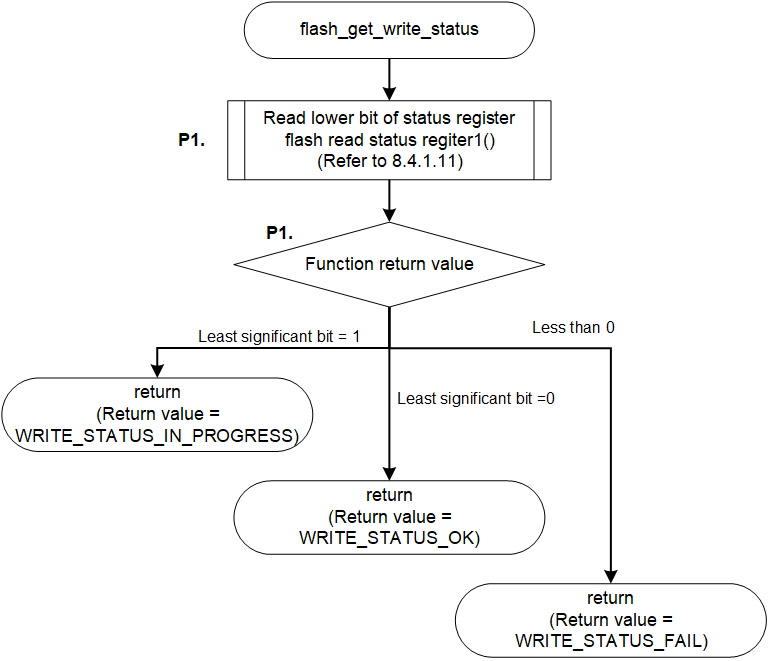

<h3 id="8.4.1.9">8.4.1.9 flash_get_write_status</h3>

flash_get_write_status() is a function to get the write status of the Serial Flash memory.

This chapter shows an example of implementing a process to check the write progress status by reading the status register from the AT25QL128A mounted on the RZ/A3UL SMARC EVK board.

<table>
<colgroup>
<col style="width: 16%" />
<col style="width: 83%" />
</colgroup>
<thead>
<tr>
<th colspan="2">flash_get_write_status</th>
</tr>
</thead>
<tbody>
<tr>
<td>Outline</td>
<td>Gets the write status of the Serial Flash memory</td>
</tr>
<tr>
<td>Declaration</td>
<td>int flash_get_write_status (xspidevice_ctrl_t * ctrl)</td>
</tr>
<tr>
<td>Description</td>
<td>
- Read Status Register 
- Return from a function with a return value that depends on the value of the Status Register
</td>
</tr>
<tr>
<td>Arguments</td>
<td>*ctrl : Pointer to the control structure for instance</td>
</tr>
<tr>
<td>Return value</td>
<td>
WRITE_STATUS_FAIL : Data write is failed 
WRITE_STATUS_IN_PROGRESS : Data write in progress 
WRITE_STATUS_OK : Data write is complete
</td>
</tr>
<tr>
<td>Note</td>
<td>-</td>
</tr>
</tbody>
</table>

<a href="#Figure8.4.1.9.1">Figure 8.4.1.9.1</a> shows a flowchart of the flash_get_write_status() implementation in the default IPL.  
The processing that changes the implementation when changing the Serial Flash memory is shown below.

* P1 Read status register

This is shown as P1 in the flow chart as implementation change points.  
The details of the processing are explained after the flow chart.

<h4 id="Figure8.4.1.9.1">Figure 8.4.1.9.1 Flowchart of flash_get_write_status</h4>

### P1. Read Status Register

AT25QL128A has Status Register shown in <a href="#Table8.4.1.9.1">Table 8.4.1.9.1.</a>

The BUSY bit in this register indicates whether it is in Write (Erase) or idle.  
Therefore, the Serial Flash memory driver implemented at default IPL reads the Status Register.  
If the value of the Status Register is checked and the WIP bit is 1, a return value indicating that processing is in progress is returned, and if it is 0, a return value indicating that processing has ended is returned.  
The default IPL provides a sub-function flash_read_status_register1() that reads the Status Register of the AT25QL128A.  
Refer to <a href="08.04.01.11 flash_read_status_reister1_flash_read_status_register2.md#8.4.1.11">8.4.1.11</a> for how to read the Status Register.

When changing the Serial flash memory, read the register corresponding to the AT25QL128A Status Register and change the source code so that the bit indicating the Erase or Write status is checked to determine the status.

<h4 id="Table8.4.1.9.1">Table 8.4.1.9.1 BUSY bit of AT25QL128A Status Register (BIT7 - BIT0)</h4>

| BIT7 | BIT6 | BIT5 | BIT4 | BIT3 | BIT2 | BIT1 | BIT0 |
| --- | --- | --- | --- | --- | --- | --- | --- |
| SRP | SEC | TB | BP2 | BP1 | BP0 | WEL | <strong> BUSY </strong> |
| Status Register Protect 0 | Selector Protect | Top/Bottom Write Protect | Block Protect | Block Protect | Block Protect | Write Enable Latch | <strong> Erase or Write in Progress </strong> |
