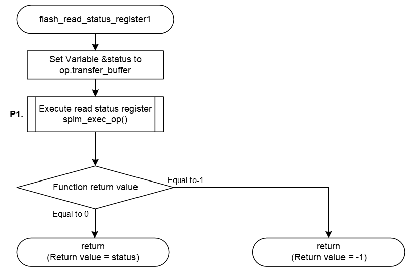

<h3 id="8.4.1.11">8.4.1.11 flash_read_status_reister1 / flash_read_status_register2</h3>

flash_read_status_reister1() / flash_read_status_reister2() are the function to read Status Register value of AT25QL128A mounted on the RZ/A3UL SMARC EVK board.  
These functions implemented in the default IPL read value from Status Register by sending the Read Status Register operation of the AT25QL128A.

The AT25QL128A Status Register is a 16bit register, and flash_read_status_reister1() reads the value of the lower 8 bits of the Status Register by sending the Read Status Register1 operation.  
flash_read_status_reister2() reads the value of the upper 8 bits of the Status Register by sending a Read Status Register2 operation.

These functions are similar in function definition and process flow.

<table>
<colgroup>
<col style="width: 16%" />
<col style="width: 83%" />
</colgroup>
<thead>
<tr>
<th colspan="2">flash_read_status_register1 / flash_read_status_register2</th>
</tr>
</thead>
<tbody>
<tr>
<td>Outline</td>
<td>Gets the status register of the Serial Flash memory</td>
</tr>
<tr>
<td>Declaration</td>
<td>
int flash_read_status_register1(qspiflash_at25_ctrl_t * myctrl) 
int flash_read_status_register2(qspiflash_at25_ctrl_t * myctrl)
</td>
</tr>
<tr>
<td>Description</td>
<td>- Send Read Status Register operation to Serial Flash memory and get register value</td>
</tr>
<tr>
<td>Arguments</td>
<td>*myctrl : Pointer to the control structure for instance</td>
</tr>
<tr>
<td>Return value</td>
<td>
Positive Number: Operation success, and status register value 
-1 : Operation Failed
</td>
</tr>
<tr>
<td>Note</td>
<td>-</td>
</tr>
</tbody>
</table>

<a href="#Figure8.4.1.11.1">Figure 8.4.1.11.1</a> shows a flowchart of the flash_read_status_register1() implementation in the default IPL.

The processing that changes the implementation when changing the Serial Flash memory is shown below.

* P1 Send Read Status Register 1/ Read Status Register2 operation

This is shown as P1 in the flow chart as implementation change points.  
The details of the processing are explained after the flow chart.

<h4 id="Figure8.4.1.11.1">Figure 8.4.1.11.1 Flowchart of flash_read_status_register1</h4>

### P1. Send Read Status Register1 / Read Status Register2 operation

Send the Read Status Register operation to get the Status Register value from the Serial Flash memory.  
The flash_read_status_regster1() function sets the Read Status Register1 command (0x05) to the variable op_read_status1, the flash_read_status_regster2() function sets the Read Status Register2 command (0x35) to the variable op_read_status2, and each function sends the Read Status Register operation.

<a href="#Table8.4.1.11.1">Table 8.4.1.11.1</a> shows the settings of op_read_status1 when using the Read Status Register1 operation, and <a href="#Table8.4.1.11.2">Table 8.4.1.11.2</a> shows the settings of op_read_status2 when using the Read Status Register2 operation.

When changing the Serial Flash memory, rewrite the variable members according to the specifications of the command equivalent to the AT25QL128A's Read Status Register operation implemented in your Serial Flash memory.

<h4 id="Table8.4.1.11.1">Table 8.4.1.11.1 op_read_status1 setting contents when using Read Status Register1 (0x05)</h4>

<table>
<colgroup>
<col style="width: 24%" />
<col style="width: 26%" />
<col style="width: 48%" />
</colgroup>
<thead>
<tr>
<th>Member</th>
<th>Setting value</th>
<th>Description</th>
</tr>
</thead>
<tbody>
<tr>
<td>form</td>
<td>SPI_FORM_1_1_1</td>
<td>
Number of I/O line used for command: 1 line 
Number of I/O line used for address: 1 line 
Number of I/O line used for data: 1 line
</td>
</tr>
<tr>
<td>op</td>
<td>0x05</td>
<td>Command code "Read Status Register1"</td>
</tr>
<tr>
<td>op_size</td>
<td>1</td>
<td>Command size = 1-byte</td>
</tr>
<tr>
<td>op_is_ddr</td>
<td>false</td>
<td>Command transfer method (SDR)</td>
</tr>
<tr>
<td>address</td>
<td>0</td>
<td>No address</td>
</tr>
<tr>
<td>address_is_ddr</td>
<td>false</td>
<td>Address transfer method (SDR)</td>
</tr>
<tr>
<td>address_size</td>
<td>0</td>
<td>No address</td>
</tr>
<tr>
<td>additional_value</td>
<td>0</td>
<td>No option data</td>
</tr>
<tr>
<td>additional_size</td>
<td>0</td>
<td>No option data</td>
</tr>
<tr>
<td>dummy_cycles</td>
<td>0</td>
<td>Dummy cycles = 0 cycles</td>
</tr>
<tr>
<td>transfer_buffer</td>
<td>&amp;status</td>
<td>Set pointer of argument status in function</td>
</tr>
<tr>
<td>transfer_is_ddr</td>
<td>false</td>
<td>Data transfer method (SDR)</td>
</tr>
<tr>
<td>transfer_size</td>
<td>1</td>
<td>Higher 8bit of Status Register</td>
</tr>
<tr>
<td>force_idle_level_mask</td>
<td>0x08</td>
<td>Keep IO3/HOLD pin to High during idle state</td>
</tr>
<tr>
<td>force_idle_level_value</td>
<td>0x08</td>
<td>Keep IO3/HOLD pin to High during idle state</td>
</tr>
<tr>
<td>slch_value</td>
<td>0</td>
<td>Clock Delay = 1.5cycle</td>
</tr>
<tr>
<td>clsh_value</td>
<td>0</td>
<td>SSL Negation Delay = 1cycle</td>
</tr>
<tr>
<td>shsl_value</td>
<td>6</td>
<td>Next Access Delay = (7 - 3) cycle</td>
</tr>
</tbody>
</table>

  
<h4 id="Table8.4.1.11.2">Table 8.4.1.11.2 op_read_status2 setting contents when using Read Status Register2 (0x35)</h4>

<table>
<colgroup>
<col style="width: 24%" />
<col style="width: 26%" />
<col style="width: 48%" />
</colgroup>
<thead>
<tr>
<th>Member</th>
<th>Setting value</th>
<th>Description</th>
</tr>
</thead>
<tbody>
<tr>
<td>form</td>
<td>SPI_FORM_1_1_1</td>
<td>
Number of I/O line used for command: 1 line 
Number of I/O line used for address: 1 line 
Number of I/O line used for data: 1 line
</td>
</tr>
<tr>
<td>op</td>
<td>0x35</td>
<td>Command code "Read Status Register2"</td>
</tr>
<tr>
<td>op_size</td>
<td>1</td>
<td>Command size = 1-byte</td>
</tr>
<tr>
<td>op_is_ddr</td>
<td>false</td>
<td>Command transfer method (SDR)</td>
</tr>
<tr>
<td>address</td>
<td>0</td>
<td>No address</td>
</tr>
<tr>
<td>address_is_ddr</td>
<td>false</td>
<td>Address transfer method (SDR)</td>
</tr>
<tr>
<td>address_size</td>
<td>0</td>
<td>No address</td>
</tr>
<tr>
<td>additional_value</td>
<td>0</td>
<td>No option data</td>
</tr>
<tr>
<td>additional_size</td>
<td>0</td>
<td>No option data</td>
</tr>
<tr>
<td>dummy_cycles</td>
<td>0</td>
<td>Dummy cycles = 0 cycles</td>
</tr>
<tr>
<td>transfer_buffer</td>
<td>&amp;status</td>
<td>Set pointer of argument status in function</td>
</tr>
<tr>
<td>transfer_is_ddr</td>
<td>false</td>
<td>Data transfer method (SDR)</td>
</tr>
<tr>
<td>transfer_size</td>
<td>1</td>
<td>Lower 8bit of Status Register</td>
</tr>
<tr>
<td>force_idle_level_mask</td>
<td>0x08</td>
<td>Keep IO3/HOLD pin to High during idle state</td>
</tr>
<tr>
<td>force_idle_level_value</td>
<td>0x08</td>
<td>Keep IO3/HOLD pin to High during idle state</td>
</tr>
<tr>
<td>slch_value</td>
<td>0</td>
<td>Clock Delay = 1.5cycle</td>
</tr>
<tr>
<td>clsh_value</td>
<td>0</td>
<td>SSL Negation Delay = 1cycle</td>
</tr>
<tr>
<td>shsl_value</td>
<td>6</td>
<td>Next Access Delay = (7 - 3) cycle</td>
</tr>
</tbody>
</table>
