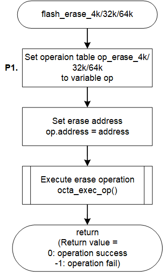

<h3 id="8.4.1.14">8.4.1.14 flash_erase_4k / flash_erase_32k / flash_erase_64k</h3>

flash_erase_4k() / flash_erase_32k() / flash_erase_64k() are functions to erase data in units of 4-Kbyte, 32-Kbyte, and 64-Kbyte respectively from AT25QL128A implemented in RZ/A3UL SMARC EVK board.  
flash_erase_4k() / flash_erase_32k() / flash_erase_64k() implemented in the default IPL send Block Erase(4 kbytes), Block Erase(32 kbytes), Block Erase(64 kbytes) commands of AT25QL128A to erase data.

These functions are similar in function definition and process flow.

<table>
<colgroup>
<col style="width: 16%" />
<col style="width: 83%" />
</colgroup>
<thead>
<tr>
<th colspan="2">flash_erase_4k / flash_erase_32k / flash_erase_64k</th>
</tr>
</thead>
<tbody>
<tr>
<td>Outline</td>
<td>Erase data by 4-Kbytes / 32-Kbytes / 64-Kbytes</td>
</tr>
<tr>
<td>Declaration</td>
<td>
int flash_erase_4k(qspiflash_at25_ctrl_t * myctrl) 
int flash_erase_32k(qspiflash_at25_ctrl_t * myctrl) 
int flash_erase_64k(qspiflash_at25_ctrl_t * myctrl)
</td>
</tr>
<tr>
<td>Description</td>
<td>
- Check size of data to be erased 
- Updating the erase operation table 
- Erase data by sending erase operation
</td>
</tr>
<tr>
<td>Arguments</td>
<td>*myctrl : Pointer to the control structure for instance</td>
</tr>
<tr>
<td>Return value</td>
<td>
0 : Operation success 
-1 : Operation Failed
</td>
</tr>
<tr>
<td>Note</td>
<td>-</td>
</tr>
</tbody>
</table>

<a href="#Figure8.4.1.14.1">Figure 8.4.1.14.1</a> shows a flowchart of the flash_erase_4k() / flash_erase_32k() / flash_erase_64k() implementation in the default IPL.

The processing that changes the implementation when changing the Serial Flash memory is shown below.

* P1 Change parameter of Erase operation table

This is shown as P1 in the flow chart as implementation change points.  
The details of the processing are explained after the flow chart.

<h4 id="Figure8.4.1.14.1">Figure 8.4.1.14.1 Flowchart of flash_erase_4k/32k/64k</h4>

### P1. Change parameter of Erase operation table

In the erase processing of the Serial Flash memory, data is erased by sending the Erase operation.

The flash_erase_4k() function implemented in the default IPL sets the Block Erase command (4 kbytes) (0x20) to the variable op_erase_4k and sends the operation.  
Similarly, in the flash_erase_32k() function, set the Block Erase command (32 kbytes) (0x52) to the variable op_erase_32k and send the operation.  
Similarly, in the flash_erase_64k() function, set the Block Erase command (64 kbytes) (0xD8) to the variable op_erase_64k and send the operation.  
By doing this, the data is erased by sending the Erase command in each function.

<a href="#Table8.4.1.14.1">Table 8.4.1.14.1</a> shows the op_erase_4k settings when using the 4-Kbytes Block Erase operation, <a href="#Table8.4.1.14.2">Table 8.4.1.14.2</a> shows the op_erase_32k settings when using the 32-Kbytes Block Erase operation, and <a href="#Table8.4.1.14.3">Table 8.4.1.14.3</a> shows the op_erase_64k settings when using the 64-Kbytes Block Erase operation.  
When changing the Serial Flash memory, rewrite each variable to the contents corresponding to the Erase operation implemented in that memory.

<h4 id="Table8.4.1.14.1">Table 8.4.1.14.1 op_erase_4k setting contents when using Block Erase (4 kbytes) operation (0x20)</h4>

<table>
<colgroup>
<col style="width: 24%" />
<col style="width: 26%" />
<col style="width: 48%" />
</colgroup>
<thead>
<tr>
<th>Member</th>
<th>Setting value</th>
<th>Description</th>
</tr>
</thead>
<tbody>
<tr>
<td>form</td>
<td>SPI_FORM_1_1_1</td>
<td>
Number of I/O line used for command: 1 line 
Number of I/O line used for address: 1 line 
Number of I/O line used for data: 1 line
</td>
</tr>
<tr>
<td>op</td>
<td>0x20</td>
<td>Command code "Block Erase (4 kbytes)"</td>
</tr>
<tr>
<td>op_size</td>
<td>1</td>
<td>Command size = 1-byte</td>
</tr>
<tr>
<td>op_is_ddr</td>
<td>false</td>
<td>Command transfer method (SDR)</td>
</tr>
<tr>
<td>address</td>
<td>address</td>
<td>Set address of argument</td>
</tr>
<tr>
<td>address_is_ddr</td>
<td>false</td>
<td>Address transfer method (SDR)</td>
</tr>
<tr>
<td>address_size</td>
<td>3</td>
<td>24bit address</td>
</tr>
<tr>
<td>additional_value</td>
<td>0</td>
<td>No option data</td>
</tr>
<tr>
<td>additional_size</td>
<td>0</td>
<td>No option data</td>
</tr>
<tr>
<td>dummy_cycles</td>
<td>0</td>
<td>Dummy cycles = 0 cycles</td>
</tr>
<tr>
<td>transfer_buffer</td>
<td>NULL</td>
<td>No data</td>
</tr>
<tr>
<td>transfer_is_ddr</td>
<td>false</td>
<td>Data transfer method (SDR)</td>
</tr>
<tr>
<td>transfer_size</td>
<td>0</td>
<td>No data</td>
</tr>
<tr>
<td>force_idle_level_mask</td>
<td>0x08</td>
<td>Keep IO3/HOLD pin to High during idle state</td>
</tr>
<tr>
<td>force_idle_level_value</td>
<td>0x08</td>
<td>Keep IO3/HOLD pin to High during idle state</td>
</tr>
<tr>
<td>slch_value</td>
<td>0</td>
<td>Clock Delay = 1.5cycle</td>
</tr>
<tr>
<td>clsh_value</td>
<td>0</td>
<td>SSL Negation Delay = 1cycle</td>
</tr>
<tr>
<td>shsl_value</td>
<td>6</td>
<td>Next Access Delay = (7 - 3) cycle</td>
</tr>
</tbody>
</table>

<h4 id="Table8.4.1.14.2">Table 8.4.1.14.2 op_erase_32k setting contents when using Block Erase (32 kbytes) operation (0x52)</h4>

<table>
<colgroup>
<col style="width: 24%" />
<col style="width: 26%" />
<col style="width: 48%" />
</colgroup>
<thead>
<tr>
<th>Member</th>
<th>Setting value</th>
<th>Description</th>
</tr>
</thead>
<tbody>
<tr>
<td>form</td>
<td>SPI_FORM_1_1_1</td>
<td>
Number of I/O line used for command: 1 line 
Number of I/O line used for address: 1 line 
Number of I/O line used for data: 1 line
</td>
</tr>
<tr>
<td>op</td>
<td>0x52</td>
<td>Command code "Block Erase (32 kbytes)"</td>
</tr>
<tr>
<td>op_size</td>
<td>1</td>
<td>Command size = 1-byte</td>
</tr>
<tr>
<td>op_is_ddr</td>
<td>false</td>
<td>Command transfer method (SDR)</td>
</tr>
<tr>
<td>address</td>
<td>address</td>
<td>Set address of argument</td>
</tr>
<tr>
<td>address_is_ddr</td>
<td>false</td>
<td>Address transfer method (SDR)</td>
</tr>
<tr>
<td>address_size</td>
<td>3</td>
<td>24bit address</td>
</tr>
<tr>
<td>additional_value</td>
<td>0</td>
<td>No option data</td>
</tr>
<tr>
<td>additional_size</td>
<td>0</td>
<td>No option data</td>
</tr>
<tr>
<td>dummy_cycles</td>
<td>0</td>
<td>Dummy cycles = 0 cycles</td>
</tr>
<tr>
<td>transfer_buffer</td>
<td>NULL</td>
<td>No data</td>
</tr>
<tr>
<td>transfer_is_ddr</td>
<td>false</td>
<td>Data transfer method (SDR)</td>
</tr>
<tr>
<td>transfer_size</td>
<td>0</td>
<td>No data</td>
</tr>
<tr>
<td>force_idle_level_mask</td>
<td>0x08</td>
<td>Keep IO3/HOLD pin to High during idle state</td>
</tr>
<tr>
<td>force_idle_level_value</td>
<td>0x08</td>
<td>Keep IO3/HOLD pin to High during idle state</td>
</tr>
<tr>
<td>slch_value</td>
<td>0</td>
<td>Clock Delay = 1.5cycle</td>
</tr>
<tr>
<td>clsh_value</td>
<td>0</td>
<td>SSL Negation Delay = 1cycle</td>
</tr>
<tr>
<td>shsl_value</td>
<td>6</td>
<td>Next Access Delay = (7 - 3) cycle</td>
</tr>
</tbody>
</table>

<h4 id="Table8.4.1.14.3">Table 8.4.1.14.3 op_erase_64k setting contents when using Block Erase (64 kbytes) operation (0xD8)</h4>

<table>
<colgroup>
<col style="width: 24%" />
<col style="width: 26%" />
<col style="width: 48%" />
</colgroup>
<thead>
<tr>
<th>Member</th>
<th>Setting value</th>
<th>Description</th>
</tr>
</thead>
<tbody>
<tr>
<td>form</td>
<td>SPI_FORM_1_1_1</td>
<td>
Number of I/O line used for command: 1 line 
Number of I/O line used for address: 1 line 
Number of I/O line used for data: 1 line
</td>
</tr>
<tr>
<td>op</td>
<td>0xD8</td>
<td>Command code "Block Erase (64 kbytes)"</td>
</tr>
<tr>
<td>op_size</td>
<td>1</td>
<td>Command size = 1-byte</td>
</tr>
<tr>
<td>op_is_ddr</td>
<td>false</td>
<td>Command transfer method (SDR)</td>
</tr>
<tr>
<td>address</td>
<td>address</td>
<td>Set address of argument</td>
</tr>
<tr>
<td>address_is_ddr</td>
<td>false</td>
<td>Address transfer method (SDR)</td>
</tr>
<tr>
<td>address_size</td>
<td>3</td>
<td>24bit address</td>
</tr>
<tr>
<td>additional_value</td>
<td>0</td>
<td>No option data</td>
</tr>
<tr>
<td>additional_size</td>
<td>0</td>
<td>No option data</td>
</tr>
<tr>
<td>dummy_cycles</td>
<td>0</td>
<td>Dummy cycles = 0 cycles</td>
</tr>
<tr>
<td>transfer_buffer</td>
<td>NULL</td>
<td>No data</td>
</tr>
<tr>
<td>transfer_is_ddr</td>
<td>false</td>
<td>Data transfer method (SDR)</td>
</tr>
<tr>
<td>transfer_size</td>
<td>0</td>
<td>No data</td>
</tr>
<tr>
<td>force_idle_level_mask</td>
<td>0x08</td>
<td>Keep IO3/HOLD pin to High during idle state</td>
</tr>
<tr>
<td>force_idle_level_value</td>
<td>0x08</td>
<td>Keep IO3/HOLD pin to High during idle state</td>
</tr>
<tr>
<td>slch_value</td>
<td>0</td>
<td>Clock Delay = 1.5cycle</td>
</tr>
<tr>
<td>clsh_value</td>
<td>0</td>
<td>SSL Negation Delay = 1cycle</td>
</tr>
<tr>
<td>shsl_value</td>
<td>6</td>
<td>Next Access Delay = (7 - 3) cycle</td>
</tr>
</tbody>
</table>
