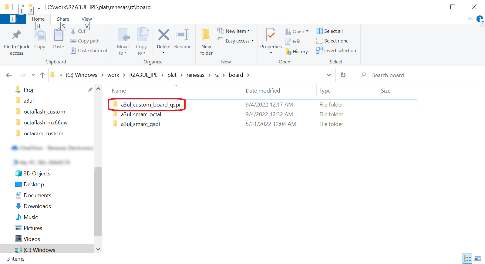
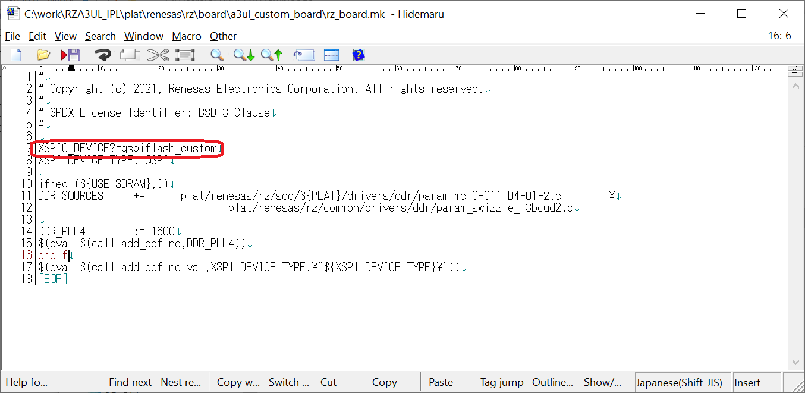
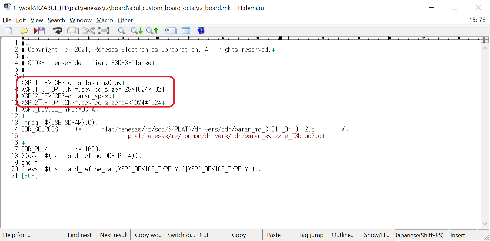
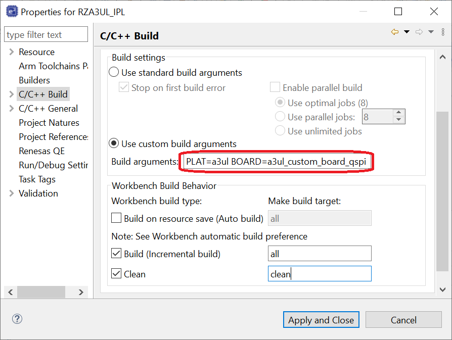
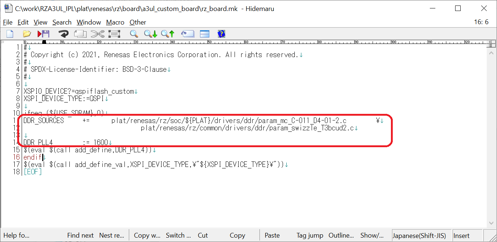

<h3 id="8.4.2">8.4.2 How to add a setting for a board on which your Serial Flash memory is mounted</h3>

1. Open the c:\work\RZA3UL_IPL\plat\renesas\rz\board folder, copy the "a3ul_smarc_qspi" folder and rename it to any name.  
   This time, rename the folder name to "a3ul_custom_board_qspi".

   

   
<h4 id="Figure8.4.2.1">Figure 8.4.2.1 Rename board setting folder</h4>

2. Open "a3ul_custom_board_qspi" folder and open "rz_board.mk".  
   Register the folder name of the Serial Flash memory driver added in <a href="08.04.01 How to customize IPL for your Serial Flash memory.md#8.4.1">Chapter 8.4.1</a>  
   This time, rewrite "_XSPI0_DEVICE:=qspiflash_at25" on line 7 to "_XSPI0_DEVICE:=qspiflash_custom".

   

   
<h4 id="Figure8.4.2.2">Figure 8.4.2.2 Change board setting Makefile</h4>

   If you want to change the OctaFlash / OctaRAM, please register the folder name of the customized OctaFlash driver in "_XSPI1_DEVICE:=".  
   Also, please register the folder name of the customized OctaRAM driver in "_XSPI2_DEVICE:=".

   

   Note:  
   For RZ/A3UL, register the OctaFlash driver in XSPI1_DEVICE and the OctaRAM driver in XSPI2_DEVICE.  
   Channels cannot be swapped.  
   Also, by removing the definition of L7 and L8, the OctaFlash driver will not be included in IPL.  
   Similarly, removing the L9 and L10 definitions will prevent the OctaRAM driver from being included in IPL.

   
<h4 id="Figure8.4.2.3">Figure 8.4.2.3 Change board setting Makefile</h4>

3. Launch e2 studio.  
   Then refer to step 10 of <a href="06. IPL build environment construction procedure.md#.6">Chapter 6.</a> IPL build environment construction procedure to launch Properties for RZA3UL_IPL and move to the [Behavior] tab.  
   Change the BOARD value set in the "Build arguments" field to "a3ul_custom_board_qspi".  
   After this, running the build as usual will generate an IPL for your custom board.

   

   
<h4 id="Figure8.4.2.4">Figure 8.4.2.4 Change project setting</h4>

   

   Note:  
   When changing DDR SDRAM, set the parameter file corresponding to DDR SDRAM to DDR_SOURCES in rz_board.mk, and set the operating clock frequency of DDR SDRAM to DDR_PLL4.  
   Please contact Renesas Electronics for the parameter file corresponding to your DDR SDRAM.

   
<h4 id="Figure8.4.2.5">Figure 8.4.2.5 Information of DDR SDRAM setting</h4>

