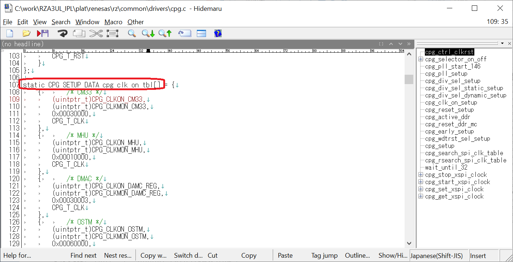
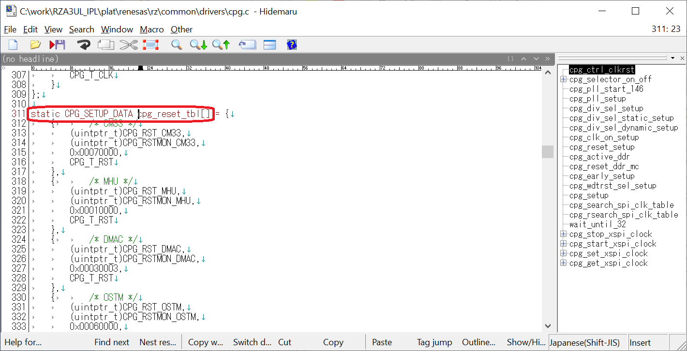

<h3 id="8.4.3">8.4.3 How to add a Module for Clock Supply</h3>

In IPL, clocks are supplied to the modules shown in the CPG column of <a href="04.02.01 Peripheral Function Setting when using Serial Flash memory.md#Table4.2.1.1">Table 4.2.1.1</a>, resets are released, and the modules are made available.

This chapter describes how to add the settings when adding a module that supplies clocks and resets.

1. Open c:\work\RZA3UL_IPL\plat\renesas\rz\common\drivers\cpg.c.  
2. Add the setting table of the module to be supplied with the clock to cpg_clk_on_tbl[].

   

   
<h4 id="Figure8.4.3.1">Figure 8.4.3.1 Information of cpg_clk_om_tbl[]</h4>

3. The setting table has the following format.  
   {  
   &emsp;reg,  
   &emsp;mon,  
   &emsp;val,  
   &emsp;type  
   }

    reg: Sets the Clock Control Register address of the module supplying the clock.  
    mon: Sets the Clock Monitor Register address corresponding to the register set in reg.  
    val: Sets the value to write to the register set in reg.  
    type: Set CPG_T_CLK.  

    For details of Clock Control Register and Clock Monitor Register, refer to User's Manual: Hardware for each RZ/A3 devices.

4. Add the setting table of the module to be reset to cpg_reset_tbl[]

   

   
<h4 id="Figure8.4.3.2">Figure 8.4.3.2 Information of cpg_reset_tbl[]</h4>

5. The format of the setting table is the same as cpg_clk_on_tbl[].  
    The values to be set are as follows.

    reg: Sets the Reset Control Register address of the module to be reset.  
    mon: Sets the Reset Monitor Register address corresponding to the register set in reg.  
    val: Sets the value to write to the register set in reg.  
    type: Set CPG_T_RST.

    For details of Reset Control Register and Reset Monitor Register, refer to User's Manual: Hardware for each RZ/A3 devices.
