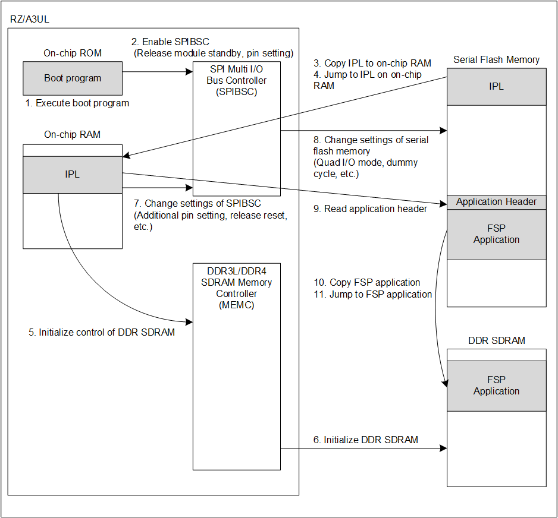

<h3 id="4.1.1.2">4.1.1.2 Boot process to launch FSP application on Serial Flash memory</h3>

<a href="#Figure4.2">Figure 4.2</a> shows an operation image when jumping directly to the FSP application written in the Serial Flash memory and executing it.

<h4 id="Figure4.2">Figure 4.2 Operation image when booting FSP application on Serial Flash memory</h4>

Describes IPL boot process.

1. RZ/A3UL executes the BootROM program after releasing the power-on reset.
2. When the RZ/A3UL operating mode is Boot mode 3, the BootROM program will enable SPIBSC and initialize it.  
The initial setting is that it can be accessed independently of the model of Serial Flash memory.
3.The BootROM program reads IPL stored in the start address of the Serial Flash memory and copies IPL to the entry point address on the On-chip RAM.  
Then SPIBSC is reset by the BootROM, and access to the Serial Flash memory will be prohibited.
4. The BootROM program jumps to IPL entry point on the On-chip RAM.
5. IPL makes additional pin settings and resets for SPIBSC for 4-byte access to the Serial Flash memory and changes the settings to the optimum settings for the Serial Flash memory (AT25QL128A) mounted on the RZ/A3UL SMARC EVK board.
6. A command is issued via SPIBSC to Serial Flash memory to change the settings.
7. IPL reads the application header.  
If the copy destination address of the FSP application is the same as the stored address, IPL will skip the copy process.
8. IPL will jump to the entry point of the FSP application in Serial Flash memory according to the contents of the application header.
