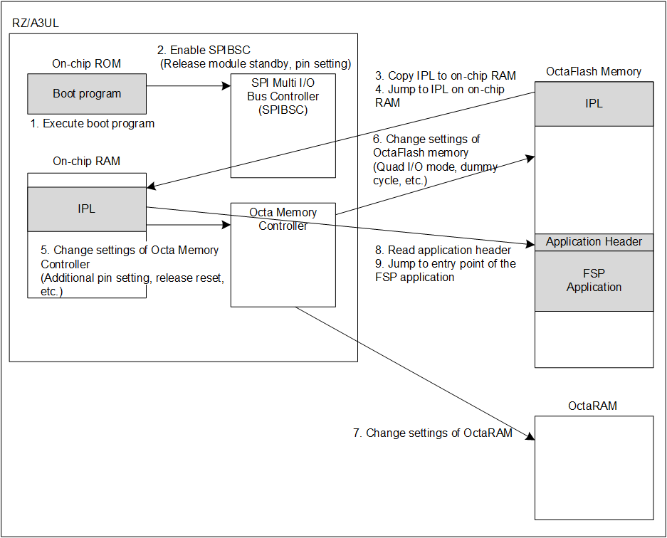

<h3 id="4.1.2.2">4.1.2.2 Boot process to launch FSP application on OctaFlash memory</h3>

<a href="#Figure4.4">Figure 4.4</a> shows an operation image when jumping directly to the FSP application written in the OctaFlash memory and executing on it.

<h4 id="Figure4.4">Figure 4.4 Operation image when booting FSP application on OctaFlash memory</h4>

Describes IPL boot process.

1. RZ/A3UL executes the BootROM program after releasing the power-on reset.
2. When the RZ/A3UL operating mode is Boot mode 3, the BootROM program will enable SPIBSC and initialize it.  
The initial setting is that it can be accessed independently of the model of OctaFlash memory.
3. The BootROM program reads IPL stored in the start address of the OctaFlash memory and copies IPL to the entry point address on the On-chip RAM.  
Then SPIBSC is reset by the BootROM, and access to the OctaFlash memory will be prohibited.
4. The BootROM program jumps to IPL entry point on the On-chip RAM.
5. IPL makes additional pin settings and changes the settings to the optimum settings for the OctaFlash memory (MX66UW1G45G), and the OctaRAM (APS51208N)) mounted on the RZ/A3UL SMARC EVK board.
6. A command is issued via the Octa Memory Controller to OctaFlash memory to change the settings.
7. A command is issued via the Octa Memory Controller to OctaRAM to change the settings.
8. IPL reads the application header.  
If the copy destination address of the FSP application is the same as the stored address, IPL will skip the copy process.
9. IPL will jump to the entry point of the FSP application in OctaFlash memory according to the contents of the application header.
