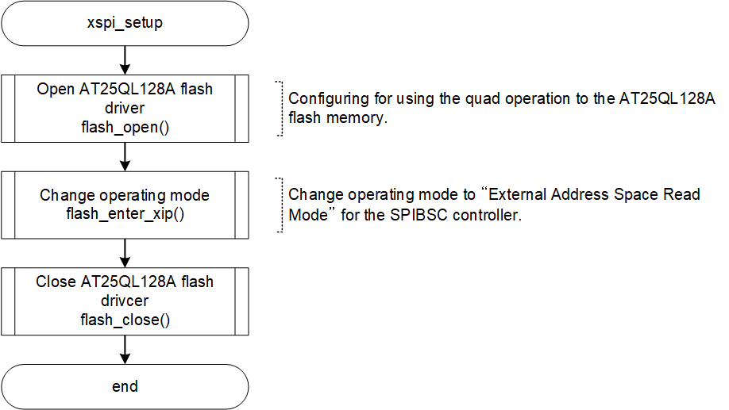
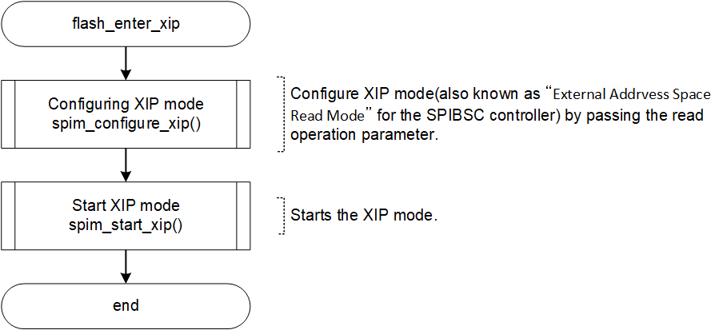

<h3 id="4.13.3">4.13.3 Setting of Serial Flash memory and SPIBSC</h3>

In the default IPL, the Renesas Electronics Serial Flash memory (AT25QL128A) mounted on the RZ/A3UL SMARC EVK board (QSPI version) is set so that it can be accessed by XIP (Execute in place) via SPIBSC.
<a href="#Figure4.12">Figure 4.12</a> - <a href="#Figure4.14">Figure 4.14</a> show the initialization procedure.

<h4 id="Figure4.12">Figure 4.12 Flowchart of xspi_setup()</h4>

  

<h4 id="Figure4.13">Figure 4.13 Flowchart of flash_open()</h4>

<h4 id="Figure4.14">Figure 4.14 Flowchart of flash_enter_xip()</h4>

