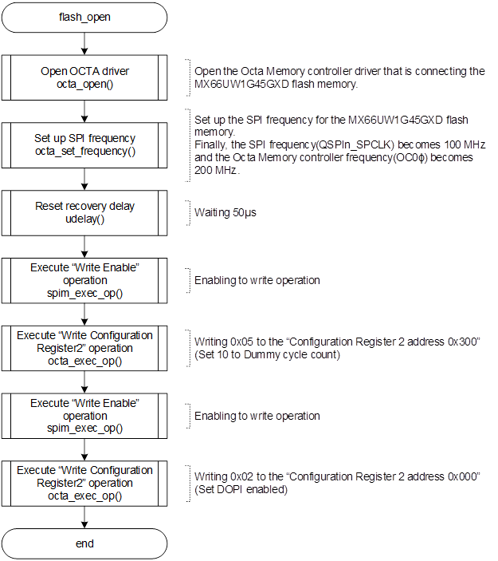
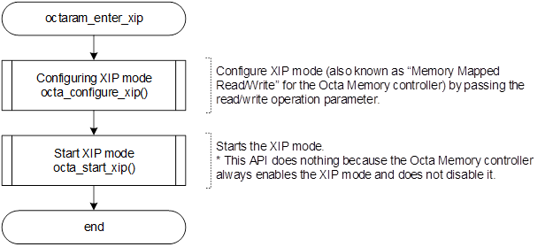

<h3 id="4.13.4">4.13.4 Setting of OctaFlash memory, OctaRAM, and Octa Memory Controller</h3>

In default IPL, the Macronix OctaFlash memory (MX66UW1G45G) and the OctaRAM (APS51208N) mounted on RZ/A3UL SMARC EVK board (Octal-SPI version) is set so that it can be accessed by Memory-map Mode via Octa Memory Controller.
<a href="#Figure4.15">Figure 4.15</a>- <a href="#Figure4.19">Figure 4.19</a> show the initialization procedure.

<h4 id="Figure4.15">Figure 4.15 Flowchart of xspi_setup</h>
  

<h4 id="Figure4.16">Figure 4.16 Flowchart of flash_open</h>
  

<h4 id="Figure4.17">Figure 4.17 Flowchart of flash_enter_xip</h>
  

<h4 id="Figure4.18">Figure 4.18 Flowchart of octaram_open</h>
  

<h4 id="Figure4.19">Figure 4.19 Flowchart of octaram_enter_xip</h>
  
