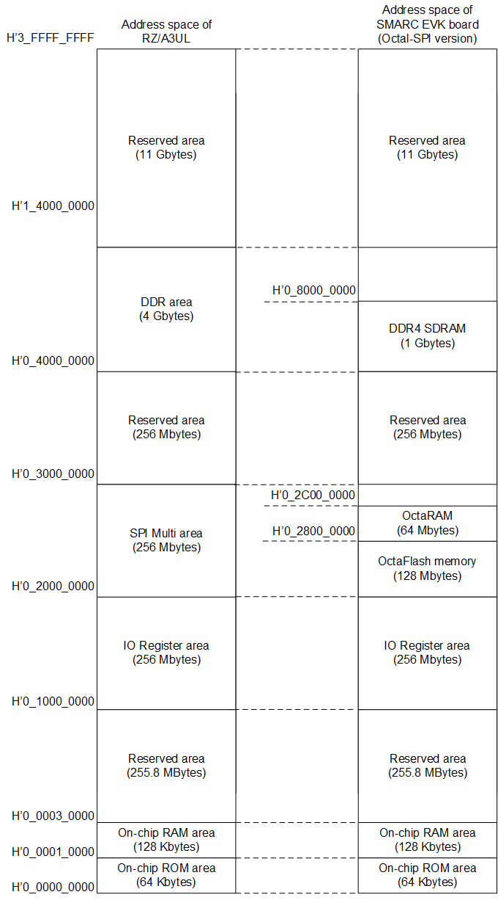

<h3 id="4.3.2">4.3.2 Memory Map of RZ/A3UL SMARC EVK board (Octal-SPI version)</h3>

<a href="#Figure4.6">Figure 4.6</a> shows the RZ/A3UL address space and the memory map of the RZ/A3UL SMARC EVK board (Octal-SPI version).

<h4 id="Figure4.6">Figure 4.6 Memory MAP of RZ/A3UL SMARC EVK board (Octal-SPI version)</h4>

