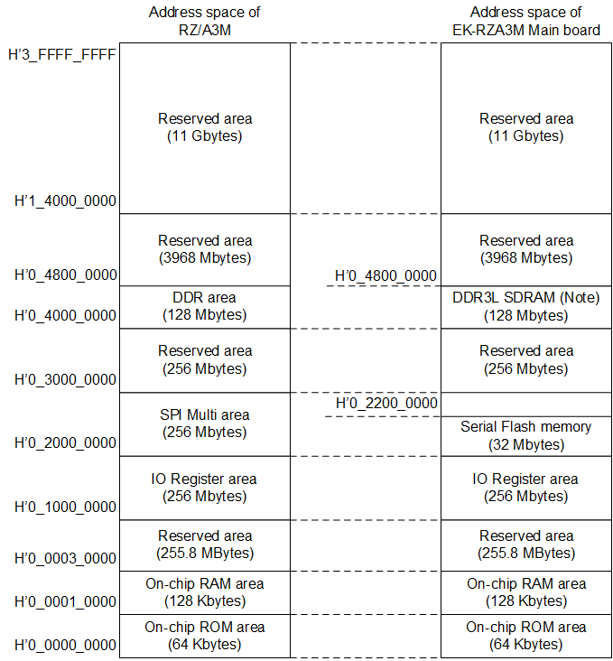

<h3 id="4.3.3">4.3.3 Memory Map of EK-RZA3M Main board</h3>

<a href="#Figure4.7">Figure 4.7</a> shows the RZ/A3M address space and the memory map of the EK-RZA3M Main board.

<h4 id="Figure4.7">Figure 4.7 Memory MAP of EK-RZA3M Main board</h4>

