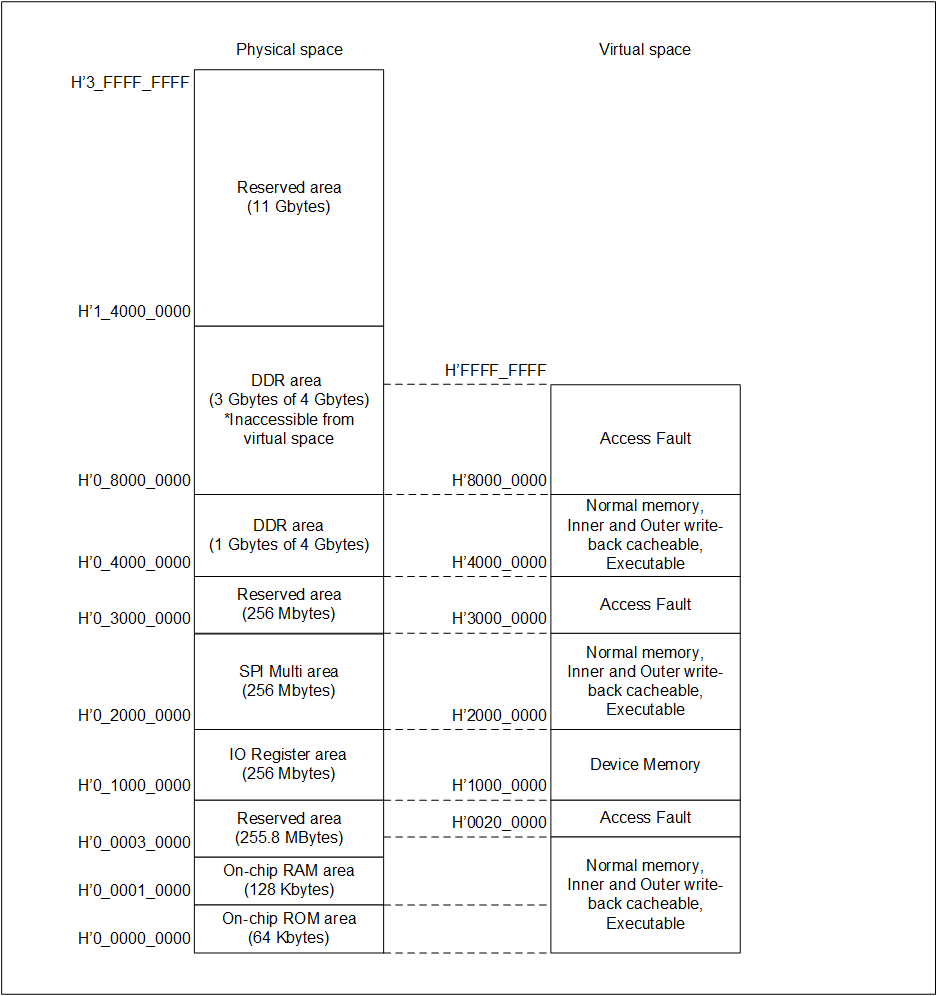

<h2 id="4.4">4.4 MMU setting</h2>

<a href="#Figure4.8">Figure 4.8</a> shows IPL MMU settings.
The MMU is set in the same setting regardless of the target device or the flash memory used.

The MMU is disabled when jumping to the FSP Application.

Make the optimum settings in the FSP application if necessary.

<h4 id="Figure4.8">Figure 4.8 MMU setting</h4>

