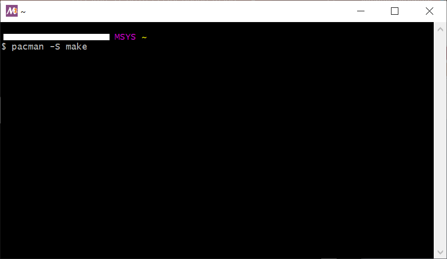
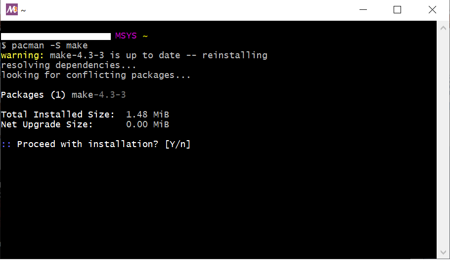
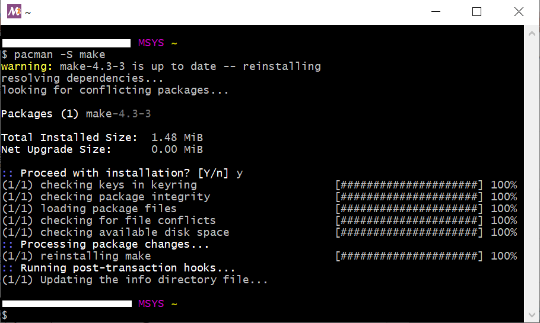

<h3 id="5.2.1">5.2.1 Install Additional Software for Windows10</h3>

You must install a tool called "MSYS2" to build IPL in Windows10 environment.

1. Download MSYS2 from "Installation" on the following website.  
   Please install by following the procedure described in "Installation".

    <https://www.msys2.org/>

    This document describes the case where MSYS2 is installed in the following folder.  
    c:\msys64

2. Install the make command on MSYS2.  
   Open the start menu and start "MSYS2 MSYS".

   

   
<h4 id="Figure5.14">Figure 5.14 Launch MSYS2</h4>

3. A command window will appear.  
   Enter "pacman -S make" on command window to install  the make command on MSYS2.

   

   
<h4 id="Figure5.15">Figure 5.15 Make command installation (1)</h4>

4. Enter 'y' when "Proceed with installation? [Y / n] "is output.

   

   
<h4 id="Figure5.16">Figure 5.16 Make command installation (2)</h4>

5. The make installation is completed.

   

   
<h4 id="Figure5.17">Figure 5.17 Make command installation (3)</h4>

