<h2 id="7.1">7.1 Create Debug Configuration</h2>

This chapter shows how to create a Debug configuration to run IPL.  
This explanation is a procedure for the RZ/A3UL SMARC Board (QSPI version).  
The explanation uses the project created in <a href="6. IPL build environment construction procedure.md#.6">Chapter 6</a> for this board.  
If you create a Debug configuration for other board, replace your environment with the ones used in this chapter.  
Also, the procedure is the same for both Windows 10 version and Ubuntu 22.04 LTS version.  

1. Right-click on RZA3UL_IPL and select [Debug As] -> [Debug Configurations].

   
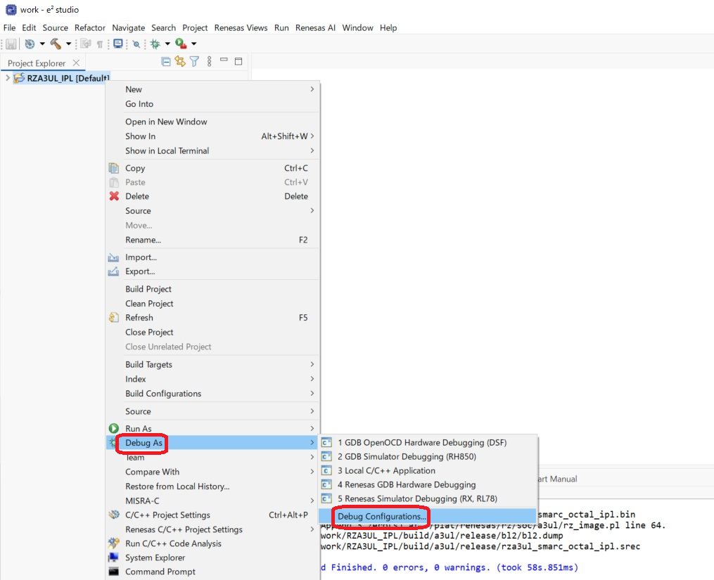

   
<h4 id="Figure7.1">Figure 7.1 Create Debug Configuration (1)</h4>

2. In the "Debug Configurations" window, double-click [Renesas GDB Hardware Debugging] to create a Debug Configuration template for the RZA3UL_IPL.  
   This debug configuration will be referred to as the "RZA3UL_IPL Default configuration" in this document.

   
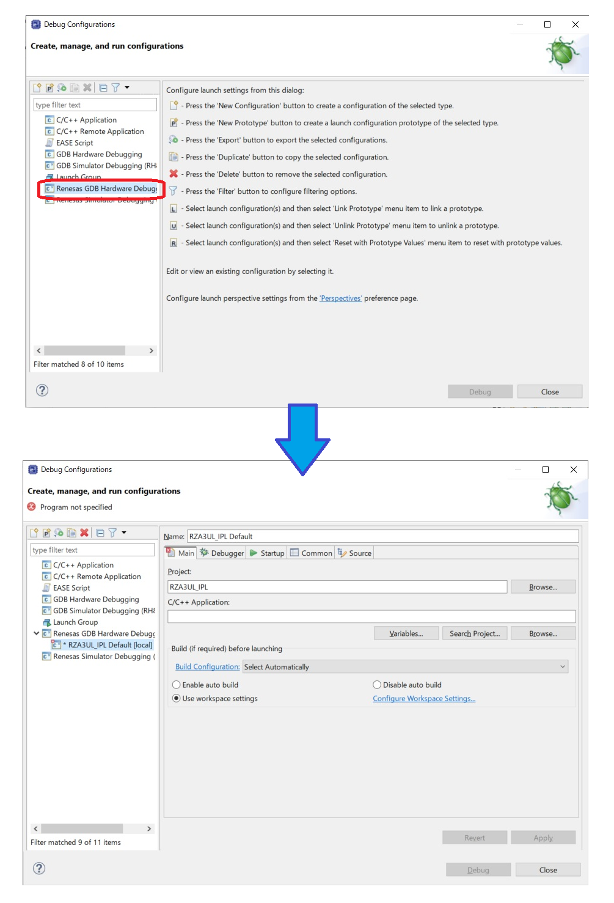

   
<h4 id="Figure7.2">Figure 7.2 Create Debug Configuration (2)</h4>

3. The Renesas GDB Hardware Debugging Launch Configuration Properties will show up.  
   Click [Search Project] on the Main tab and select [rza3ul_smarc_qspi_ipl.elf] on the Program Selection window.  
   Furthermore, after selecting "Use Active" in [Build Configuration], click [Apply].

   
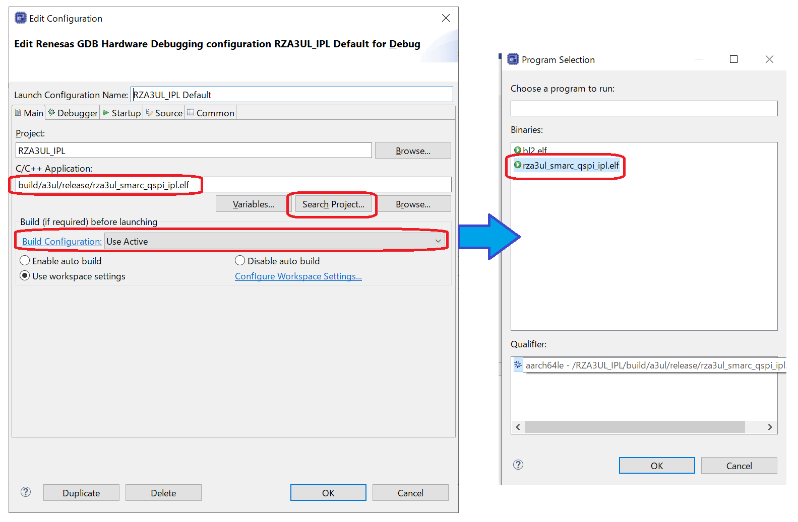

   
<h4 id="Figure7.3">Figure 7.3 Create Debug Configuration (3)</h4>

4. Go to the [Debugger] tab.  
   Select "J-Link ARM" in the Debug Hardware field.  
   Click [...] next to "Target Device" and select the device name you want to use.  
   The device and device name combinations are as follows.

    * For RZ/A3UL : [RZ/A3UL] -> [R9A07G063U02GBG]
    * For RZ/A3M : [RZ/A3M] -> [R9A07G066M04GBG]

   Then, set "aarch64-elf-gdb" in the GDB command field of the [GDB settings] tab.

   
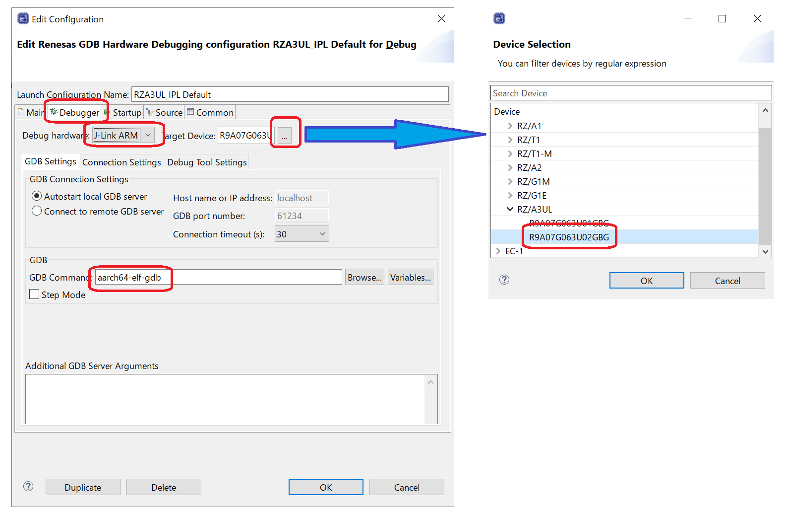

   
<h4 id="Figure7.4">Figure 7.4 Create Debug Configuration (4)</h4>

5. Go to the "Debugger" -> "Connection Settings" tab.  
   If you use J-Link Lite, set [SWD] to "Type".  
   If you use other J-Link models, please set [JTAG] or [SWD] to "Type" according to the specification.  
   Then, set [Yes] to "Reset at the beginning of connection".

   
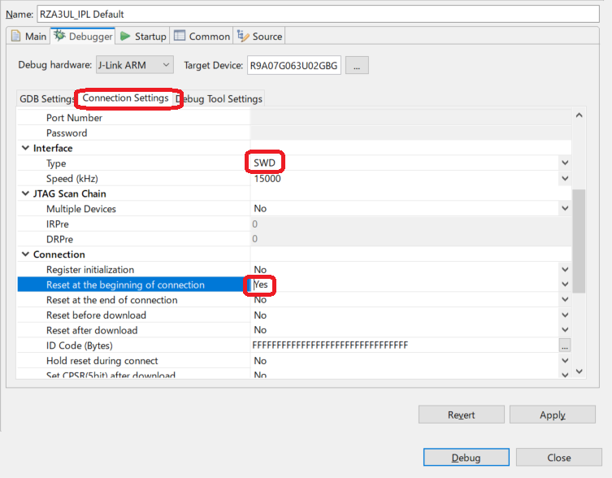

   
<h4 id="Figure7.5">Figure 7.5 Create Debug Configuration (5)</h4>

6. Go to the "Debugger"-> "Debug Tool Settings" tab.  
   Set [No] to "Reset After Reload".  
   Set the combinations of Flash memory types and settings of your environment to "Flash Bus Type" and "Flash Memory Type".  
   The combinations of Flash memory types and settings are shown below.

    * For Serial Flash memory : "Flash Bus Type" to [SPIBSC], "Flash Memory Type" to [SerialFlash]
    * For OctaFlash memory : "Flash Bus Type" to [OctaBus], "Flash Memory Type" to [OctaFlash]

    Then, set "Run Break Time Measurement" to No.

   
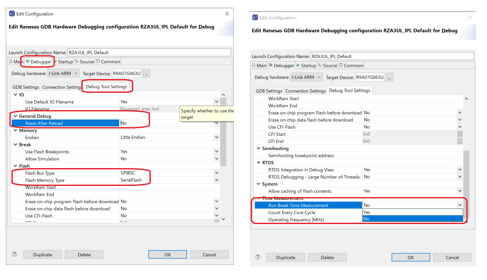

   
<h4 id="Figure7.6">Figure 7.6 Create Debug Configuration (6)</h4>

   
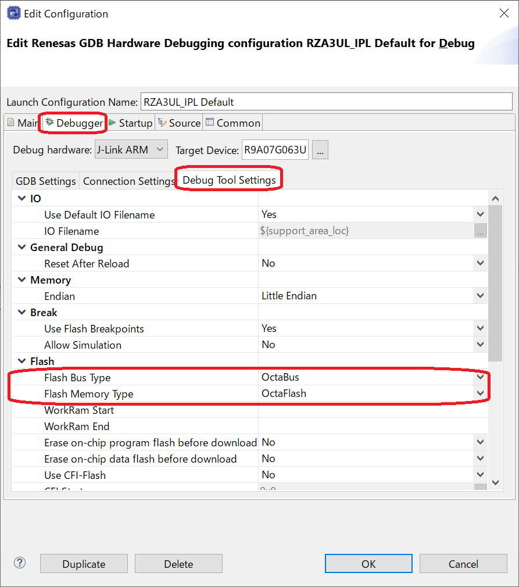

   
<h4 id="Figure7.7">Figure 7.7 Change settings when using OctaFlash memory

7. Go to "Startup" tab  
   Set "On connect" of "Program Binary" to [No].

   
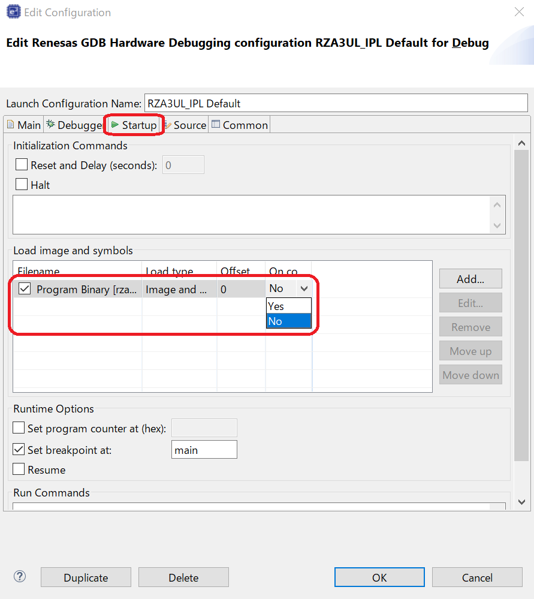

   
<h4 id="Figure7.8">Figure 7.8 Create Debug Configuration (7)</h4>

8. Click [Add] to bring up the Add download module window.  
   Next click Workspace, select [RZA3UL_IPL\build\a3ul\release\rza3ul_smarc_qspi_ipl.srec], and then click [OK] to return.  
   Then, rza3ul_smarc_qspi_ipl.srec is registered in Load image and symbols.

   
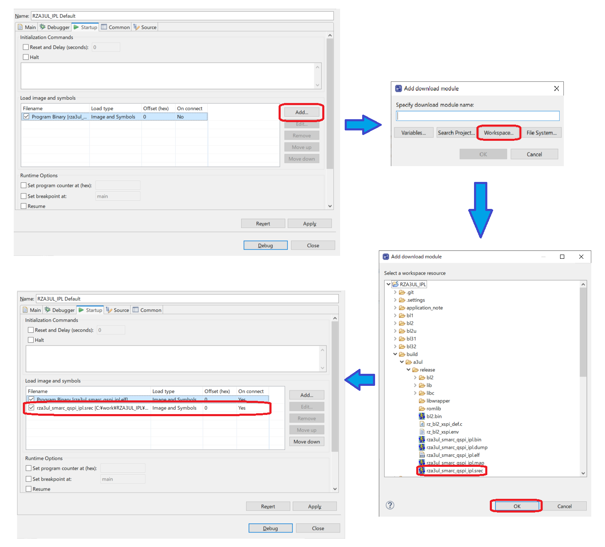

   
<h4 id="Figure7.9">Figure 7.9 Create Debug Configuration (8)</h4>

9. Since IPL write destination address H'2000_0000 is set in the registered rza3ul_smarc_qspi_ipl.srec itself, set [0] to "Offset(hex)".  
   With this setting, IPL image will be written to H'2000_0000 at the start of debugging.  
   Also, set" On connect" to [No] and uncheck "Set breakpoint at".

   
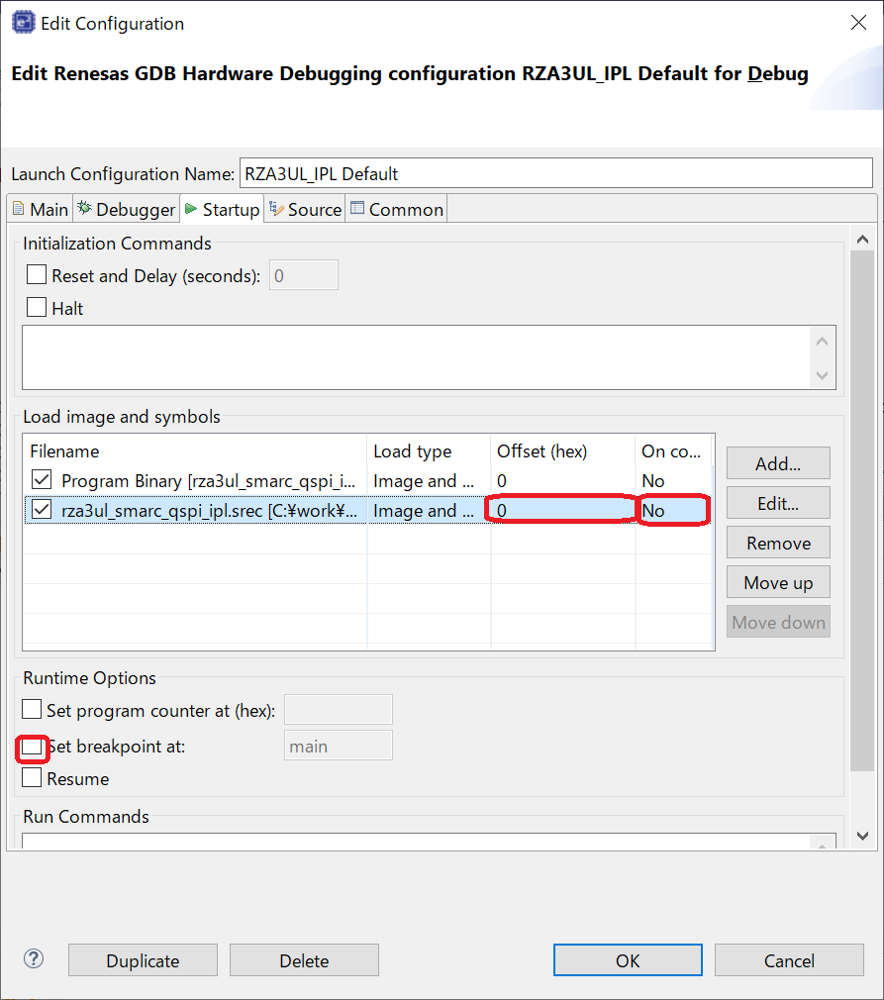

   
<h4 id="Figure7.10">Figure 7.10 Create Debug Configuration of Serial Flash (9)</h4>

10. Go to the Common tab and set Save as to Shared file:, and set the path to [\RZA3UL_IPL].  
   Also, uncheck "Launch in background".  
   After completing these settings, click [Apply] -> [Finish] to complete the settings.

   
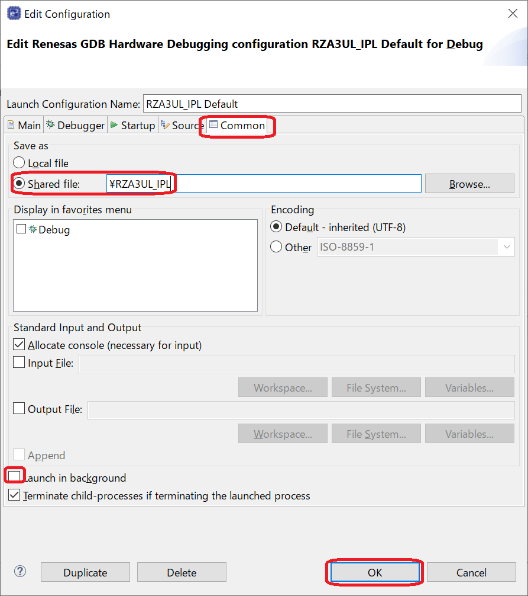

   
<h4 id="Figure7.11">Figure 7.11 Create Debug Configuration (10)</h4>

