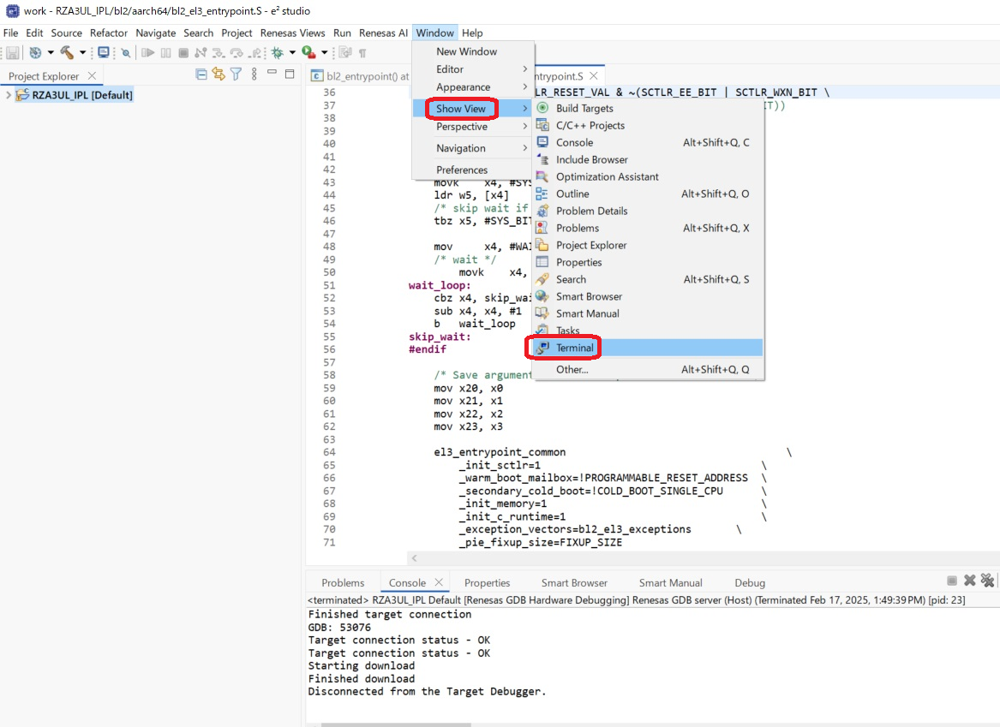
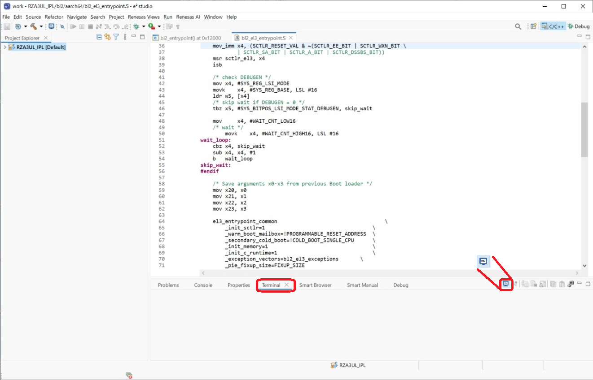
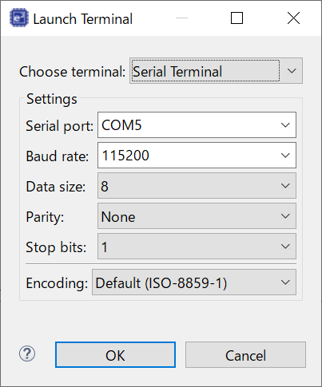
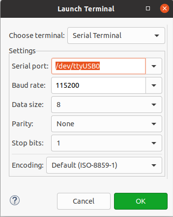
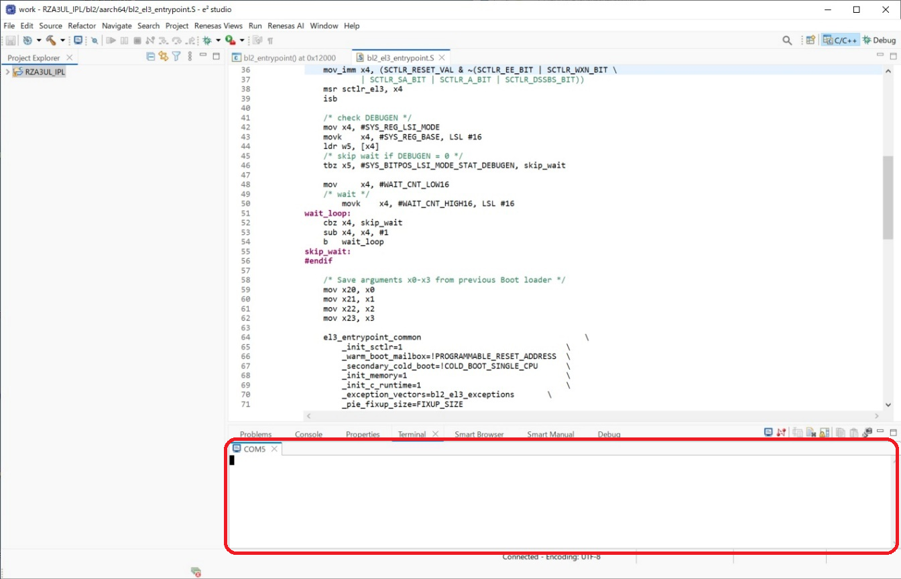

<h2 id="7.3">7.3 Setting Serial Terminal</h2>

This section describes the procedure for setting the serial terminal to check the message output by IPL.  
The procedure is the same for both Windows 10 version and Ubuntu 22.04 LTS version.

1. Power on the RZ/A3UL SMARC EVK board.  
2. Launch e2 studio.  
3. Click [Window] -> [Show View] -> [Terminal].

   

   
<h4 id="Figure7.12">Figure 7.12 Setting Serial Terminal (1)</h4>

  

4. The Terminal window will open.  
   Please click the&nbsp;&nbsp;mark.

   

   
<h4 id="Figure7.13">Figure 7.13 Setting Serial Terminal (2)</h4>

  

5. The Lunch Terminal window will be brought up.  
   Set the parameters as shown in <a href="#Figure7.14">Figure 7.14</a> on a Windows 10 PC and <a href="#Figure7.15">Figure 7.15</a> on an Ubuntu 22.04 LTS PC and click OK.  
   "Serial port" is a PC environment-dependent port.  
   Please set it according to your environment.

   

   
<h4 id="Figure7.14">Figure 7.14 Parameter of Serial Terminal (Windows10)</h4>

  

   

   
<h4 id="Figure7.15">Figure 7.15 Parameter of Serial Terminal (Ubuntu 22.04 LTS)</h4>

  

6. Start the Serial Terminal.

   

   
<h4 id="Figure7.15">Figure 7.16 Setting Serial Terminal (3)</h4>

