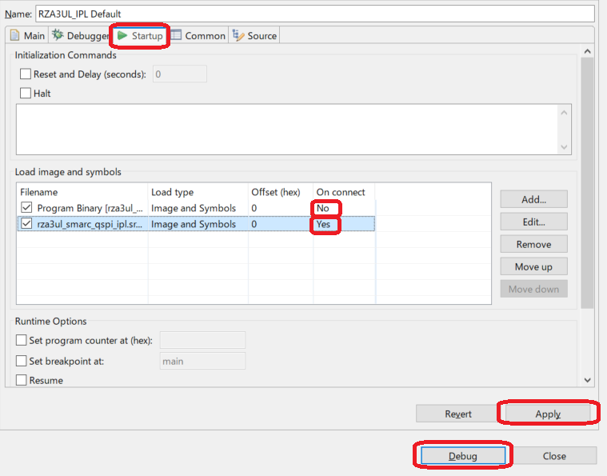
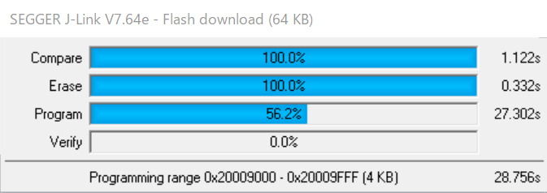
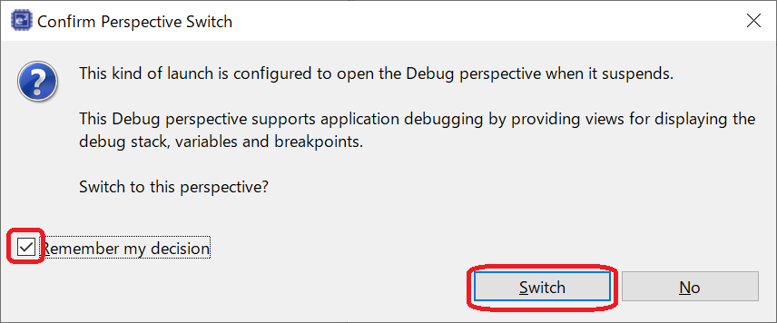
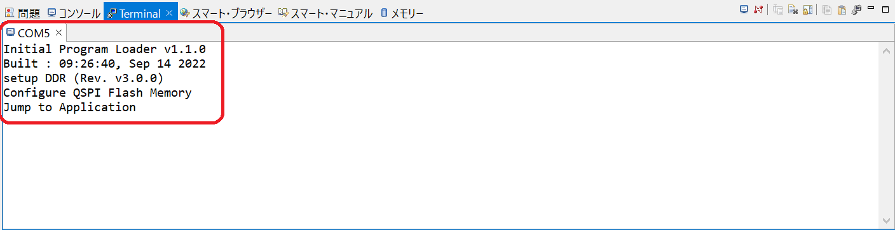

<h2 id="7.4">7.4 Execution procedure of IPL</h2>

The procedure for writing IPL to the Serial Flash memory and executing IPL is shown below.  
This explanation is a procedure for the RZ/A3UL SMARC Board (QSPI version).  
The explanation uses the project created in <a href="6. IPL build environment construction procedure.md#.6">Chapter 6</a> for this board.  
If you create a Debug configuration for other board, replace your environment with the ones used in this chapter.  
Also, the procedure is the same for both Windows 10 version and Ubuntu 22.04 LTS version.

1. As the FSP application must be written to Flash memory to confirm the boot operation by IPL, if the FSP application is not written to the Flash memory, write it.  
   For the write procedure, refer to 8.1 Procedure for writing the FSP application to Serial Flash memory.  
2. Set the RZ/A3UL SMARC EVK board operating mode to Boot Mode3 (1.8-V Serial Flash Memory) and turn on the power.  
3. Right-click on RZA3UL_IPL and select [Debug As] -> [Debug Configurations].  
   Then, open RZA3UL_IPL Default configuration to bring up the setting window.

   

   
<h4 id="Figure7.17">Figure 7.17 Change Debug Configuration of Serial Flash (1)</h4>

4. Go to the "Startup" tab and set "On connect" for "rza3ul_smarc_qspi_ipl.srec" to [Yes].  
   Also, set "On connect" in "Program Binary" to [No].  
   Then, click [Apply] to complete the setting, and click [Debug] to start the device connection.

   

   
<h4 id="Figure7.18">Figure 7.18 Change Debug Configuration of Serial Flash (2)</h4>

5. Writing to the Serial Flash memory is performed.  
   After the write is complete, the perspective for the debug control will be launched.

   

   
<h4 id="Figure7.19">Figure 7.19 Execution of IPL on Serial Flash memory (1)</h4>

6. If "Confirm Perspective Switch" is displayed during the launch of the perspective, press [Switch] button.

   

   
<h4 id="Figure7.20">Figure 7.20 Execution of IPL on Serial Flash memory (2)</h4>

7. After writing to the Serial Flash, click&nbsp;&nbsp;mark in the perspective to disconnect from the RZ/A3UL SMARC EVK board.  
   After that, press the RESET button on the RZ/A3UL SMARC EVK board to execute IPL.  
  At this time, the log shown in <a href="#Figure7.22">Figure 7.22</a> is displayed on Terminal.  
   In addition, the program written in the Serial Flash memory starts and the LED of the RZ/A3UL SMARC EVK board blinks as shown in <a href="#Figure7.23">Figure 7.23</a>.

   

   
<h4 id="Figure7.21">Figure 7.21 Execution of IPL (3)</h4>

   

   
<h4 id="Figure7.22">Figure 7.22 IPL execution log</h4>

   

   
<h4 id="Figure7.23">Figure 7.23 LED blinking</h4>

