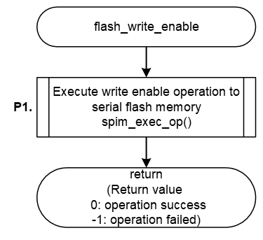

<h3 id="8.3.1.10">8.3.1.10 flash_write_enable</h3>

flash_write_enable() implemented in the default IPL release Write Protect by sending the Write Enable operation of the AT25QL128A mounted on the RZ/A3UL SMARC EVK board.

<table>
<colgroup>
<col style="width: 16%" />
<col style="width: 83%" />
</colgroup>
<thead>
<tr>
<th colspan="2">flash_write_enable</th>
</tr>
</thead>
<tbody>
<tr>
<td>Outline</td>
<td>Set Write enable to AT25QL128A</td>
</tr>
<tr>
<td>Declaration</td>
<td>int flash_write_enable (qspiflash_at25_ctrl_t * myctrl)</td>
</tr>
<tr>
<td>Description</td>
<td>- Send Write Enable operation to Serial Flash memory</td>
</tr>
<tr>
<td>Arguments</td>
<td>*myctrl : Pointer to the control structure for instance</td>
</tr>
<tr>
<td>Return value</td>
<td>
0 : Operation success 
-1 : Operation Failed
</td>
</tr>
<tr>
<td>Note</td>
<td>-</td>
</tr>
</tbody>
</table>

<a href="#Figure8.35">Figure 8.35</a> shows a flowchart of the flash_write_enable() implementation in the default IPL.  
The processing that changes the implementation when changing the Serial Flash memory is shown below.

* P1 Send Write Enable operation

This is shown as P1 in the flow chart as implementation change points.  
The details of the processing are explained after the flow chart.

<h4 id="Figure8.35">Figure 8.35 Flowchart of flash_write_enable</h4>

### P1. Send Write Enable operation

The Write Enable setting to the Serial Flash memory is performed by sending the Write Enable command.  
The Serial Flash memory driver implemented in the default IPL sets the AT25QL128A Write Enable command (code: 0x06) to the variable op_write_enable as the Write Enable operation, and the Write Enable information is sent by serial communication.

<a href="#Table8.7">Table 8.7</a> shows the op_write_enable settings when using the Write Enable operation.  
When changing the Serial Flash memory, refer to <a href="#Table8.7">Table 8.7</a> and rewrite the setting contents of op_write_enable to the contents equivalent to the Write Enable operation of your Serial Flash memory.  
In addition, there are Serial Flash memories that require register access in a specific procedure when executing Write Enable.  
In such cases, execute the operation transfer flow according to the determined procedure.

<h4 id="Table8.7">Table 8.7 op_write_enable setting contents when using Write Enable (0x06)</h4>

<table>
<colgroup>
<col style="width: 24%" />
<col style="width: 26%" />
<col style="width: 48%" />
</colgroup>
<thead>
<tr>
<th>Member</th>
<th>Setting value</th>
<th>Description</th>
</tr>
</thead>
<tbody>
<tr>
<td>form</td>
<td>SPI_FORM_1_1_1</td>
<td>
Number of I/O line used for command: 1 line 
Number of I/O line used for address: 1 line 
Number of I/O line used for data: 1 line
</td>
</tr>
<tr>
<td>op</td>
<td>0x06</td>
<td>Command code "Write Enable"</td>
</tr>
<tr>
<td>op_size</td>
<td>1</td>
<td>Command size = 1-byte</td>
</tr>
<tr>
<td>op_is_ddr</td>
<td>false</td>
<td>Command transfer method (SDR)</td>
</tr>
<tr>
<td>address</td>
<td>0</td>
<td>No address</td>
</tr>
<tr>
<td>address_is_ddr</td>
<td>false</td>
<td>Address transfer method (SDR)</td>
</tr>
<tr>
<td>address_size</td>
<td>0</td>
<td>No address</td>
</tr>
<tr>
<td>additional_value</td>
<td>0</td>
<td>No option data</td>
</tr>
<tr>
<td>additional_size</td>
<td>0</td>
<td>No option data</td>
</tr>
<tr>
<td>dummy_cycles</td>
<td>0</td>
<td>Dummy cycles = 0 cycles</td>
</tr>
<tr>
<td>transfer_buffer</td>
<td>NULL</td>
<td>No data</td>
</tr>
<tr>
<td>transfer_is_ddr</td>
<td>false</td>
<td>Data transfer method (SDR)</td>
</tr>
<tr>
<td>transfer_size</td>
<td>0</td>
<td>No data</td>
</tr>
<tr>
<td>force_idle_level_mask</td>
<td>0x08</td>
<td>Keep IO3/HOLD pin to High during idle state</td>
</tr>
<tr>
<td>force_idle_level_value</td>
<td>0x08</td>
<td>Keep IO3/HOLD pin to High during idle state</td>
</tr>
<tr>
<td>slch_value</td>
<td>0</td>
<td>Clock Delay = 1.5cycle</td>
</tr>
<tr>
<td>clsh_value</td>
<td>0</td>
<td>SSL Negation Delay = 1cycle</td>
</tr>
<tr>
<td>shsl_value</td>
<td>6</td>
<td>Next Access Delay = (7 - 3) cycle</td>
</tr>
</tbody>
</table>