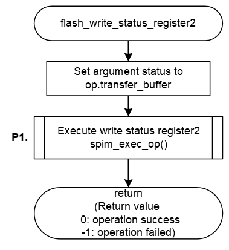

<h3 id="8.3.1.12">8.3.1.12 flash_write_status_register2</h3>

flash_write_status_reister2() is a function that writes value to the upper 8bits of the AT25QL128A Status Register.

flash_write_status_reister2() implemented in the default IPL write value to the register by sending the Write Status Register2 operation of the AT25QL128A mounted on the RZ/A3UL SMARC EVK board.

<table>
<colgroup>
<col style="width: 16%" />
<col style="width: 83%" />
</colgroup>
<thead>
<tr>
<th colspan="2">flash_write_status_register2</th>
</tr>
</thead>
<tbody>
<tr>
<td>Outline</td>
<td>Set value to higher 8bit of Status Register</td>
</tr>
<tr>
<td>Declaration</td>
<td>int flash_write_status_register2(qspiflash_at25_ctrl_t * myctrl, uint8_t status)</td>
</tr>
<tr>
<td>Description</td>
<td>- Send Write Status Register2 operation and write value to Status Register</td>
</tr>
<tr>
<td>Arguments</td>
<td>
*myctrl : Pointer to the control structure for instance 
status : Setting value to Status Register
</td>
</tr>
<tr>
<td>Return value</td>
<td>
0 : Operation success 
-1 : Operation Failed
</td>
</tr>
<tr>
<td>Note</td>
<td>-</td>
</tr>
</tbody>
</table>

<a href="#Figure8.37">Figure 8.37</a> shows a flowchart of the flash_write_status_register2() implementation in the default IPL.

The processing that changes the implementation when changing the Serial Flash memory is shown below.

* P1 Send Write Status Register2 operation

This is shown as P1 in the flow chart as implementation change points.  
The details of the processing are explained after the flow chart.

<h4 id="Figure8.37">Figure 8.37 Flowchart of flash_write_status_register2</h4>

### P1. Send Write Status Register2 operation

Send a Write Status Register command to write the value to the Status Register.

The flash_write_status_regster2() function sets the Write Status Register2 command (0x31) to the variable op_write_status2 and sends the Write Status Register operation.

<a href="#Table8.10">Table 8.10</a> shows the settings of op_write_status2 when using the Write Status Register2 operation.

When changing the Serial Flash memory, rewrite the variable members according to the specifications of the operation equivalent to the AT25QL128A Write Status Register2 operation implemented in your Serial Flash memory.

<h4 id="Table8.10">Table 8.10 op_write_status2 setting contents when using Write Status Register2 (0x31)</h4>

<table>
<colgroup>
<col style="width: 24%" />
<col style="width: 26%" />
<col style="width: 48%" />
</colgroup>
<thead>
<tr>
<th>Member</th>
<th>Setting value</th>
<th>Description</th>
</tr>
</thead>
<tbody>
<tr>
<td>form</td>
<td>SPI_FORM_1_1_1</td>
<td>
Number of I/O line used for command: 1line 
Number of I/O line used for address: 1line 
Number of I/O line used for data: 1line
</td>
</tr>
<tr>
<td>op</td>
<td>0x05</td>
<td>Command code "Write Status Register2"</td>
</tr>
<tr>
<td>op_size</td>
<td>1</td>
<td>Command size = 1-byte</td>
</tr>
<tr>
<td>op_is_ddr</td>
<td>false</td>
<td>Command transfer method (SDR)</td>
</tr>
<tr>
<td>address</td>
<td>0</td>
<td>No address</td>
</tr>
<tr>
<td>address_is_ddr</td>
<td>false</td>
<td>Address transfer method (SDR)</td>
</tr>
<tr>
<td>address_size</td>
<td>0</td>
<td>No address</td>
</tr>
<tr>
<td>additional_value</td>
<td>0</td>
<td>No option data</td>
</tr>
<tr>
<td>additional_size</td>
<td>0</td>
<td>No option data</td>
</tr>
<tr>
<td>dummy_cycles</td>
<td>0</td>
<td>Dummy cycles = 0 cycles</td>
</tr>
<tr>
<td>transfer_buffer</td>
<td>&amp;status</td>
<td>Set pointer of argument status in function</td>
</tr>
<tr>
<td>transfer_is_ddr</td>
<td>false</td>
<td>Data transfer method (SDR)</td>
</tr>
<tr>
<td>transfer_size</td>
<td>1</td>
<td>Lower 8bit of Status Register</td>
</tr>
<tr>
<td>force_idle_level_mask</td>
<td>0x08</td>
<td>Keep IO3/HOLD pin to High during idle state</td>
</tr>
<tr>
<td>force_idle_level_value</td>
<td>0x08</td>
<td>Keep IO3/HOLD pin to High during idle state</td>
</tr>
<tr>
<td>slch_value</td>
<td>0</td>
<td>Clock Delay = 1.5cycle</td>
</tr>
<tr>
<td>clsh_value</td>
<td>0</td>
<td>SSL Negation Delay = 1cycle</td>
</tr>
<tr>
<td>shsl_value</td>
<td>6</td>
<td>Next Access Delay = (7 - 3) cycle</td>
</tr>
</tbody>
</table>

