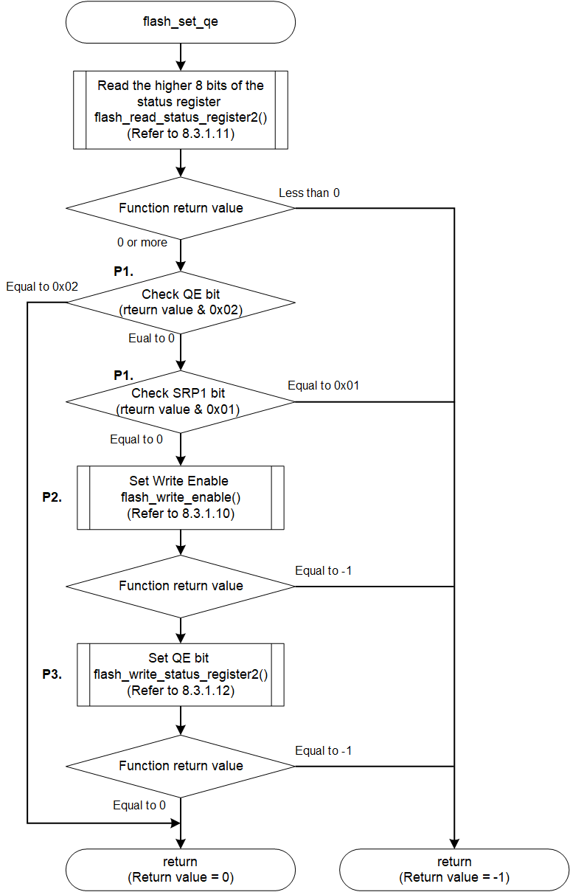

<h3 id="8.3.1.13">8.3.1.13 flash_set_qe</h3>

flash_set_qe() is a function that set Quad Enable bit of AT25QL128A.

flash_set_qe() implemented in the default IPL sets Quad Enable bit by Writing value to Status Register of the MX66UW1G45G mounted on the RZ/A3UL SMARC EVK board.

<table>
<colgroup>
<col style="width: 16%" />
<col style="width: 83%" />
</colgroup>
<thead>
<tr>
<th colspan="2">flash_set_qe</th>
</tr>
</thead>
<tbody>
<tr>
<td>Outline</td>
<td>Set the QE bit of Status Register</td>
</tr>
<tr>
<td>Declaration</td>
<td>int flash_set_qe(qspiflash_at25_ctrl_t * myctrl)</td>
</tr>
<tr>
<td>Description</td>
<td>
- Read Status Register value 
- Check Quad Enable bit 
- Check Write Protect of Status Register 
- Release Write Protect 
- Change Quad Enable mode
</td>
</tr>
<tr>
<td>Arguments</td>
<td>*myctrl : Pointer to the control structure for instance</td>
</tr>
<tr>
<td>Return value</td>
<td>
0 : Operation success 
-1 : Operation Failed
</td>
</tr>
<tr>
<td>Note</td>
<td>-</td>
</tr>
</tbody>
</table>

<a href="#Figure8.38">Figure 8.38</a> show the flowchart of the flash_set_qe() implementation in the default IPL.

The processing that changes the implementation when changing the Serial Flash memory is shown below.

* P1. Check Quad Enable
* P2. Release Write Protect
* P3. Change mode of Quad Enable

These are shown as P1 to P3 in the flow chart as implementation change points.  
The details of the processing are explained after the flow chart.

<h4 id="Figure8.38">Figure 8.38 Flowchart of flash_set_qe</h4>

### P1. Check Quad Enable

The flash_set_qe() function once obtains the Status Register value shown in <a href="#Table8.11">Table 8.11</a> and skips processing if the QE bit has already been set.  
Also, if the SRP1 bit is set, the Status Register is protected and cannot be changed, so the function terminates as an error.  
The bits used to determine these processing branches vary depending on the implementation of the Serial Flash memory.  
Therefore, when changing the Serial Flash memory, use the bits implemented in your Serial Flash memory that correspond to the SRP1 bit and QE bit to check.  
To get the Status Register, execute flash_read_status_register2().

Refer to <a href="8.3.1.11 flash_read_status_reister1_flash_read_status_register2.md#8.3.1.11">8.3.1.11</a> for processing details.

<h4 id="Table8.11">Table 8.11 QE bit and SRP1 bit of AT25QL128A Status Register (BIT15 - BIT8)</h4>

| BIT15 | BIT14 | BIT13 | BIT12 | BIT11 | BIT10 | BIT9 | BIT8 |
| --- | --- | --- | --- | --- | --- | --- | --- |
| SUS | CMP | - | - | - | - | QE</strong> | SRP1</strong> |
| Suspend Status | Complement Protect | Reserved | Reserved | Reserved | Reserved | Quad Enable</strong> | Register Protect1</strong> |

### P2. Release Write Protect

AT25QL128A must release write protect when writing to Status Register.  
The Serial Flash memory driver implemented in the default IPL provides a sub function flash_write_enable() that release Write Protect for AT25QL128A.  
Since the write protect release method depends on the specifications of the Serial Flash memory, it is necessary to change the implementation of the function when changing the memory.  

Please refer to <a href="8.3.1.10 flash_write_enable.md#8.3.1.10">8.3.1.10</a> for change of write protect release method.

### P3. Change mode of Quad Enable

By passing 0x02 as the register write value to the sub-function flash_write_status_register2() that writes to the Status Register, it writes to the Status Register and sets the QE bit.  
Similarly, when changing the Serial Flash memory, set appropriate values for the registers mounted in that memory and perform register operations.  

Please refer to <a href="8.3.1.12 flash_write_status_register2.md#8.3.1.12">8.3.1.12</a> for changing the writing method to the Status Register.

For the AT25QL128A, writing 1 to the SRP1 bit protects the Status Register from being written and disables rewriting.  
Be sure to set 0 when writing to the Status Register in processing for the AT25QL128A.
