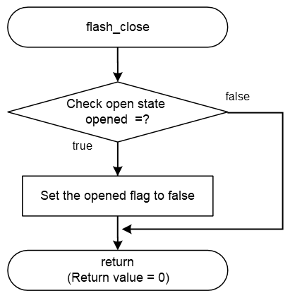

<h3 id="8.3.1.2">8.3.1.2 flash_close</h3>

flash_close() is a function to terminate the Serial Flash memory driver.  
flash_close() implemented in the default IPL only clears the opened flag, which indicates the open state of the driver.

Therefore, it is possible to access Serial Flash memory even after executing flash_close().

<table>
<colgroup>
<col style="width: 16%" />
<col style="width: 83%" />
</colgroup>
<thead>
<tr>
<th colspan="2">flash_close</th>
</tr>
</thead>
<tbody>
<tr>
<td>Outline</td>
<td>Close the Serial Flash memory</td>
</tr>
<tr>
<td>Declaration</td>
<td>int flash_close (xspidevice_ctrl_t * ctrl)</td>
</tr>
<tr>
<td>Description</td>
<td>- Clear opened flag</td>
</tr>
<tr>
<td>Arguments</td>
<td>*ctrl : Pointer to xSPI device control structure</td>
</tr>
<tr>
<td>Return value</td>
<td>0 : Close process is complete 
-1 : Close process is failed</td>
</tr>
<tr>
<td>Note</td>
<td>-</td>
</tr>
</tbody>
</table>

<a href="#Figure8.24">Figure 8.24</a> shows a flowchart of the flash_close() implementation in the default IPL.

<h4 id="Figure8.24">Figure 8.24 Flowchart of flash_close</h4>

