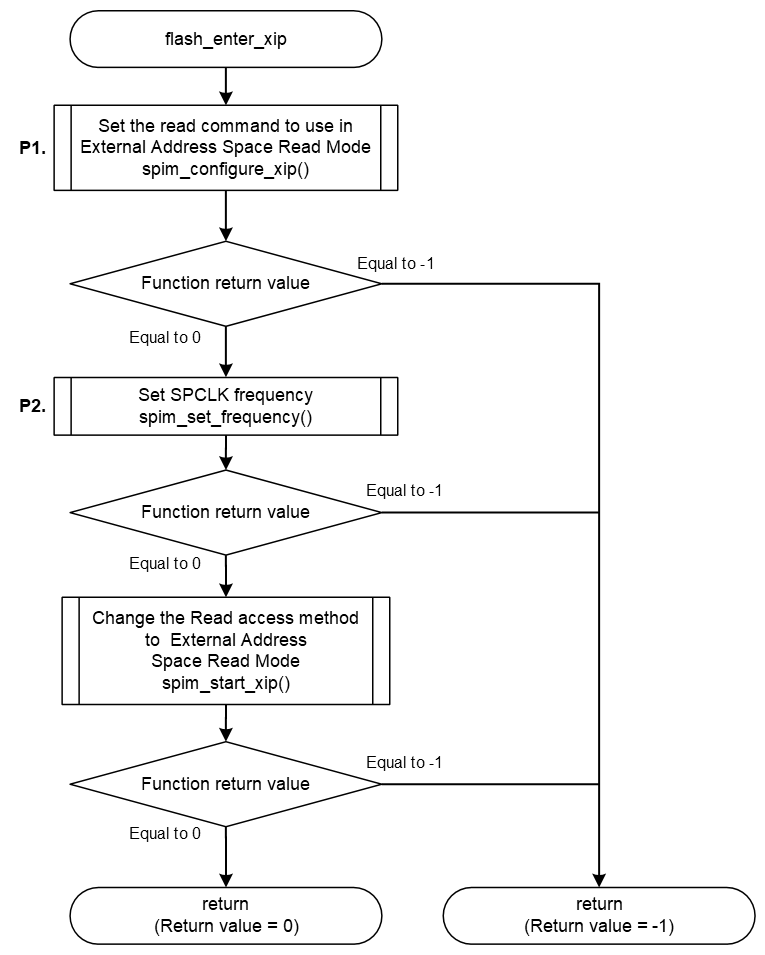

<h3 id="8.3.1.4">8.3.1.4 flash_enter_xip</h3>

flash_enter_xip() is a function that changes the read access method of SPIBSC from Manual Mode to External Space Address Read Mode.  
In External Space Address Read Mode, when a read access is made to the Serial Flash memory area (H'20000000) in the memory space shown in <a href="4.3.1 Memory Map of RZA3UL SMARC EVK board (QSPI version).md#Figure4.5">Figure 4.5</a>, SPIBSC automatically performs serial communications and data is read from that address in the Flash memory.

This chapter shows an example of implementing a process to change the mode for accessing the AT25QL128A mounted on the RZ/A3UL SMARC EVK board to the external space read address mode.

<table>
<colgroup>
<col style="width: 16%" />
<col style="width: 83%" />
</colgroup>
<thead>
<tr>
<th colspan="2">flash_enter_xip</th>
</tr>
</thead>
<tbody>
<tr>
<td>Outline</td>
<td>Set the External Address Space Read Mode to the Serial Flash memory</td>
</tr>
<tr>
<td>Declaration</td>
<td>int flash_enter_xip (xspidevice_ctrl_t * ctrl)</td>
</tr>
<tr>
<td>Description</td>
<td>
- Register Read operation to SPIBSC 
- Set SPCLK frequency 
- Change the Read access method to External Space Address Read Mode
</td>
</tr>
<tr>
<td>Arguments</td>
<td>*ctrl : Pointer to the control structure for instance</td>
</tr>
<tr>
<td>Return value</td>
<td>0 : Setting is complete 
-1 : Setting is failed</td>
</tr>
<tr>
<td>Note</td>
<td>-</td>
</tr>
</tbody>
</table>

<a href="#Figure8.26">Figure 8.26</a> shows a flowchart of the flash_enter_xip() implementation in the default IPL.

The processing that changes the implementation when changing the Serial Flash memory is shown below.

* P1 Register Read operation
* P2. Clock frequency setting change

These are shown as P1, P2 in the flow chart as implementation change points. 
The details of the processing are explained after the flow chart.

<h4 id="Figure8.26">Figure 8.26 Flowchart of flash_enter_xip</h4>

### P1. Register Read operation

Register the Read operation used in External Space Address Read Mode in the argument rop of spim_config_xip().  
The Serial Flash memory driver implemented in the default IPL uses the Fast Read quad I/O operation (code: 0xEB) as the Read operation.  
<a href="#FTable8.4">Table 8.4</a> shows the rop settings when using the Fast Read quad I/O operation.

When changing the Serial Flash memory, rewrite rop to the contents corresponding to the Read operation of your Serial Flash memory.  
<h4 id="Table8.4">Table 8.4 rop setting contents when using Fast Read quad I/O(0xEB)</h4>

<table>
<colgroup>
<col style="width: 24%" />
<col style="width: 26%" />
<col style="width: 48%" />
</colgroup>
<thead>
<tr>
<th>Member</th>
<th>Setting value</th>
<th>Description</th>
</tr>
</thead>
<tbody>
<tr>
<td>form</td>
<td>SPI_FORM_1_4_4</td>
<td>
Number of I/O line used for command: 1line 
Number of I/O line used for address: 4line 
Number of I/O line used for data: 4line
</td>
</tr>
<tr>
<td>op</td>
<td>0xEB</td>
<td>Command code "Fast Read Quad I/O"</td>
</tr>
<tr>
<td>op_size</td>
<td>1</td>
<td>Command size = 1-byte</td>
</tr>
<tr>
<td>op_is_ddr</td>
<td>false</td>
<td>Command transfer method (SDR)</td>
</tr>
<tr>
<td>address</td>
<td>0</td>
<td>Address is not set because bus access is translated</td>
</tr>
<tr>
<td>address_is_ddr</td>
<td>false</td>
<td>Address transfer method (SDR)</td>
</tr>
<tr>
<td>address_size</td>
<td>3</td>
<td>24bit address</td>
</tr>
<tr>
<td>additional_value</td>
<td>0x55555555</td>
<td>Option data</td>
</tr>
<tr>
<td>additional_size</td>
<td>1</td>
<td>Option data size</td>
</tr>
<tr>
<td>dummy_cycles</td>
<td>4</td>
<td>Dummy cycles = 4 cycles</td>
</tr>
<tr>
<td>transfer_buffer</td>
<td>NULL</td>
<td>Buffer pointer is not set because bus access is translated</td>
</tr>
<tr>
<td>transfer_is_ddr</td>
<td>false</td>
<td>Data transfer method (SDR)</td>
</tr>
<tr>
<td>transfer_size</td>
<td>0</td>
<td>Transfer data size is not set because bus access is translated</td>
</tr>
<tr>
<td>force_idle_level_mask</td>
<td>0x08</td>
<td>Keep IO3/HOLD pin to High during idle state</td>
</tr>
<tr>
<td>force_idle_level_value</td>
<td>0x08</td>
<td>Keep IO3/HOLD pin to High during idle state</td>
</tr>
<tr>
<td>slch_value</td>
<td>0</td>
<td>Clock Delay = 1.5cycle</td>
</tr>
<tr>
<td>clsh_value</td>
<td>0</td>
<td>SSL Negation Delay = 1cycle</td>
</tr>
<tr>
<td>shsl_value</td>
<td>6</td>
<td>Next Access Delay = (7 - 3) cycle</td>
</tr>
</tbody>
</table>

### P2. Clock frequency setting change

The defined value of DEFAULT_SPI_FREQUENCY in L14 of qspiflash_custom.c shown in <a href="8.3.1.1 flash_open.md#Figure8.23">Figure 8.23</a> is used for the operating clock frequency.  
Set this define value to the optimum value for your Serial Flash memory.  
The maximum value that can be set is 100000000 (100MHz) and the minimum value is 3125000 (3.125MHz)
