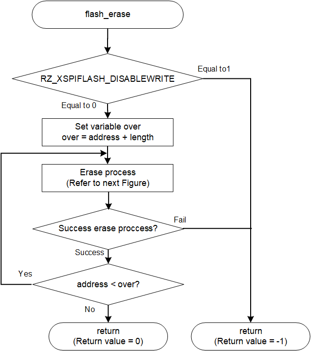
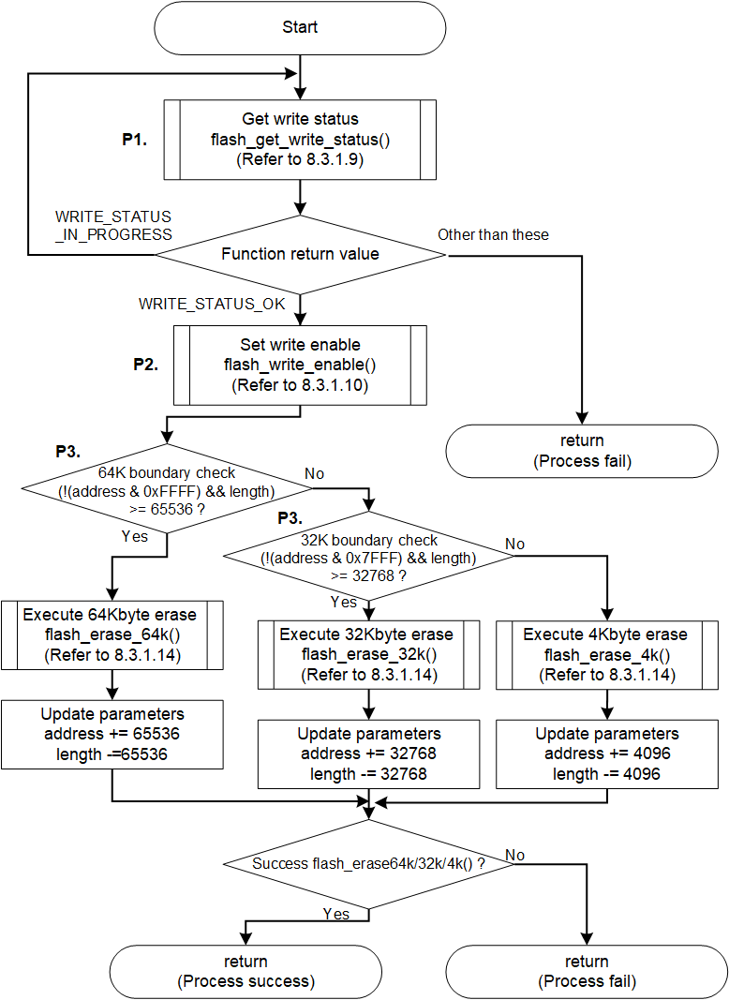

<h3 id="8.3.1.8">8.3.1.8 flash_erase</h3>

flash_erase() is a function to erase data from Serial Flash memory.

This chapter shows an example of implementing the erase process for the AT25QL128A mounted on the RZ/A3UL SMARC EVK board.

<table>
<colgroup>
<col style="width: 16%" />
<col style="width: 83%" />
</colgroup>
<thead>
<tr>
<th colspan="2">flash_erase</th>
</tr>
</thead>
<tbody>
<tr>
<td>Outline</td>
<td>Erase the Serial Flash memory</td>
</tr>
<tr>
<td>Declaration</td>
<td>int flash_erase (xspidevice_ctrl_t * ctrl, size_t address, size_t length)</td>
</tr>
<tr>
<td>Description</td>
<td>
- Checking the write status 
- Waiting for the end of the write process 
- Release write protection 
- Updating the erase operation table 
- Erase data by sending erase operation data to Serial Flash memory
</td>
</tr>
<tr>
<td>Arguments</td>
<td>
*ctrl : Pointer to the control structure for instance 
address : Start address for data erase 
&emsp;&emsp;&emsp;&emsp;Specify the offset address in the Serial Flash memory for this argument. 
&emsp;&emsp;&emsp;&emsp;If a value other than a multiple of 4-Kbytes is set, the address obtained by aligning the specified address with 4-Kbytes will be the start address of the erase area. 
length : erase size 
&emsp;&emsp;&emsp;&nbsp;&nbsp;If a value other than 4-Kbyte aligned size is set in this argument, it erases the data up to the 4-Kbyte aligned address including the specified range.
</td>
</tr>
<tr>
<td>Return value</td>
<td>
0 : Data erase is success 
-1 : Data erase is failed.
</td>
</tr>
<tr>
<td>Note</td>
<td>
Processing of this function is disabled at the default IPL.

To enable erase process, refer to <a href="8.3.1.7 flash_write.md#Figure8.29">Figure 8.29</a> and rewrite RZ_XSPIFLASH_DISABLE_WRITE:=1 in rz_xspi_common.mk L13 to RZ_XSPIFLASH_DISABLE_WRITE:=0 and rebuild.
</td>
</tr>
</tbody>
</table>

<a href="#Figure8.32">Figure 8.32</a> and <a href="#Figure8.33">Figure 8.33</a> show the flowchart of the flash_erase() implementation in the default IPL.

The processing that changes the implementation when changing the Serial Flash memory is shown below.

* P1. Wait process of write completion
* P2. Release Write Protect
* P3. Send Erase operation

These are shown as P1 to P3 in the flow chart as implementation change points.  
The details of the processing are explained after the flow chart.

<h4 id="Figure8.32">Figure 8.32 Flowchart of flash_erase</h4>

<h4 id="Figure8.33">Figure 8.33 Flowchart of Erase process</h4>

### P1. Wait process of write completion

Since the next data cannot be received while the Serial Flash memory is writing the data received by serial communication or erasing the data, IPL must check the write status and wait for the end.  
The sub function flash_get_write_status() for getting the write status for the AT25QL128A is implemented in the Serial Flash memory driver implemented in the default IPL.  
Since the method of checking the write status depends on the Serial Flash memory specifications, it is necessary to change the implementation of the function when changing the memory.  
Please refer to <a href="8.3.1.9 flash_get_write_status.md#8.3.1.9">8.3.1.9</a> for change of checking method of write status.

### P2. Release Write Protect

Most of Serial Flash memories require release of write protect when writing data or erasing data.  
The Serial Flash memory driver implemented in the default IPL provides a sub function flash_write_enable() that release Write Protect for AT25QL128A.  
Since the write protect release method depends on the specifications of the Serial Flash memory, it is necessary to change the implementation of the function when changing the memory.  
Please refer to <a href="8.3.1.10 flash_write_enable.md#8.3.1.10">8.3.1.10</a> for change of write protect release method.

### 3. Send Erase Operation

When erasing data to Serial Flash memory, data is erased by sending an Erase command.  
The AT25QL128A provides an Erase operation in 4-Kbyte units (Block Erase (4 kbytes)), Erase operation in 32-Kbyte units (Block Erase (32 kbytes)) and Erase operation in 64-Kbyte units (Block Erase (64 kbytes)).  
Therefore, the Serial Flash memory driver implemented in the default IPL switches the Erase operation to be executed according to the remaining erase size as shown below.

* Remaining Erase size is 64-Kbyte or more: Block Erase (64 kbytes)
* Remaining Erase size is 32-Kbyte or more and less than 64-Kbyte: Block Erase (32 kbytes)
* Remaining Erase size is less than 32-Kbyte: Block Erase (4 kbytes)

These erase operations are executed by the sub functions flash_erase_4k() / flash_erase_32k() / flash_erase_64k() corresponding to each operation.  
Refer to <a href="8.3.1.14 flash_erase_4k_flash_erase_32k_flash_erase_64k.md#8.3.1.14">8.3.1.14</a>  for how to change the erase operation execution process.

The size unit that can be erased depends on the operations implemented in the Serial Flash memory.  
Adjust the erase unit of the program according to the erase unit of the erase operation provided by your Serial Flash memory.
