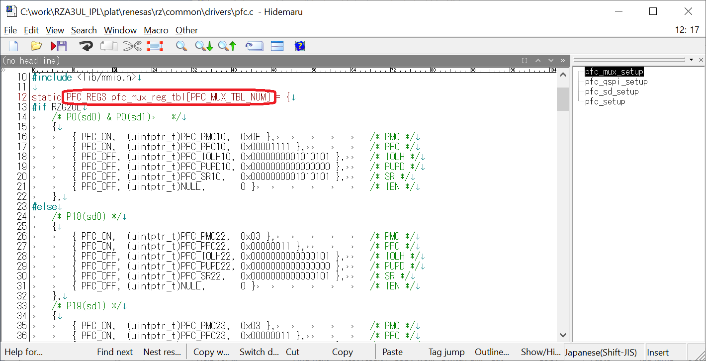

<h3 id="8.3.4">8.3.4 How to add pin setting</h3>

In IPL, the pin setting shown in the GPIO column of <a href="4.2.1 Peripheral Function Setting when using Serial Flash memory.md#Table4.1">Table 4.1</a> is performed.

This chapter shows how to add pin settings.

1. Open c:\work\RZA3UL_IPL\plat\renesas\rz\common\drivers\pfc.c.  
2. Add the pin setting table to pfc_mux_reg_tbl[].

   

   
<h4 id="Figure8.47">Figure 8.47 Information of pfc_mux_reg_tbl[]</h4>

3. The setting table has the following format.

    {  
    &emsp;{pmc.flag, pmc.reg, pmc.val },  
    &emsp;{pfc.flag, pfc.reg, pfc.val },  
    &emsp;{iolh.flag, iolh.reg, iolh.val },  
    &emsp;{pupd.flag, pupd.reg, pupd.val },  
    &emsp;{sr.flag, sr.reg, sr.val },  
    &emsp;{ien.flag, ien.reg, ien.val }  
    }

    "XXX" below indicates PMCn, PFCn, IOLHn, PUPDn, SRn, IENn registers.

    XXX.flag: Set PFC_ON to change the register value registered in the table. Set PFC_OFF if you do not want to change the register value.  
    XXX.reg: Set the address of the register to which the parameter is to be set.  
    XXX.val: Sets the value to write to the register set in reg.  

    For details of each register, refer to User's Manual: Hardware for each RZ/A3 devices.

4. Open pfc_regs.h and increase the value of PFC_MUX_TBL_NUM by the number of added tables.

