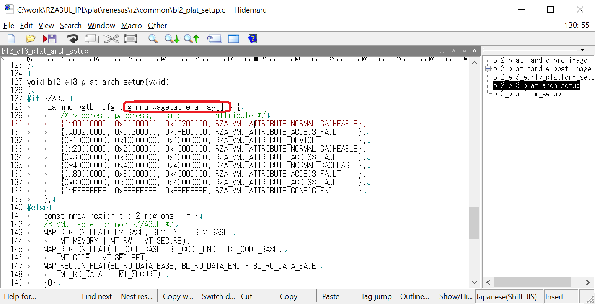

<h3 id="8.3.5">8.3.5 How to change MMU setting</h3>

This chapter shows how to change MMU settings.

1. Open c:\work\RZA3UL_IPL\plat\renesas\rz\common\bl2_plat_setup.c.
2. Rewrite the MMU setting table of g_mmu_pagetable_array[].

   

   
<h4 id="Figure8.48">Figure 8.48 Information of g_mmu_pagetable_array[]</h4>

3. Each line in g_mmu_pagetable_array[] is the setting for each block in the virtual address space, and consists of the following format.

    {  
    &emsp;{vaddress, paddress, size, attribute },  
    &emsp;...  
    &emsp;{0xFFFFFFFF, 0xFFFFFFFF, 0xFFFFFFFF, RZA_MMU_ATTRIBUTE_CONFIG_END }  
    }

    vaddress: Sets the starting address of the virtual address space. Sets a 2-Mbyte aligned address.  
    paddress: Sets the starting address of the physical address space. Sets a 2-Mbyte aligned address.  
    size: Sets the size of block. Sets a 2-Mbyte aligned size.  
    Attribute: Memory attribute. The following parameters can be specified.  
    &emsp;RZA_MMU_ATTRIBUTE_NORMAL_CACHEABLE: Normal Memory, Cache enable (Write-back)  
    &emsp;RZA_MMU_ATTRIBUTE_NORMAL_UNCACHE: Normal Memory, Cache disable  
    &emsp;RZA_MMU_ATTRIBUTE_DEVICE: Device Memory  
    &emsp;RZA_MMU_ATTRIBUTE_ACCESS_FAULT: Areas where access is prohibited  
    &emsp;&emsp;This attribute is set for areas that are not set in the MMU setting table.  
    &emsp;RZA_MMU_ATTRIBUTE_CONFIG_END: Indicates the end of MMU configuration  
    &emsp;&emsp;This attribute is set to the last element of the MMU setting table.
